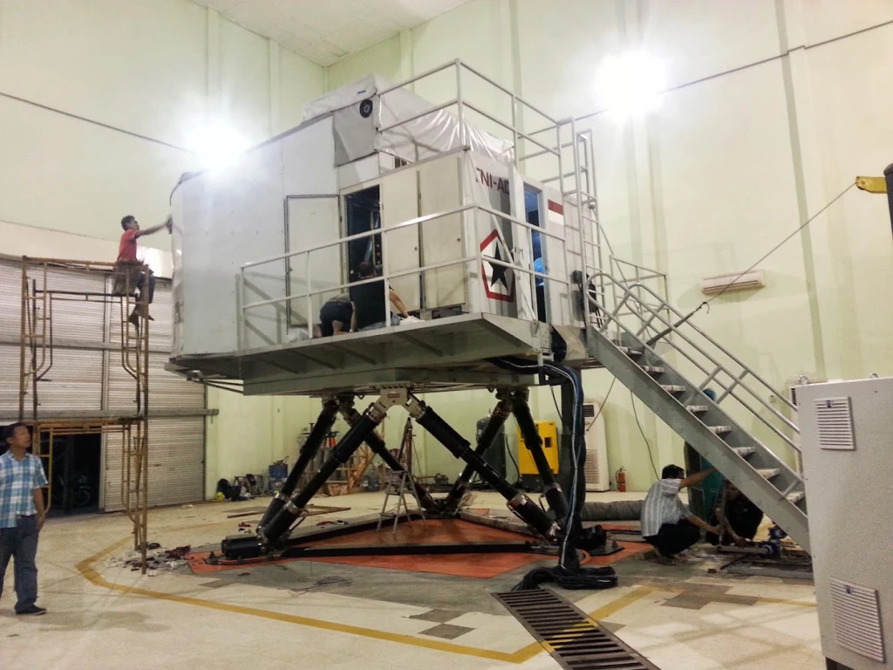

# BO-105 Light Twin Helicopter Simulator & Advanced Lab Testbed

> **Role:** Flight Simulation Software Engineer  
> **Company:** PT. Technology & Engineering Simulation (T&E)  
> **Customer:** Indonesian Army Aviation (*Penerbang Angkatan Darat — Penerbad, TNI-AD*)  
> **Domain:** Rotorcraft Simulation, Active Control Loading, Curved Projection Warping, Motion Platforms  
> **Tech Stack:** C++, OpenGL, OpenAL, CodeGraph, CommSystem, Electrical Servomotors, Custom Motion Platform, VR Headset  

---

## 1. Project Context & Organizational Dynamics

The primary commercial contract with the Indonesian Army Aviation (*Penerbad, TNI-AD*) was the full-scale refurbishment and modernization of an aging **BO-105 light twin utility helicopter simulator**. The physical simulator was an imposing, high-bay installation mounted on a massive 6-DOF hydraulic hexapod motion platform, housing an authentic aluminum airframe cockpit.

Internally at PT. T&E Simulation, both the **BAe Hawk 209** and **BO-105** programs were "senior-owned" projects—directed by veteran aerospace engineers who had migrated from IPTN/DI. As a young systems engineer, I operated within their framework: I respected the seniority hierarchy, executed the tasks assigned to me, and absorbed every ounce of rotorcraft physics and flight dynamics data I could lay my hands on.

However, the real engineering breakthrough came when we decided not to restrict our work to the customer's massive physical rig. 

We took the validated BO-105 flight dynamics model and brought it directly into our software laboratory to serve as an **advanced experimental R&D testbed**.

---

## 2. The Laboratory Cockpit: Pragmatic Tablet Glass Cockpit & Projection R&D

Rather than spending tens of thousands of dollars on delicate aircraft hardware gauges or waiting for physical avionics panels to be wired, we built our own internal laboratory cockpit to iterate rapidly on flight handling and display systems.

### Tablet-Backed Analog Gauge Cluster
We fabricated a lightweight fiberglass helicopter cockpit shell. To solve the instrument panel without expensive hardware:
- We cut precise circular dial apertures directly into the dashboard panel.
- Behind the cutouts, we mounted consumer **iPads and tablets** running custom real-time rendering software.
- The tablets rendered the analog needles, airspeed indicators, dual-tachometer (rotor RPM / turbine RPM), torquemeter, artificial horizon, and altimeter with butter-smooth 60 FPS animation.
- Peering through the dashboard bezels, the pilot saw crisp, illuminated instruments that looked and responded exactly like physical electromechanical dials, yet could be modified or recalibrated in software within seconds.

### Multi-Projector Curved Screen Calibration
The laboratory cockpit was surrounded by a custom cylindrical curved projection screen:
- We used this rig to develop our in-house **automatic multi-projector warping and edge-blending algorithms**.
- Using optical calibration cameras mounted on tripods, the software projected geometric test grids (visible in the photo) and calculated non-linear distortion matrices to seamlessly stitch multiple overlapping projector beams across the curved surface with zero seam lines or brightness hot spots.

---

## 3. Active Control Loading: Electric Motor Force Feedback

In a helicopter, flight controls are not passive springs:
- The **Cyclic stick** experiences dynamic aerodynamic stick forces, trim breakout forces, and cyclic vibration depending on forward airspeed, rotor blade flap, and translational lift.
- The **Collective lever** requires constant friction balancing, collective trim releases, and torque feedback.

In conventional commercial simulators, "control loading" (force feedback) was handled by monstrous, high-maintenance hydraulic actuators or complex analog torque motors.

We used our laboratory cockpit to develop **direct-drive electrical servomotor control loading**:
- We linked the cyclic stick to precision brushless electric motors governed by real-time force-feedback control loops running in C++.
- The motor controller continuously calculated aerodynamic hinge moments, rotor disk loading, dynamic centering gradients, and hydraulic boost loss scenarios.
- This allowed test pilots to feel authentic tactile resistance—including the subtle shudder of transitional stall and blade vortices—purely through programmable electric torque.

---

## 4. The Custom Motion Platform & VR Immersion Rig

One of our most ambitious research initiatives was closing the loop between human vestibular perception and physical simulator acceleration.

### Validating Physical Motion, Not VR Hype
While the rig featured a Virtual Reality (VR) headset, **the VR headset was merely an immersion tool, not the core engineering objective.** 

Our true focus was the **custom-built motion platform** engineered directly underneath the pilot seat:
- We designed and fabricated a dedicated steel motion base with heavy-duty linear drive linkages and electric actuators.
- In flight simulation, the human inner ear senses accelerations rather than constant velocity. A realistic motion platform must execute **motion washout algorithms**: tilting the seat backward to simulate sustained forward acceleration through gravity vector substitution, then imperceptibly resetting the platform below the human vestibular perception threshold.
- The VR headset was utilized solely to eliminate visual motion parallax from the surrounding room: by blinding the test pilot to the physical laboratory walls and immersing them in an artificial 360-degree cockpit, the pilot could evaluate whether the **physical G-forces, roll pitches, and rotor buffets produced by our custom motion base felt aerodynamically and tactilely correct.**

---

## 5. Integration into the T&E Platform Ecosystem

The BO-105 laboratory testbed served as a critical proving ground for our reusable software platform engines:
- **`CommSystem`:** Ran all turbine whine, rotor blade slap (BVI), gear mesh frequencies, and crew intercom communications.
- **`CodeGraph`:** Connected the flight model outputs directly to the motion platform actuator pins, iPad instrument telemetry, and electric control loading motor drivers over high-speed network sockets.

By taking an otherwise routine military refurbishment contract and building a skunkworks R&D lab around it, we mastered active electric force feedback, multi-projector projection blending, and custom motion kinematics—technologies that would directly feed into **STMR**, **SOYUT**, and future aircraft simulation programs.

---

*Document Author: Uray Meiviar*  
*Repository: [`uraymeiviar/data/T&E/BO`](https://github.com/uraymeiviar/uraymeiviar/tree/main/data/T&E/BO)*
