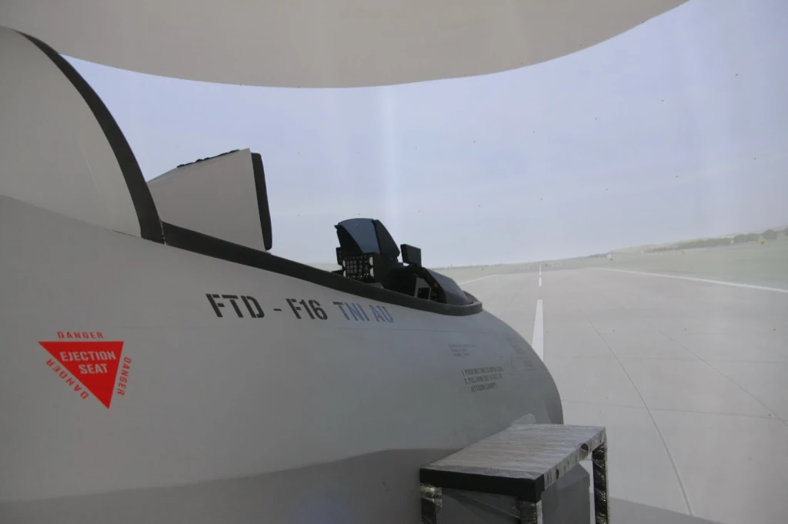

# F-16 Fighting Falcon Flight Training Device (FTD)

> **Role:** Subsystem Architecture Contributor (Core Foundations)  
> **Company:** PT. Technology & Engineering Simulation (T&E)  
> **Customer:** Indonesian Air Force (*Tentara Nasional Indonesia Angkatan Udara — TNI-AU*, Iswahjudi Air Force Base)  
> **Domain:** Supersonic Jet Fighter Simulation, Tactical Cockpit Integration, Subsystem Reuse  
> **Key Subsystems Utilized:** `libDIS` (IEEE 1278), `CommSystem` (Audio/Radio), `CodeGraph` (Integration Middleware)  

---

## 1. Project Context & Engineering Attribution

The **F-16 Fighting Falcon Flight Training Device (FTD)** represents one of Indonesia's premier military flight simulation assets, deployed at Iswahjudi Air Force Base (Lanud Iswahjudi, Madiun) to train frontline fighter pilots of the Indonesian Air Force.

In the spirit of rigorous engineering honesty: **I was not involved in the day-to-day routine development of the F-16 project.** The daily physical assembly, cockpit panel wiring, and flight dynamics tuning were handled by dedicated project teams.

However, the entire software and integration architecture of the F-16 simulator was built directly upon the **foundational platform engines and reusable subsystems that I had designed and built across our earlier simulation programs.**

---

## 2. Core Reusable Subsystem Foundations

By the time the F-16 program was under active development, our initiative to decouple simulator architectures and eliminate redundant engineering had taken full effect across PT. T&E Simulation. The F-16 FTD was powered by three critical architectural backbones:

### 1. Network Interoperability via `libDIS`
- The F-16 simulator was required to interoperate with Joint Tactical War Games and other ground/air units across military training exercises.
- Rather than licensing expensive proprietary runtimes or building custom network bridges, the F-16 simulator transmitted and ingested tactical entity states, weapons fire events, and radar lock PDUs using **`libDIS`**—the custom IEEE 1278 C++ protocol engine I had authored from scratch during the ACV-300 and STMR eras.

### 2. Tactical Soundscape & Radio via `CommSystem`
- Supersonic jet cockpits require rich, low-latency audio environments: from the screaming spool-up of the Pratt & Whitney / General Electric afterburning turbofan to cockpit warning claxons (Bitchin' Betty), stall audio cues, and UHF/VHF radio comms.
- The F-16 simulator utilized our in-house **`CommSystem`**, leveraging low-latency ASIO hardware pipelines, VST signal degradation for radio transmissions, and spatial 3D audio cues.

### 3. Subsystem Interconnects via `CodeGraph`
- Integrating the pilot's Hands-On Throttle-And-Stick (HOTAS) switches, circuit breaker panels, and warning annunciators with simulator mathematics was handled through **`CodeGraph`**, our standardized node-based integration protocol that bridged physical device I/O with simulation logic across the network.

---

## 3. Engineering Takeaway

The successful deployment of the F-16 FTD at Iswahjudi AFB was living proof of the platform strategy I championed at T&E: **build robust, decoupled, protocol-driven core engines once, and multiple defense programs—whether armored tanks, transport helicopters, or supersonic fighters—can be deployed with high reliability and zero architectural reinventing of the wheel.**

---

*Document Author: Uray Meiviar*  
*Repository: [`uraymeiviar/data/T&E/F16-FTD`](https://github.com/uraymeiviar/uraymeiviar/tree/main/data/T&E/F16-FTD)*
