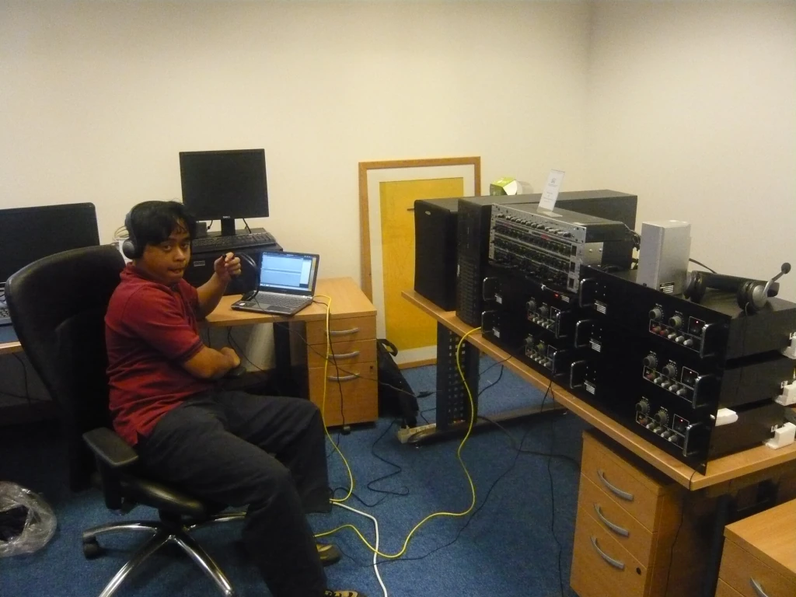
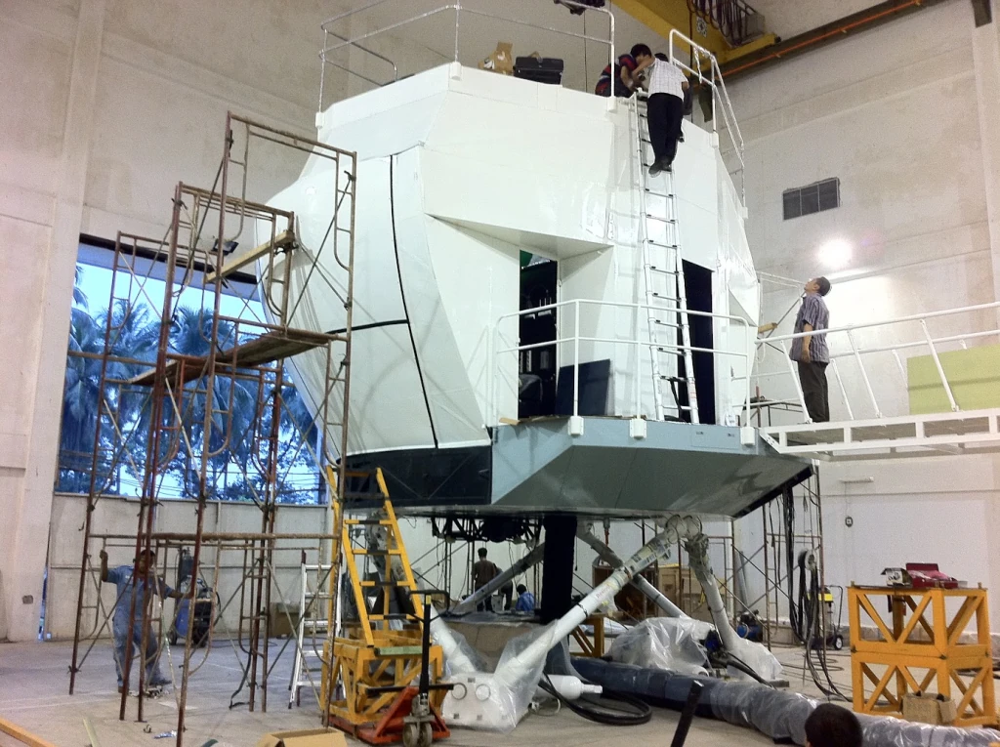

# NAS332 Super Puma Full Flight Simulator (FFS)

> **Role:** Lead Systems Integration & Flight Dynamics Engineer  
> **Company:** PT. Technology & Engineering Simulation (T&E)  
> **Customer:** Indonesian Air Force (*TNI Angkatan Udara*)  
> **Domain:** Full Flight Simulation (FFS Level D equivalent), 6-DOF Motion Systems, Rotorcraft Aerodynamics  
> **Tech Stack:** C++, Turbomeca Makila Turbine Governors, Blade Element Theory (BET), Hydraulic Hexapod Stewart Platform, CommSystem Audio, Multi-Channel Collimated Visuals  

---

## 1. The Clean-Sheet Aerospace Milestone

Following our successful modernization of legacy tactical trainers, PT. Technology & Engineering Simulation was contracted for our first clean-sheet, ground-up Level-D capable build: the **NAS332 Super Puma Helicopter Full Flight Simulator**.

The Eurocopter / Aérospatiale AS332 (locally designated NAS332 Super Puma, assembled by PT DI / IPTN) is a twin-engine, medium-lift tactical transport and VIP rotorcraft. Building a full-mission simulator for a twin-turbine helicopter required solving intricate physical interactions:
- Coupled rotor flapping, lead-lag dynamics, and gyroscopic precession.
- Twin Turbomeca Makila 1A1 turboshaft engines governed by hydromechanical / digital fuel controls (FADEC).
- Ground effect aerodynamics, vortex ring state (VRS), and dynamic autorotation landing profiles.
- An active **6-DOF motion system** (hydraulic Stewart platform) requiring sub-20ms sensory synchronization.

---

## 2. Motion Platform Dynamics & Vestibular Cueing

In a motion-based flight simulator, latency is life or death for pilot qualification. If the visual horizon, rotor vibration acoustics, instrument response, and physical motion platform diverge by more than **15 to 20 milliseconds**, the conflict between the visual system and vestibular system (*inner ear*) induces severe simulator sickness (*vestibular disorientation*).

### Vestibular Motion Washout Architecture
Because physical motion platform actuators have limited stroke travel (typically $\pm 0.5$ to $1.0$ meters), the simulator cannot continuously travel in the direction of flight. I engineered the data interface feeding our **motion washout filter pipeline**:
1. **High-Pass Acceleration Filtering (Onset Cues):** Delivers immediate physical onset kicks when the pilot commands cyclic inputs or collective pops.
2. **Low-Pass Sustained Tilt Coordination:** Subtly rolls or pitches the cabin below the pilot's vestibular detection threshold ($< 3^\circ/\text{s}$), aligning gravity with the simulated aerodynamic G-force vector to produce sustained acceleration sensations.
3. **Smooth Washout Reset:** Silently recenters the platform to neutral geometry during steady-state flight, resetting actuator stroke headroom for the next maneuver.

---

## 3. Cockpit Architecture & Subsystem Integration

- **Dual-Pilot Control Linkages:** Synchronized dual-pilot cyclic sticks, collective levers, and anti-torque pedals with active hydraulic/electric control loading simulating authentic aerodynamic breakout forces, friction clutches, and artificial feel trims.
- **Overhead Electrical & Fuel Panels:** Complete cockpit switchology faithfully reproducing the Super Puma's 28V DC and 115V AC 400Hz electrical distribution buses, fuel crossfeed valves, and fire suppression systems.
- **Tactical Audio Backbone (`CommSystem`):** Integrated our in-house `CommSystem` to simulate twin-turbine compressor whines, transmission gearbox gear-mesh whines, 4-blade main rotor blade slap, tail rotor high-frequency buzz, and tactical two-way radio channels.

---

*Document Author: Uray Meiviar*  
*Repository: [`uraymeiviar/data/T&E/NAS332`](https://github.com/uraymeiviar/uraymeiviar/tree/main/data/T&E/NAS332)*
