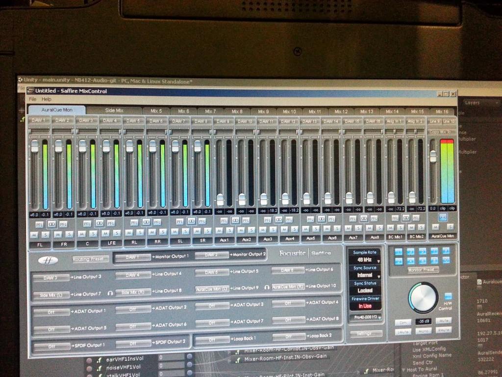

# Tactical Intercom, Radio & Audio Simulation Engine (`CommSystem`)

> **Role:** Lead Audio & Communications Architect  
> **Company:** PT. Technology & Engineering Simulation (T&E)  
> **Domain:** Real-Time VoIP, Tactical Radio Simulation, 3D Spatial Audio, Pro Audio Hardware Integration  
> **Tech Stack:** C++, OpenAL, VST Audio Chaining, ASIO Drivers, FireWire Pro Audio, UDP Multicast, CodeGraph  
> **Programs Deployed:** ACV-300, BO-105, BAe Hawk 209, STMR, F-16 FTD, KCI Commuter Train, SOYUT  

---

## 1. Genesis: The ACV-300 Tactical Radio Challenge

In military combat simulation, audio is not cosmetic background music: it is a mission-critical tactical sensor. A tank commander or fighter pilot relies on subtle sound cues—the directional roar of an approaching turbine, the acoustic resonance of a cannon breech loading, and above all, **tactical radio voice communications** over chaotic battlefield networks.

The project that birthed **`CommSystem`** was the **ACV-300 armored combat vehicle program** for the Malaysian Army. I needed to engineer a real-time radio communication system that allowed crew members (Driver, Gunner, Commander) to communicate over internal vehicle intercoms (*hot-mic*) and transmit over tactical military radio channels to other combat vehicles across the training network.

Rather than buying overpriced, proprietary commercial intercom boxes that required dedicated wiring harnesses, I decided to engineer a pure software-defined, networked communications engine from first principles.

---

## 2. Architectural Evolution of `CommSystem`

`CommSystem` evolved through distinct architectural phases as our simulation fidelity demands expanded:

### Phase 1: FFmpeg Encoding & UDP Multicast
- In its earliest iteration on ACV-300, the system captured microphone audio using standard Windows audio APIs, encoded raw PCM audio frames using **FFmpeg libraries**, and packetized the compressed bitstream into **UDP Multicast** packets.
- Multicast allowed any simulator node tuned to the same simulated radio frequency or intercom channel to receive and decode the audio with zero centralized server bottlenecks.

### Phase 2: Custom Low-Latency Codecs
- FFmpeg was versatile but carried buffer queuing and processing overhead unsuitable for sub-second, fast-paced tactical training.
- I replaced FFmpeg with a lightweight, **custom built-in encoder/decoder pipeline** specifically tuned for low-latency voice transmission, slashing frame packing overhead and eliminating buffer jitter.

### Phase 3: Beyond Voice — 3D Spatial Audio via OpenAL
- Tactical simulation required more than speech: it required physical acoustic realism.
- I integrated the **OpenAL (Open Audio Library)** 3D spatial audio API directly into `CommSystem`.
- By mapping 3D coordinate transforms from our flight and vehicle physics models (Doppler shifts, distance attenuation curves, and acoustic cone orientations), `CommSystem` dynamically positioned environmental sounds in full 3D space:
  - Turbine whine and rotor blade slap (BVI) dynamically shifting based on pilot head orientation.
  - Directional muzzle blasts, incoming artillery impacts, and ricochets.
  - Cockpit warning claxons sounding from their exact physical panel locations.

---

## 3. VST-Compatible Audio Chaining: Simulating RF Signal Degradation

One of the greatest technical achievements in `CommSystem` was making military radio communications sound like *real combat radios*, not crystal-clear telephone lines.

Real military VHF/UHF combat radios suffer from physical RF degradation: atmospheric noise, squelch cutouts, bandpass frequency truncation (300 Hz – 3,400 Hz voice band), harmonics, and cross-talk when multiple operators speak simultaneously.

To solve this mathematically:
- I implemented a **VST (Virtual Studio Technology) compatible audio plugin chaining architecture** directly into the real-time audio pipeline.
- Raw voice packets passing through the virtual radio channel were routed through a dynamically calculated DSP processing chain:
  1. **Bandpass Filtering:** Stripping low bass and high air frequencies to replicate narrow-band military radio transceivers.
  2. **Harmonic Saturation & Clipping:** Simulating amplifier overdrive and non-linear analog transmitter distortion.
  3. **White Noise Injection & Squelch Tail:** Injecting procedural static, carrier hiss, and that unmistakable electromagnetic "click-shhh" squelch burst when releasing the push-to-talk (PTT) switch.
  4. **Dynamic Line-of-Sight (LOS) Attenuation:** Cross-referencing terrain elevation databases: if a mountain ridge broke line-of-sight between two units, `CommSystem` automatically dropped the signal-to-noise ratio into static and silence.

---

## 4. Hardware Integration: ASIO & Studio-Grade Multi-Channel Interfaces

Consumer sound cards suffer from unpredictable Windows driver latency (often 50ms to 150ms) and poor multi-channel isolation. In multi-crew simulators (such as a two-pilot helicopter or three-man tank turret), every crew member requires independent microphone inputs and isolated headphone feeds.

I bypassed consumer audio pipelines entirely:
- Integrated **ASIO (Audio Stream Input/Output)** driver support, allowing `CommSystem` to communicate directly with hardware soundcard buffers with deterministic latencies under **5 milliseconds**.
- Deployed professional multi-channel hardware racks:
  - **Focusrite Saffire Pro 40** FireWire audio interfaces locked at 48 kHz internal clocking.
  - **M-Audio Fast Track Ultra 8R** multi-channel preamplifiers.
  - **Behringer Multicom & Composer Pro-XL** hardware audio compressors, noise gates, and headphone distribution amplifiers.
- This allowed a single audio workstation to drive multiple crew stations simultaneously: routing pilot, copilot, gunner, and observer channels with complete acoustic isolation and hardware-level push-to-talk (PTT) triggering.

---

## 5. Ubiquitous Platform Deployment

Because `CommSystem` was architected as a modular, decoupled engine, it became the ubiquitous tactical audio and intercom backbone across PT. T&E Simulation's entire product portfolio:
- **ACV-300:** Multi-crew combat vehicle intercom and tactical combat radio.
- **BO-105 & NAS332 Super Puma:** Dual-pilot cockpit hot-mics, air-traffic control (ATC) radio, turbine acoustics, and rotor blade slap.
- **BAe Hawk 209 & F-16 FTD:** High-speed jet turbofan acoustics, cockpit claxons, and tactical radio.
- **Project STMR:** 3-crew tank intercom, tank-to-tank tactical platoon radio, and heavy diesel engine / 90mm cannon audio.
- **KCI Commuter Train:** Train cab radio, passenger public address (PA) system, and track noise.
- **Project SOYUT:** National strategic war game command communications linking generals across theater command kiosks.

`CommSystem` demonstrated that software-defined DSP and commodity pro-audio hardware could completely replace hundred-thousand-dollar military intercom hardware while delivering superior acoustic fidelity.

---

*Document Author: Uray Meiviar*  
*Repository: [`uraymeiviar/data/T&E/commSystem`](https://github.com/uraymeiviar/uraymeiviar/tree/main/data/T&E/commSystem)*
