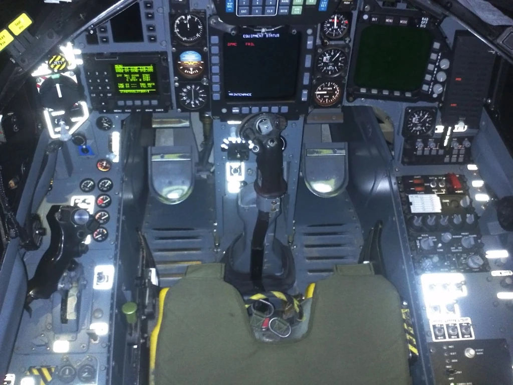
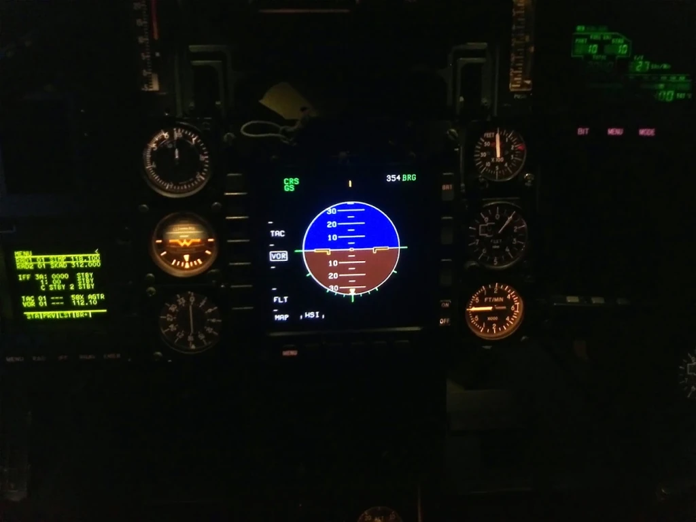

# BAe Hawk 209 Combat Trainer Simulator

> **Role:** Systems & Avionics Simulation Engineer (Audio, Comms & MPD Display)  
> **Company:** PT. Technology & Engineering Simulation (T&E)  
> **Customer:** Indonesian Air Force (*Tentara Nasional Indonesia Angkatan Udara — TNI-AU*)  
> **Domain:** Fast-Jet Combat Training, Multi-Purpose Displays (MPD), Tactical Audio & Comms  
> **Tech Stack:** C++, OpenGL, CommSystem, CodeGraph, Military Avionics Symbology, ASIO  

---

## 1. Project Context & Engineering Role

The **BAe Hawk 209** is a single-seat, lightweight multirole combat fighter operated by the Indonesian Air Force for advanced pilot training, air defense, and ground attack. 

At PT. T&E Simulation, the Hawk 209 and BO-105 programs were flagship "senior-owned" contracts led by veteran aerospace directors formerly of IPTN/DI. As a member of the engineering team, I operated as a dedicated systems engineer focusing squarely on core subsystem responsibilities:
- **Cockpit Audio Simulation:** Modeling the soundscape of the Rolls-Royce Turbomeca Adour Mk 871 turbofan, cockpit environmental systems, landing gear mechanical deployment sounds, stall warnings, and aerodynamic airflow buffeting.
- **Tactical Radio & Intercom (`CommSystem`):** Integrating military UHF/VHF radio transmission channels, simulated push-to-talk (PTT) flight stick switches, and line-of-sight signal attenuation.
- **Multi-Purpose Display (MPD) Avionics:** Programming real-time vector symbology and pages for the digital MPD cathode-ray/liquid-crystal displays in the cockpit.

---

## 2. Multi-Purpose Display (MPD) Architecture

The Hawk 209 cockpit features a multi-function head-down display (MPD) that pilots rely on for tactical situational awareness, navigation, and weapon delivery.

### Display Symbology & Real-Time Rendering
Using C++ and low-level OpenGL vector drawing:
- I implemented the **tactical navigation and horizontal situation displays (HSI)**, rendering real-time waypoints, flight plan route legs, TACAN/VOR navigation beacons, and wind direction vectors.
- I programmed the **weapon management and inventory pages**, reflecting the status of underwing stores, AIM-9 Sidewinder missile lock cues, rocket pods, gun pod rounds, and bomb drop sequences.
- I mapped the physical **Bezel Buttons (Softkeys)** surrounding the physical MPD screen to trigger mode transitions between NAV, A/A (Air-to-Air), and A/G (Air-to-Ground) master display modes.

---

## 3. Subsystem Integration & Legacy

Working within a senior-led aerospace hierarchy gave me invaluable exposure to strict military simulator validation standards:
- Verifying latency constraints between stick switch actuation and audio/display response (maintaining sub-50ms glass-to-glass latency).
- Providing the foundational testing grounds for **`CommSystem`**, validating that our tactical audio pipeline could simulate authentic military radio clipping and squelch without taxing simulator CPU cycles.

The lessons learned on Hawk 209 directly accelerated my later leadership on **Project STMR** and **SOYUT**, proving how modular cockpit software components can be reused across vastly different combat domains.

---

*Document Author: Uray Meiviar*  
*Repository: [`uraymeiviar/data/T&E/hawk`](https://github.com/uraymeiviar/uraymeiviar/tree/main/data/T&E/hawk)*
