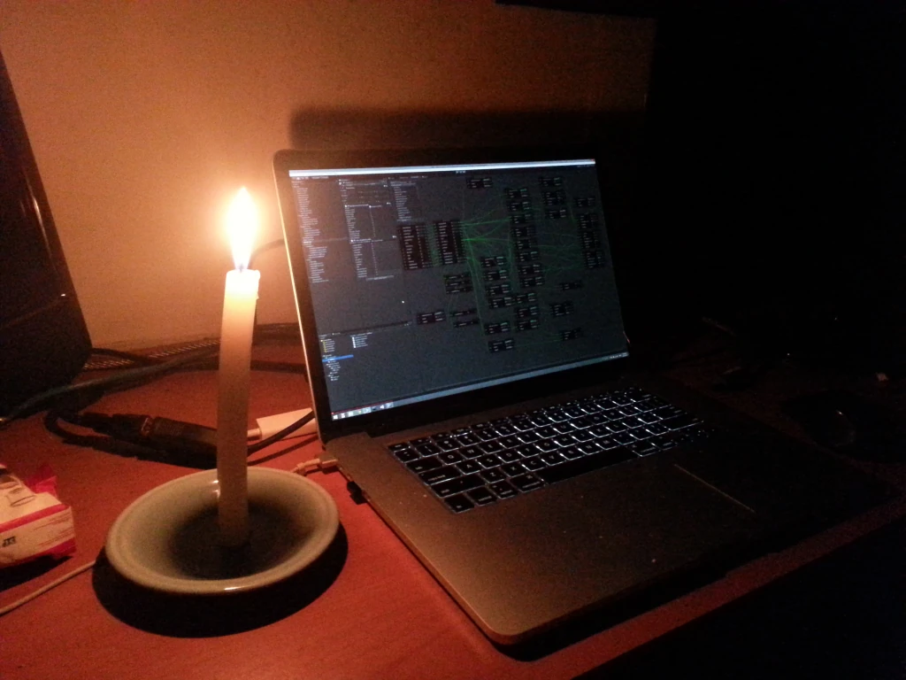
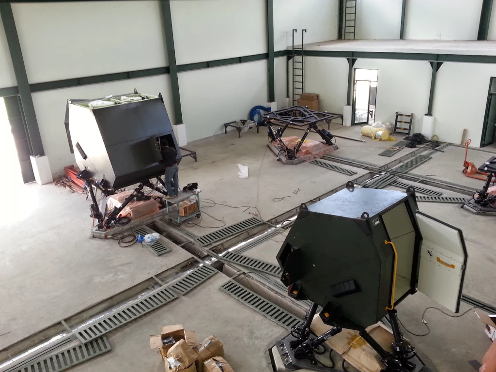

# STMR — Simulator Taktis Multi Ranpur (Armored Cavalry Tactical Simulator)

> **Role:** Lead Distributed Systems & Electronics Architect  
> **Customer:** Indonesian Army Cavalry Corps (*Pusat Kesenjataan Kavaleri / Pussenkav TNI AD*)  
> **Company:** PT. Technology & Engineering Simulation (T&E)  
> **Domain:** Heavy Armored Vehicle Simulation, Platoon Gunnery, Hardware Decoupling, Motion Systems  
> **Tech Stack:** C++, IEEE 1278 DIS, COTS Microcontrollers (Arduino/AVR SoCs), Ethernet UDP/IP Protocol, CommSystem Audio, Hydraulic/Electric Motion Base  

---


## 1. The Generational Shift: Dismantling Aerospace Over-Engineering

Historically, simulation engineering at PT. T&E Simulation was dominated by senior aerospace engineers who had transitioned from Indonesia's state aerospace manufacturer (*IPTN / PT Dirgantara Indonesia*). These engineers built ground vehicle simulators the only way they knew: as if they were certifying an airliner.
- Thick, heavy wiring bundles with hundreds of copper conductors routed to analog signal-conditioning boxes.
- Massive banks of mechanical relays, custom discrete PCBs, and high-voltage DC rails.
- High point-to-point failure rates and brittle field maintenance.

When our company was awarded the **STMR** contract to simulate the multi-type armored fighting vehicle fleet of the Indonesian Army Cavalry Corps (*Pussenkav*—operating the British **Alvis FV101 Scorpion 90**, the French **AMX-13**, and wheeled armored personnel carriers), our next-generation software team took complete ownership of the electrical and systems architecture.

I disarmed senior resistance with a single pragmatic argument: *"Well, it's a tank anyway, not an aircraft."*

---

## 2. Architectural Mandates: Complete Ethernet Decoupling

Drawing on lessons from my 330 kVA computing lab—where COTS single-board computers (SBCs) and microcontrollers reliably automated and monitored massive electrical infrastructure 24/7/365—I established three non-negotiable architectural mandates:

1. **Zero Analog Signals Across Cabin Boundaries:** All analog-to-digital conversions (ADCs) occurred locally inside the vehicle cabin. No raw analog potentiometer lines or raw voltage rails crossed outside the hull.
2. **100% IP/Ethernet Data Transmission:** All telemetry, steering inputs, gunner yoke voltages, and turret encoders were serialized into lightweight digital packets transmitted over standard Ethernet cabling.
3. **Zero Custom Discrete PCBs:** Eliminated costly, time-consuming custom circuit board manufacturing in favor of standard, Commercial-Off-The-Shelf (COTS) microcontrollers and industrial bus multiplexers.



```
[ Traditional Aerospace Architecture ]
Cockpit Switches ---> [Analog Harness] ---> [Signal Conditioners] ---> [Relay Banks] ---> [Server A/D Cards]
(Hundreds of heavy analog wires, brittle connectors, high latency, fixed spatial distance)

[ My IP-Decoupled Architecture ]
Cockpit Switches ---> [COTS Microcontrollers] ---> [Local Switch] ======= SINGLE CAT6 CABLE =======> [Simulation Host]
                                                                        (Pure Digital Packets)
```

---

## 3. The Hot-Swappable Cabin Innovation

The Army required training across multiple armored vehicles, but budget realities prevented purchasing separate multi-million dollar motion bases for each vehicle variant.

Because the entire cabin was fully decoupled over a single standard Ethernet cable, I architected a breakthrough solution:
- **A Single Shared Motion Base:** One high-performance motion base platform remained fixed on the facility floor.
- **Unboltable, Hot-Swappable Cabins:** The vehicle cabins (Scorpion 90, AMX-13, APC) were fabricated as standalone modules that could be unbolted and swapped via an overhead gantry crane.
- **Auto-Configuring Network Endpoint:** When a new cabin was bolted on and the single Cat6 Ethernet cable plugged in, the simulation host detected the cabin's hardware handshake and automatically reconfigured the vehicle dynamics, visual perspective, weapon ballistics, and tactical radio profiles.



---

## 4. Key Subsystem Capabilities

- **Synchronized Multi-Crew Stations:** Realistic driver, gunner, and vehicle commander stations with authentic periscopes, optical day/night gun sights, and recoil kickback effects.
- **Networked Platoon Tactical Operations:** Multiple vehicle simulators connected via **`libDIS` (IEEE 1278)** to conduct coordinated multi-tank tactical maneuvers, line-of-sight targeting, and combined-arms fire missions in shared virtual environments.
- **Tactical Audio (`CommSystem`):** Simulated intercom loops, atmospheric RF static, engine diesel rumble, turret traverse motor whine, and 90mm cannon acoustic blast impulses.

---

*Document Author: Uray Meiviar*  
*Repository: [`uraymeiviar/data/T&E/stmr`](https://github.com/uraymeiviar/uraymeiviar/tree/main/data/T&E/stmr)*
