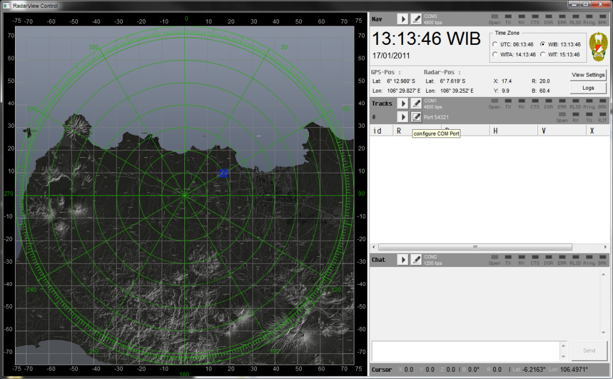

# TDR RadarView: Legacy Military Radar Telemetry Acquisition & TCP Relay

**Architect & Engineer:** Uray Meiviar  
**Role:** Systems & Telemetry Engineer  
**Company:** PT. Technology & Engineering Simulation (T&E)  
**Period:** 2010 – 2011  
**Domain:** Radar Systems Engineering, Serial Telemetry (RS-232), Network Protocols (TCP/IP), Real-Time PPI Display, Defense Hardware Retrofitting  
**Core Technologies:** C/C++, Win32 Asynchronous Serial API, Multi-threaded Socket Networking, Polar-to-Cartesian Coordinate Math, Plan Position Indicator (PPI) Graphics, Topographic Geospatial Mapping  

---

## Executive Summary

Military radar installations represent enormous capital investments. While mechanical antenna pedestals, heavy gearboxes, microwave wave guides, and high-frequency RF transceivers can remain physically sound for decades, their dedicated receiver computers and display consoles frequently suffer irrecoverable hardware failure. When proprietary computing boards, CRT driver units, or discrete microprocessors from decades past fail, replacement parts are often impossible to procure.

During an air defense modernization initiative, an operational military radar unit was rendered unusable because its original processing computer had suffered permanent hardware failure, leaving the functional antenna pedestal stranded without a digital interface.

To restore operational capability without multi-million-dollar hardware replacement, I engineered **`RadarView Control`**—a standalone telemetry acquisition and bridge system. By tapping directly into the raw RS-232 serial datastream output by the radar pedestal electronics, `RadarView` reverse-engineered and decoded the raw target tracking data, rendered an intuitive Plan Position Indicator (PPI) radar display over georeferenced satellite terrain, and served as a high-speed network gateway streaming target telemetry over TCP (Port 54321) to upstream command and fire-control systems.

---

## 1. System Architecture & Telemetry Bridge Pipeline

```
=============================================================================
                    TDR RADAR TELEMETRY BRIDGE PIPELINE
=============================================================================
  [ Operational Military Radar Antenna & Pedestal ]
                        │
                        ▼ (Raw RS-232 Serial Datastream @ 4800 bps)
      ┌─────────────────┴─────────────────┐
      │  COM1: Track Telemetry Stream     │ (4800 bps)
      │  COM2: Tactical Radio/Chat Link   │ (1200 bps)
      │  COM3: GPS & Navigation Sync      │ (4800 bps)
      └─────────────────┬─────────────────┘
                        │
                        ▼
  [ RadarView Control: Win32 Multi-Threaded Engine ]
   ├── Asynchronous Serial Engine (OVERLAPPED I/O & Event Loops)
   ├── Hardware Handshake Watchdog (CTS / DSR / RLSD Line Status)
   ├── Datagram Parser & Cyclic Checksum Verification
   ├── Coordinate Solver: Polar (R, B) -> Cartesian (X, Y) -> WGS-84 Lat/Lon
   │                    │
   ▼                    ▼
[ Real-Time Display ]   [ Upstream Network Bridge ]
 - 360° PPI Polar Grid   - Multi-Threaded TCP Server (Port 54321)
 - Topographic Terrain   - Real-Time Target Track Datagrams
 - Target Reticles [X]   - Streamed to C4I, Fire Control, & Simulators
=============================================================================
```

---

## 2. Core Engineering Innovations

### Multi-Port Asynchronous Serial Acquisition
The application was built directly on the Win32 communication API (`CreateFile`, `SetCommState`, `WaitCommEvent`, and `OVERLAPPED` I/O) to service multiple concurrent serial channels without blocking the graphical interface:
- **`COM1` (4800 bps — Target Tracks):** Ingested the continuous binary packet stream from the radar pedestal, decoding track IDs, target range ($R$ in kilometers), azimuth/bearing ($B$ in degrees), altitude/heading ($H$), and velocity ($V$).
- **`COM2` (1200 bps — Tactical Chat):** Provided a low-bandwidth tactical communication link operating over tactical serial modems or combat net radios, allowing operators to send and receive text directives.
- **`COM3` (4800 bps — Navigation/GPS Sync):** Polled external GPS telemetry (`Lat: 6° 12.980' S, Lon: 106° 29.827' E`) to dynamically calibrate the radar's exact origin location.
- **Hardware Line Diagnostics:** Monitored physical RS-232 handshake lines in real time (CTS, DSR, ERR, RLSD, Ring, BRK) with visual LED indicators, instantly diagnosing disconnected cables or line noise.



---

### Plan Position Indicator (PPI) Scope & Geospatial Math
The operator display featured a 360° Plan Position Indicator (PPI) radar screen overlaying a high-resolution topographic and coastline map:
- **Polar to Cartesian Conversion:** Transformed polar target coordinates $(R, B)$ into Cartesian coordinates relative to radar origin:
  $$X = R \cdot \sin(B)$$
  $$Y = R \cdot \cos(B)$$
- **Concentric Range Rings & Degree Markings:** Rendered clear 10 km range increments spanning up to a 75 km radius, with azimuth ticks from 0° to 360°.
- **Dynamic Crosshair Cursor:** Displayed continuous mouse cursor readouts showing Cartesian distance $(X, Y, Z)$, bearing, range, and instantaneous geodetic coordinates (Latitude / Longitude).

---

### TCP/IP Upstream Network Bridge (Port 54321)
Rather than locking the radar data inside a closed desktop console, `RadarView` acted as an open distributed gateway:
- Hosted an internal multi-threaded TCP server listening on **Port 54321**.
- Broadcasted parsed target tracking vectors in clean digital datagrams to any connected upstream client over the local network.
- Allowed upstream military command centers, artillery fire-control systems, or distributed simulation platforms (such as our SOYUT war game network) to consume live radar feeds without needing direct physical access to the serial bus.

---

## 3. Impact & Significance

- **Mission Recovery:** Brought a grounded, multi-million-dollar defense radar system back to full operational readiness by replacing an obsolete, failed computer with lightweight, modern software.
- **Protocol Decoupling:** Converted legacy, proprietary serial datastreams into standard TCP/IP network packets, extending the service life of defense hardware and enabling integration with modern C4I infrastructure.
