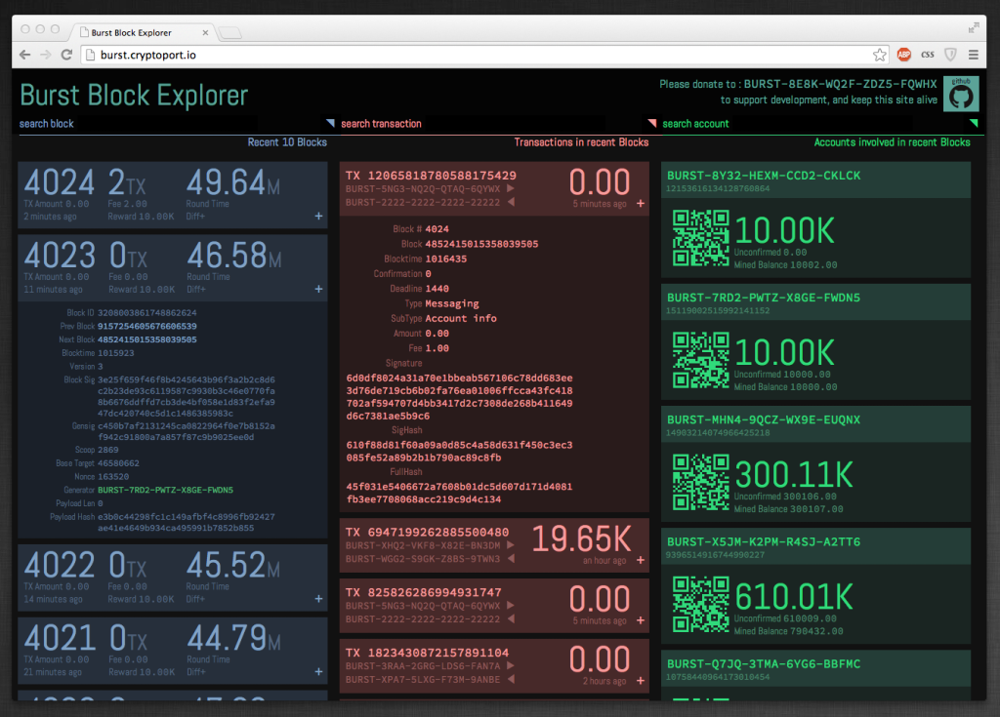
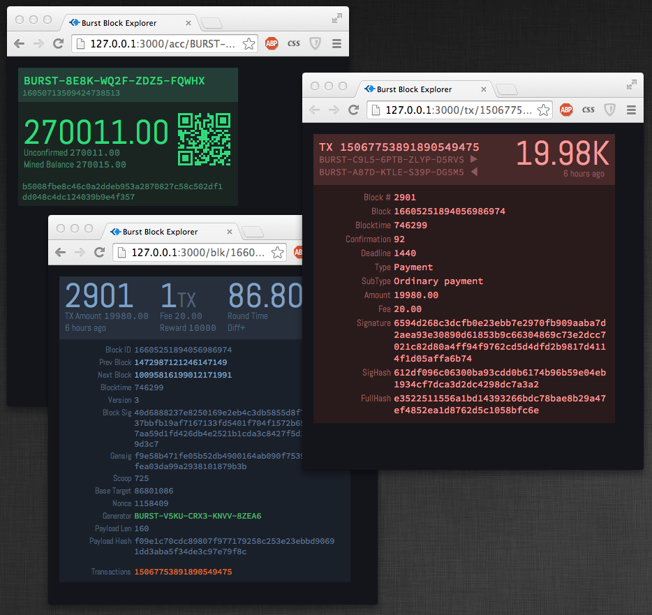

# Burstcoin Blockchain Explorer: Real-Time Telemetry & On-Chain Asset Indexing

**Architect & Engineer:** Uray Meiviar  
**Role:** Full-Stack Blockchain Engineer & Cloud Architect  
**Period:** 2014 – 2016  
**Domain:** Blockchain Telemetry, Real-Time Distributed Systems, Proof-of-Capacity (PoC), High-Availability Web Services  
**Core Technologies:** Node.js, JavaScript, WebSocket, Redis, Shabal-256, Nginx, AWS EC2, Google Cloud Platform (GCP)

---

## Executive Summary

When the **Burstcoin** blockchain pioneered **Proof-of-Capacity (PoC)** consensus in 2014, navigating the network required specialized tooling that standard Bitcoin or Ethereum block explorers could not provide. PoC blocks were not forged through brute-force hashing cycles; rather, they were generated by reading pre-calculated cryptographic plot nonces to determine mathematical forging **deadlines**.

To provide the global cryptocurrency ecosystem with transparent, real-time visibility into this new consensus paradigm, I engineered the **Burstcoin Blockchain Explorer** (`burst.cryptoport.io`). 

Built on an asynchronous Node.js stack with an in-memory caching pipeline, the platform continuously polled the core Burst daemon RPC socket, deserialized 256-bit Shabal-hash payloads, decoded on-chain decentralized exchange (DEX) transactions, and visualized global network plot capacity in real time.

---

## 1. Proof-of-Capacity Telemetry & Architecture

```
=============================================================================
             BURST EXPLORER INGESTION & TELEMETRY PIPELINE
=============================================================================
  [ Burst P2P Node / Daemon ] (JSON-RPC Socket / Loopback API)
               │
               ▼
  [ Node.js Ingestion Engine ]
   ├── Binary Payload Deserializer (Scoop Index, Nonce, Base Target, Gensig)
   ├── Transaction Parser (Ordinary Payments, Messaging, Asset Transfers, DEX)
   └── Account Ledger Aggregator (Unconfirmed & Mined Balances)
               │
               ▼
  [ Redis In-Memory State Cache ] ──> Fast Key-Value Queries (<2ms lookup)
               │
               ▼
  [ High-Throughput REST & WebSocket Server ] (Node.js + Nginx Reverse Proxy)
               │
               ▼
  [ Reactive Single-Page Interface ]
   ├── Live 3-Column Stream: Recent Blocks | Recent Transactions | Active Accounts
   ├── Macro Statistics: Difficulty, Generation Times, Wealth Distribution Curves
   └── Entity Inspectors: Deep Block Inspector, Transaction Hashes, QR Address Balances
=============================================================================
```

Unlike traditional explorers that only track transaction outputs, the Burstcoin explorer had to expose unique consensus-critical parameters for every forged block:
- **Base Target & Nonce:** The dynamic difficulty metric representing the target ceiling and the specific disk nonce that yielded the winning scoop.
- **Generation Signature (Gensig):** The 256-bit cryptographic seed generated from the previous block signature and generator account ID using the Shabal-256 hash.
- **Scoop Pointer:** The specific 64-byte segment (out of 4,096 scoops per nonce) evaluated for the round.
- **Block Deadline:** The computed time differential (in seconds) indicating when the winning miner was permitted to forge the candidate block.



---

## 2. Core Functional Capabilities

### 2.1 Three-Column Real-Time Stream
The primary explorer interface (`burst.cryptoport.io`) featured an interactive three-column live dashboard:
1. **Recent Blocks:** Live cards showing Block ID, transaction count, block generation round time, difficulty modifier (`Diff+`), and generator account with full payload signatures.
2. **Transactions in Recent Blocks:** Real-time decoding of ordinary payments, multi-out transfers, encrypted messages, account metadata updates, and decentralized asset trades.
3. **Accounts Involved:** Real-time extraction of sender/receiver addresses, dynamically rendering QR codes, unconfirmed balances, and lifetime mined totals.

### 2.2 Macro-Telemetry & Network Analytics
At `burst.cryptoport.io/stat`, the explorer rendered comprehensive macro-economic and network health visualizations:
- **Block Difficulty Trends:** Hourly moving averages of base target difficulty, illustrating changes in global storage capacity committed to the network.
- **Block Generation Time Distribution:** Frequency histogram of block intervals, verifying whether the network was adhering to its target ~4-minute Poisson distribution.
- **Transaction & Funds Velocity:** Hourly metrics of funds in circulation, transaction volume, and fee consumption.
- **Wealth Distribution Curves:** Mathematical breakdown of address tiers, separating solo miners, pool accumulation addresses, and exchange custody cold storage.
- **Top 100 Leaderboards:** Ranked tables tracking blocks mined, transaction velocity, and circulating token concentration.


### 2.3 Deep Entity Inspectors
Users could inspect any entity on the ledger with zero latency:
- **Block Inspector (`/blk/:id`):** Exhaustive technical readouts of previous/next block hashes, generation signature, scoop index, base target, payload length, and generator address.
- **Transaction Inspector (`/tx/:id`):** Cryptographic verification displaying the 64-byte Ed25519/Curve25519 signature, signature hash (`SigHash`), full transaction hash (`FullHash`), fee, and payment recipient.
- **Account Inspector (`/acc/:address`):** Dedicated account dossiers showing QR codes, public keys, confirmed balances, unconfirmed mempool delta, and historical transaction logs.



---

## 3. High-Availability Cloud Deployment

When public traffic surged alongside the rapid expansion of the Burstcoin network, running the explorer on local infrastructure became untenable due to residential bandwidth limits and international latency bottlenecks.

I transitioned the explorer to enterprise cloud infrastructure across **AWS** and **Google Cloud Platform**:
- **Reverse Proxy & TLS:** Fronted with Nginx caching static assets and terminating SSL/TLS certificates.
- **In-Memory Caching:** Redis cached historical blocks, transaction queries, and pre-rendered account summaries, reducing database hits to the local daemon RPC by over 92%.
- **High Concurrency:** Node.js event-driven non-blocking I/O effortlessly supported thousands of concurrent API requests from miners, exchanges, and third-party tools.
- **Global Availability:** Integrated with Cloudflare CDN and latency-based DNS routing to deliver sub-50ms explorer response times to users across North America, Europe, and Asia.

---

## 4. Key Takeaways & Impact

- **Consensus Transparency:** Provided the first public, graphical window into Proof-of-Capacity storage consensus, making complex nonce and scoop dynamics intuitive for the global community.
- **High-Throughput State Indexing:** Engineered an asynchronous ingestion pipeline capable of indexing high transaction throughput and maintaining real-time reactive WebSockets under heavy traffic spikes.
- **Foundation for Web3 Infrastructure:** Pioneered decentralized ledger visualization techniques that established the foundation for my subsequent cloud and cryptocurrency infrastructure projects.
