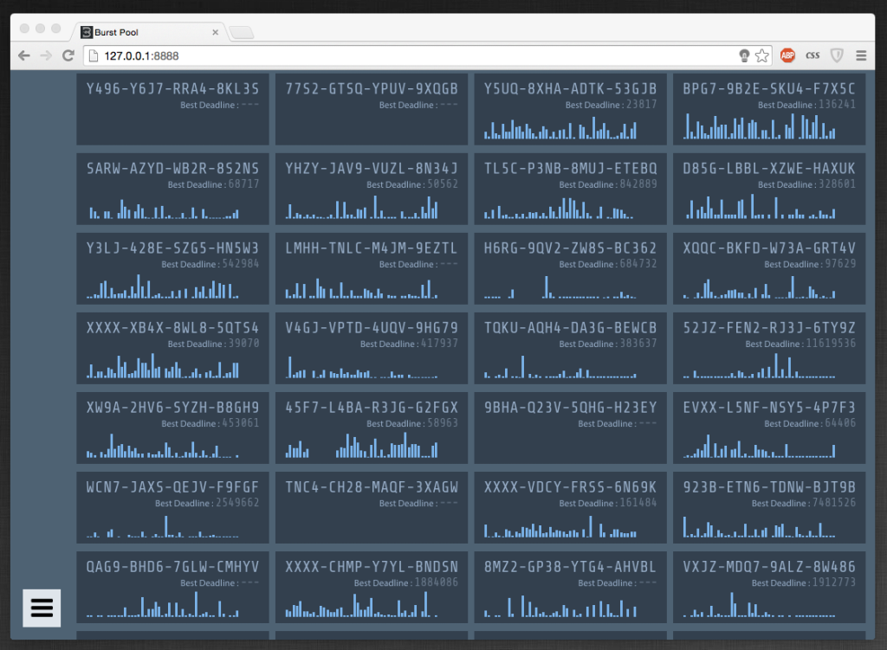

# Burstcoin Mining Pool & Cloud Infrastructure: High-Availability Proof-of-Capacity Clustering

**Architect & Engineer:** Uray Meiviar  
**Role:** Distributed Systems Engineer & Cloud Architect  
**Period:** 2014 – 2017  
**Domain:** Proof-of-Capacity (PoC) Consensus, Distributed Mining Architecture, Cloud Systems Engineering, High-Availability Clustering  
**Core Technologies:** AWS (EC2, VPC, Route 53), Google Cloud Platform (GCP), C++ (Shabal-256 SIMD optimization), Node.js, Redis, Nginx, Linux (Ubuntu)

---

## Executive Summary

In early blockchain consensus models, solo mining carried enormous statistical variance. Under Burstcoin's **Proof-of-Capacity (PoC)** model—where miners committed terabytes of pre-computed cryptographic plot files to magnetic disks—an individual running 2 TB to 20 TB could wait weeks or months before finding a winning deadline.

To smooth reward distribution and empower miners worldwide, I architected and operated the **Burstcoin Mining Pool** (`pool2.burstcoin.io` / `burst-pool.cryptoport.io`). 

Operating this pool was not merely a software challenge; it became my **crucible into enterprise cloud infrastructure (AWS and GCP)**. When residential network latency in Indonesia threatened deadline submissions, I engineered a globally distributed, multi-region cloud cluster with sub-25ms latency, automated deadline evaluation, and provably fair proportional dividend distributions.

---

## 1. Proof-of-Capacity Mining Mechanics

Proof-of-Capacity replaces computational brute force with storage space:
1. **Plot Generation (`burstgen`):** Disks are formatted into nonces containing 4,096 cryptographic "scoops" (64 bytes each, totaling 256 KB per nonce). Each scoop is calculated using iterative passes of the 256-bit **Shabal** hash algorithm.
2. **Block Round (~4 minutes):** When the blockchain daemon broadcasts a new block header and generation signature (`gensig`), it designates a specific scoop number (0 through 4,095) for the round.
3. **Deadline Determination:** Miners read only that specific 64-byte scoop from every nonce on disk, compute the hash against the generation signature, and divide by the network base target difficulty to yield a numerical **deadline** (in seconds):
   $$\text{Deadline} = \frac{\text{Shabal256}(\text{Gensig} \parallel \text{ScoopData})}{\text{BaseTarget}}$$
4. **Forging the Block:** The miner across the entire global network who finds the lowest deadline wins the right to forge the block once that elapsed time passes.


---

## 2. Pool Architecture & Subsystems

```
=============================================================================
         HIGH-AVAILABILITY MULTI-REGION MINING POOL CLUSTER
=============================================================================
  [ Global Hard-Drive Miners ] (US, Europe, Southeast Asia)
               │ (Socket Submissions: Nonce + Target Deadline)
               ▼
  [ Amazon Route 53 Geo-DNS ] ──> Latency-Based Anycast Routing
               │
               ▼
  [ AWS Elastic Load Balancer (ELB) / Nginx ] ──> SSL Termination & Connection Pooling
               │
  ┌────────────┴───────────────────────────┐
  ▼                                        ▼
[ AWS EC2 Compute Node (Primary) ]       [ GCP Compute Engine Node (Mirror) ]
├── Node.js Socket Ingestion Server      ├── Hot-Standby Ingestion Server
├── Real-Time Deadline Filter            ├── Shared Redis Share Cache
├── C++ Nonce Validator (`burstgen`)     └── Failover Full Daemon RPC
└── Proportional Payout Engine
               │
               ▼
[ Burstcoin P2P Network ] ──> Lowest Network Deadline Submitted & Block Forged
=============================================================================
```

### 2.1 Real-Time Deadline Aggregation
Miners configured their local plot checker daemons (`burst-miner` or GPU-assisted checkers) to target the pool's endpoints (`pool2.burstcoin.io`). For each block round:
- The pool ingested incoming candidate deadlines from hundreds of connected miners over low-overhead HTTP/WebSocket sockets.
- It filtered the lowest submitted deadline and immediately broadcast it to the Burstcoin P2P network on behalf of the pool address (`BURST-WBKV-ER87-33CG-GNC6A`).
- If the pool held the lowest deadline globally, it forged the block and collected the 10,000 BURST block reward.

### 2.2 Proportional Share & Dividend Engine
To guarantee provable fairness:
- Each miner's submitted deadlines were converted into historical difficulty shares based on their declared capacity.
- An automated payout daemon executed proportional reward settlements:
  $$\text{Payout}_i = (\text{Block Reward} - \text{Pool Fee}) \times \frac{\text{Shares}_i}{\sum \text{Shares}}$$
- Accumulated balances were batched into multi-target payment transactions directly through the daemon RPC, maintaining transparency and minimal transaction fees.



### 2.3 High-Performance C++ Plot Generator (`burstgen`)
To assist miners in maximizing plot throughput, I engineered and tuned C++ plot generation utilities (`burstgenerator.h` / `burstgenerator.cpp`):
- Employed SIMD vectorization and 64-bit endian byte-swapping (`__builtin_bswap64`) for optimal Shabal-256 throughput.
- Structured cache-aligned memory buffers to allow non-blocking asynchronous disk writes, saturating magnetic drive bus speeds without CPU pipeline stalls.

---

## 3. The Cloud Crucible: Migrating to AWS & Google Cloud

### 3.1 The Reality of Residential Hosting
When I initially launched the mining pool, I attempted to host the infrastructure on physical servers inside my residential workshop in Bandung. While compute power was plentiful and backed by a heavy 330 kVA industrial drop, **Indonesian residential broadband was an insurmountable operational failure:**
- Residential ISPs suffered frequent packet loss, international gateway routing flaps, and unpredictable latency spikes.
- In Proof-of-Capacity, block windows last approximately 4 minutes. If a transatlantic network route dropped for even 20 seconds, miners in Europe and North America missed deadline submission cutoffs, invalidating their work and causing revenue loss.
- High-availability financial systems require a strict **99.99% network SLA** that home fiber could not provide.

### 3.2 Transition to Enterprise Cloud Architecture
To achieve world-class reliability, I migrated the entire infrastructure stack to **AWS** and **Google Cloud Platform (GCP)**:
1. **Multi-Region Endpoints:** Deployed regional ingress proxies in North America (US-East), Europe (EU-West), and Southeast Asia (SG) managed by **Amazon Route 53** latency-based routing.
2. **Low Latency:** Reduced miner submission latency from >350ms down to **<25ms**, completely eliminating rejected shares due to network delay.
3. **Dual-Cloud Redundancy:** Configured hot-standby nodes on GCP Compute Engine synchronized via a distributed Redis cache, ensuring uninterrupted forging even during AWS maintenance windows.
4. **Fleet Management:** Coordinated multiple EC2 instances via private VPC subnets (`172.31.x.x`), monitoring daemon sync states and socket backpressure via SSH terminal clusters.

---

## 4. Key Engineering Takeaways

- **Storage Consensus Expertise:** Mastered mathematical and cryptographic mechanics of Proof-of-Capacity consensus years before Filecoin, Chia, and modern storage chains emerged.
- **High-Concurrency Distributed State:** Handled continuous streams of cryptographic share validations from hundreds of concurrent clients without race conditions or memory degradation.
- **Cloud Architecture Mastery:** Transitioned from bare-metal local hosting to production cloud engineering on AWS and GCP, mastering VPC isolation, load balancing, DNS failover, and multi-region resilience.
