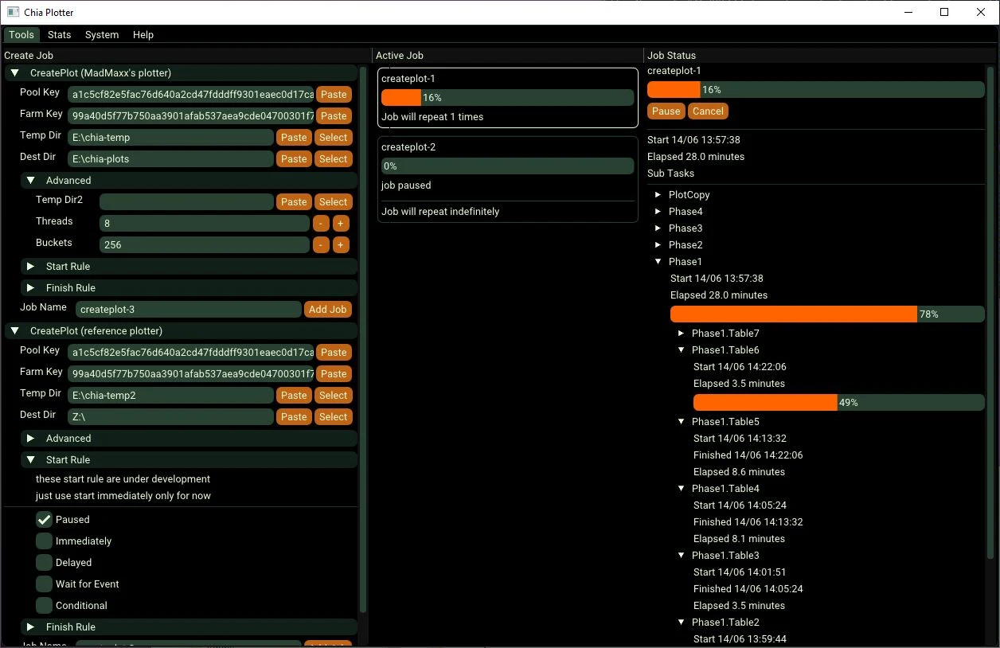
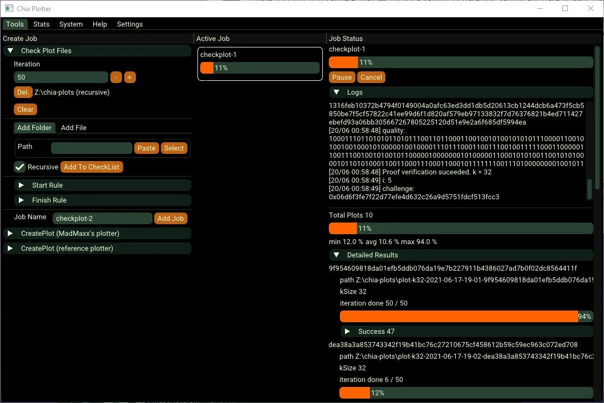

# chiagen: Standalone Chia Generator & Event-Driven Plot Manager

**Architect & Engineer:** Uray Meiviar  
**Role:** Systems Programmer & Performance Engineer  
**Period:** 2021  
**Domain:** Systems Programming, High-Performance Computing, Proof-of-Space Cryptography, Concurrency & Thread Scheduling  
**Core Technologies:** C/C++17, Chia Network Proof-of-Space (`chiapos`), `madMAx43v3r` Engine, Dear ImGui, Win32 API & POSIX Threads, RapidJSON, Hardware Telemetry Samplers (CPU Kernel/User, RAM, Disk I/O)  
**Repository:** [github.com/uraymeiviar/chiagen](https://github.com/uraymeiviar/chiagen)

---

## Executive Summary

During the explosive rise of the **Chia Network** in 2021, cryptocurrency farming shifted from energy-intensive Proof-of-Work (PoW) computation toward **Proof-of-Space and Time (PoST)**. In Chia, network consensus relies on allocating pre-calculated cryptographic proof tables written to massive storage arrays as `.plot` files. Generating these plots (typically `k=32`, ~101.4 GiB each) involves a highly demanding four-phase sorting and bitfield compression pipeline requiring sustained multi-gigabyte RAM buffering and terabytes of intermediate disk writes per day.

Most community plotters at the time were rigid standalone command-line tools—primarily the official reference `chiapos` plotter and early iterations of `madMAx43v3r`. Miners coordinated multi-plot queues by wrapping external CLI executables inside brittle Python or shell scripts. These wrappers could not inspect internal phase boundaries, could not throttle or pause threads when drives overheated, and frequently induced severe I/O bottlenecks when multiple processes collided on identical phases.

To eliminate these constraints, I engineered **`chiagen`**—a standalone, native C++ plotting platform and event-driven plot manager. Rather than acting as a superficial wrapper process, `chiagen` compiles the core cryptographic plotting engines directly into the binary, executing jobs on native worker threads with real-time performance telemetry, reactive phase-event scheduling, and an immediate-mode graphical interface alongside a headless CLI.

---

## 1. Architectural Architecture: In-Process Engine Compilation

```
=============================================================================
                     CHIAGEN SYSTEM ARCHITECTURE
=============================================================================
  [ User Interface Layer ]
        │
        ├──> [ Dear ImGui GUI ] (DirectX / OpenGL Hardware-Accelerated Viewport)
        │     ├── Real-Time Telemetry Plots (Disk R/W, Memory, CPU Kernel/User)
        │     ├── Interactive Job Queue & Rule Editor Table
        │     └── Live Scrolling Console & Diagnostics Log
        │
        └──> [ CLI Command Runner ] (`chiagen.exe <cmd> [options]`)
              ├── Headless Farming Rig Automation & Batch Scripts
              └── Standalone Plot Verification & Key Derivation Utilities
                                    │
                                    ▼
  [ Orchestration Layer: JobManager (Singleton Engine) ]
        │
        ├──> [ Background Hardware Sampler Thread ]
        │     ├── Win32 API Process Memory Tracking (Working Set / Private Bytes)
        │     ├── Disk Read & Write Throughput Sampler (Rolling Histograms)
        │     └── CPU Time Collector (Kernel vs User Time Metrics per Thread)
        │
        └──> [ Event & Rule Dispatcher ]
              ├── Job Event Emission (`PhaseStarted`, `PhaseFinished`, `CopyStarted`)
              └── Reactive Job Launching (`Launch next plot when Job A hits Phase 3`)
                                    │
                                    ▼
  [ Native Worker Thread Layer: In-Process Plotter Cores ]
        │
        ├──> [ JobCreatePlotMax ] (Compiled madMAx43v3r Core Engine)
        │     ├── Direct Native Memory Allocation (Temp1 & Temp2 RAM Drive Buffers)
        │     ├── In-Thread Bitfield & Bucket Sorting
        │     └── Fine-Grained Thread Control (`pause`, `resume`, `cancel`)
        │
        └──> [ JobCreatePlotRef ] (Compiled Chia Reference Chiapos Core)
              ├── Multi-Threaded Table Generation (Tables 1 through 7)
              └── Direct File Streaming to Final Destination Directory
=============================================================================
```

### The In-Process Advantage
Conventional plot managers execute external processes via `CreateProcess` or `fork/exec` and attempt to guess the plotter's progress by scraping text output from standard output pipes (`stdout`). This approach suffers from significant limitations:
- **Zero Thread Control:** An external process cannot be suspended or throttled gracefully without terminating the entire hours-long plotting pass.
- **High Process Overhead:** Process creation, IPC buffering, and pipe parsing introduce unnecessary latency and fragility.
- **Blind Scheduling:** External managers only detect phase completion after the process decides to print to stdout, preventing precise phase coordination.

`chiagen` solved this by integrating the plotter codebases directly into the compilation unit (`chiagen.vcxproj`). Both `madMAx43v3r` and `chiapos` run within dedicated C++ worker threads governed by the `JobActvity` class.

---

## 2. Event-Driven Plot Management & Reactive Pipeline Rules

Generating multiple plots concurrently on NVMe SSDs or RAM drives requires staggered execution. If two jobs execute **Phase 1 (Table Computation)** simultaneously on the same storage bus, NVMe write controllers throttle due to queue saturation and thermal limits. However, once a job enters **Phase 3 (Compression)** or starts copying to slow spinning magnetic storage (Final Directory), the primary temporary drive is free to accept the next job's Phase 1.

`chiagen` implements a reactive **Event and Rule Engine**:
1. **Internal Phase Hooks:** As worker threads progress through each cryptographic phase, `JobTaskItem` instances dispatch lifecycle events:
   - `Event: Phase 1 Completed`
   - `Event: Phase 2 Completed`
   - `Event: Phase 3 Completed`
   - `Event: Plot File Move Started`
   - `Event: Job Finished`
2. **Dynamic Rule Evaluation:** Users can configure launch conditions in the UI or via configuration files. A secondary job can be set to start automatically as soon as the active job triggers `Phase 3 Completed`, ensuring maximum drive throughput without I/O thrashing.
3. **Pausable Workflows:** If temporary drive temperatures exceed safety limits or urgent disk maintenance is required, the operator can pause running plotting threads instantly via `activity->pause()`, preserving volatile table progress.



---

## 3. Real-Time Hardware Telemetry & Immediate-Mode UI

Plotting is fundamentally a hardware benchmarking and stress-testing workload. `chiagen` features a real-time diagnostics dashboard built using **Dear ImGui**:

- **Real-Time Disk Throughput:** Collects rolling 100-sample write and read throughput metrics directly from Win32 process disk performance counters, plotting real-time I/O curves to detect storage bottlenecks.
- **CPU Kernel vs. User Time:** Evaluates thread CPU consumption by distinguishing between kernel-mode driver overhead (often indicating NVMe driver congestion or memory paging) and user-mode cryptographic compute.
- **Memory Tracking:** Continuously graphs working set and private byte consumption, preventing out-of-memory crashes on high-thread plotting runs.
- **Centralized Parameter Management:** RapidJSON-backed settings engine (`settings.json`) that manages farm keys, pool public keys, puzzle hashes, bucket counts, stripe sizes, buffer memory allocations, and dual temporary directories.



---

## 4. Dual-Mode Flexibility: GUI & Headless CLI

While the graphical interface provides visual telemetry for desktop workstations, high-scale storage farms typically operate headless Windows or Linux nodes. `chiagen` was built with dual-mode entry points:

- **Interactive GUI Mode:** Launched by default for desktop operators, offering full parameter adjustment, visual queue manipulation, and instant log inspection.
- **Headless CLI Mode (`chiagen.exe help`):** Enables direct invocation inside automated batch workflows, administrative scripts, and remote terminal sessions with specialized subcommands for plot creation, plot verification, and key derivation.

---

## 5. Technical Highlights & Summary

- **Language & Frameworks:** Modern C++ (C++17), Win32 API, Dear ImGui, RapidJSON, POSIX Threads.
- **Plotter Integrations:** In-process compiled `madMAx43v3r` and `chiapos` reference plotters.
- **Concurrency Model:** Multi-threaded job scheduler with per-activity thread control, mutex synchronization, and thread-safe circular telemetry buffers.
- **Target Impact:** Enabled Chia farmers to maximize plot throughput per 24-hour cycle while protecting hardware longevity through intelligent phase staggering.
