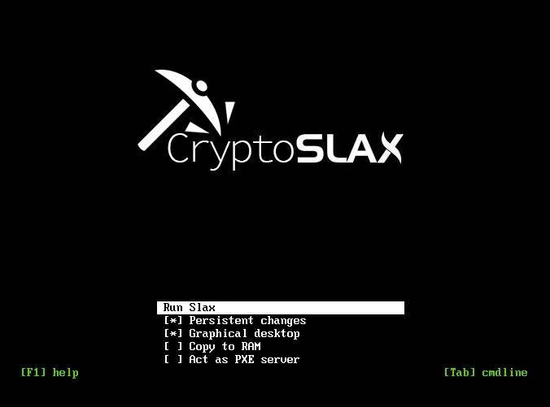
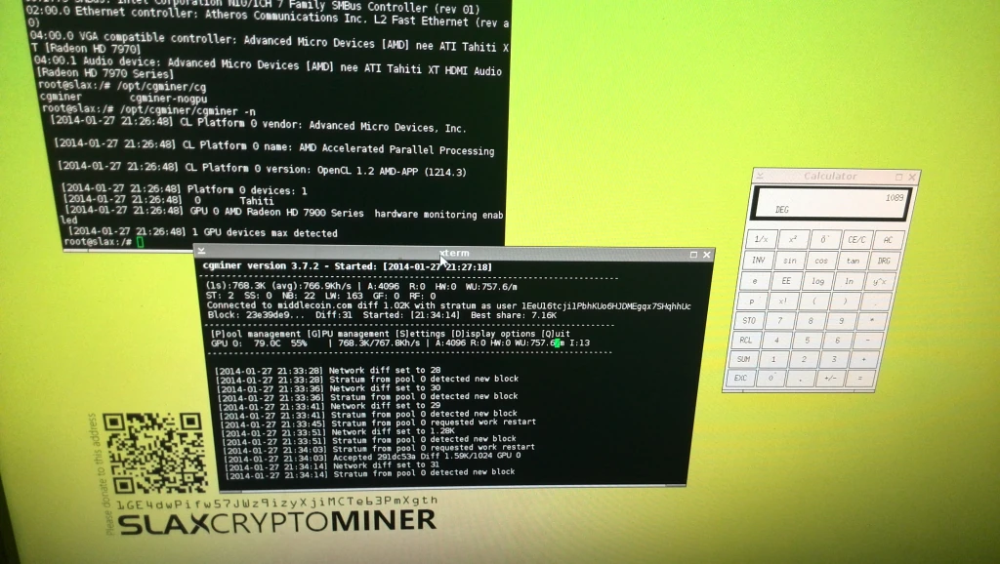

# CryptoSlax: Ultra-Lightweight Stateless Linux OS for Autonomous GPU Clusters

**Architect & Author:** Uray Meiviar  
**Role:** Systems & Operating Systems Architect  
**Period:** 2013 – 2016  
**Domain:** Linux Kernel Engineering, Stateless Systems, PXE Network Boot, GPU Computing, Embedded Systems  
**Core Technologies:** Linux (x86_64), SLAX / Slackware Base, PXE / TFTP / DHCP, SquashFS & AUFS / OverlayFS, AMD Catalyst `fglrx` & OpenCL 1.2, NVIDIA CUDA, Bash / POSIX Shell, `cgminer` / `sgminer` / `ethminer`

---

## Executive Summary

**CryptoSlax** is an ultra-lightweight (~100 MB footprint), completely stateless, diskless Linux distribution engineered specifically for 24/7/365 unattended, high-density GPU computing clusters. 

Born out of the harsh operational reality of managing hundreds of consumer graphics cards across a 330 kVA private datacenter in Bandung, CryptoSlax completely eliminated the primary vulnerability of distributed computing clusters: **local storage media corruption**. By executing 100% in volatile system RAM via PXE network booting and leveraging read-only SquashFS modular layering (AUFS / OverlayFS), CryptoSlax achieved complete deterministic recovery—allowing compute nodes to be violently power-cycled or hard-reset with zero risk of filesystem corruption, zero `fsck` prompts, and zero human maintenance.

This architecture later served as the proven technical blueprint for the diskless, zero-trust RTOS I engineered for the Indonesian Armed Forces High Command (**Project SOYUT**).

---

## 1. Requirements & Operational Context

```
=============================================================================
             THE STORAGE FAILURE CYCLE IN LARGE-SCALE MINING
=============================================================================
 [ 100+ GPU Nodes ] ──> GPU Hang / Voltage Sag / Kernel Panic
                                │
                                ▼
 [ Force Power Cycle ] ──> Abrupt Power Interruption
                                │
                                ▼
 [ Storage Corruption ] ──> ext4 / NTFS Journal Corrupted or Flash Wear-Out
                                │
                                ▼
 [ Boot Stoppage ] ──> Halts at "Press Enter for Maintenance (fsck)"
                                │
                                ▼
 [ Human Overhead ] ──> Manual Keyboard/Monitor Intervention Across Hundreds of Rigs
=============================================================================
```

### 1.1 The Operational Bottleneck of Consumer GPU Farms
When scaling a GPU computing cluster from a handful of machines to hundreds of GPUs drawing over 300 kW, traditional system administration completely breaks down:
- **Consumer Hardware Fragility:** Mining rigs utilize consumer-grade motherboards, PCIe 1x-to-16x riser ribbon cables, and open-air aluminum frames. Component instability, bus resets, and thermal throttling are normal operational events.
- **The Power Cycle Requirement:** When a graphics card driver hangs (e.g., AMD `fglrx` GPU lockup), soft-rebooting the OS is frequently impossible because the kernel driver freezes in un-interruptible I/O sleep (`D` state). The only recovery mechanism is a hard power cut.
- **The Storage Degradation Trap:** Standard desktop distributions (Ubuntu, Debian, Windows) assume persistent writable storage. Writing continuous system logs (`/var/log/messages`, syslog, systemd journals) to cheap USB flash drives quickly exhausts their limited NAND P/E write cycles. Worse, hard-power cycling during an active journal write corrupts the filesystem, leaving the machine stranded at an interactive emergency maintenance shell (`fsck.ext4`).

### 1.2 Architectural Objectives
1. **Absolute Statelessness:** Zero local write operations to persistent physical media.
2. **Diskless Architecture:** Nodes must operate without mechanical hard drives, SATA SSDs, or local USB thumb drives.
3. **RAM Execution ("Copy to RAM"):** Operating system files must decompress directly into volatile system memory (4 GB DDR3/DDR4), freeing the network bus once booted.
4. **Instant Self-Healing Recovery:** If a node freezes, an automated watchdog cuts the AC power. Upon power restoration, the node must boot cleanly, auto-detect hardware, apply clock/voltage profiles, and resume compute execution within 30 seconds without human intervention.
5. **Driver & Mining Modularity:** Ability to hot-swap or roll back graphics driver suites and mining software packages across hundreds of nodes by updating a single master module file.

---

## 2. Subsystem Architecture & Implementation Details



### 2.1 The Stateless PXE Boot Pipeline
Every mining rig in the cluster was stripped of all storage drives. System boot was orchestrated entirely over local Gigabit Ethernet:

```
[ Mining Node BIOS ]
       │ (1) PXE Network Boot Request
       ▼
[ ISC-DHCP Server ] ──> Returns IP address, Subnet, and 'next-server' TFTP Pointer
       │ (2) TFTP Fetch
       ▼
[ TFTP Server ] ──────> Delivers 'pxelinux.0', Kernel ('vmlinuz'), and 'initramfs'
       │ (3) RAM Load
       ▼
[ Node System RAM ] ──> Decompresses SquashFS System Bundles (.sb) into tmpfs
       │ (4) Decouple Network
       ▼
[ OverlayFS / AUFS ] ─> Mounts Read-Only Core + Drivers + Miners as Unified Root (/)
       │ (5) Auto-Run
       ▼
[ Watchdog & Miner ] ─> Probes OpenCL Devices, Sets Overclocks, Spawns Mining Process
```

1. **PXE Handshake:** The motherboard Realtek/Intel NIC issues a DHCP broadcast. The central master server—an ultra-compact vertical wall-mounted x86 SBC with a bare 256 GB master SSD (documented in [Mining Rigs Infrastructure](../miningRigs/DESC.md))—leases an IP address and passes the PXE bootloader path (`pxelinux.0`).
2. **Kernel Injection:** Via TFTP, the node downloads the stripped-down, high-performance Linux kernel and initial RAM filesystem from the master node.
3. **Copy to RAM:** The initramfs script pulls the modular `.sb` (SquashFS) system bundles from the master server's HTTP/NFS repository directly into a tmpfs ramdisk. Once the copy is completed, the node completely severs its OS read dependency on the network.
4. **OverlayFS Unification:** Using AUFS (and later OverlayFS), the init script stacks the read-only module layers with a writable tmpfs scratchpad in RAM.

### 2.2 Modular SquashFS Layering (`.sb` Packages)
Instead of a monolithic disk image, CryptoSlax decomposed the operating system into distinct, independently maintainable modules:

```
/ (Unified Virtual Root via OverlayFS)
├── [Writable tmpfs]      (Volatile RAM Scratchpad - discarded on reboot)
├── 04-config.sb          (Node ID, Wallet Addresses, Pool Failover Lists)
├── 03-miners.sb          (cgminer 3.7.2, sgminer, ethminer binaries & scripts)
├── 02-drivers.sb         (AMD Catalyst fglrx / NVIDIA Proprietary + OpenCL Runtime)
├── 01-xorg.sb            (Minimal X11 server required for GPU device contexts)
└── 00-core.sb            (Linux Kernel, Glibc, BusyBox, SysVinit / eudev)
```

- **`00-core.sb` (~35 MB):** Stripped-down base system. No printer drivers, no sound subsystems, no office suites, no Bluetooth stacks.
- **`01-xorg.sb` (~20 MB):** A headless X11 display server. In Linux, AMD and NVIDIA GPU drivers historically required an active Xorg display context to query temperature, fan speeds, and set core/memory clock frequencies.
- **`02-drivers.sb` (~45 MB):** Optimized graphics drivers and compute runtimes. For AMD cards, this contained the custom-patched AMD Catalyst `fglrx` driver with the OpenCL 1.2 compute ICD. For NVIDIA rigs, it packaged the proprietary NVIDIA UNIX driver.
- **`03-miners.sb` (~15 MB):** Stripped binaries of `cgminer 3.7.2` (compiled specifically for Tahiti HD 7970 architectures), `sgminer`, and `ethminer`, optimized with `-O3 -march=native` compiler flags.
- **`04-config.sb` (<1 MB):** Dynamic configuration layer mapping the node's MAC address to its designated mining pool, worker credentials, and per-card voltage/clock offsets.



### 2.3 Automated Watchdog Daemon & Hardware Telemetry
To achieve true unattended operation, CryptoSlax ran a background watchdog process in user-space that monitored GPU health via the ADL (AMD Display Library) or NVML (NVIDIA Management Library):

```bash
#!/bin/bash
# cryptoslax-watchdog.sh - Autonomous GPU Health Daemon

HASH_THRESHOLD=500  # Minimum acceptable kH/s per card
MAX_TEMP=88         # Emergency throttle temperature (Celsius)
REBOOT_GRACE=180    # Seconds to wait before hard watchdog trigger

while true; do
  # Query active GPU stats from cgminer RPC API
  STATS=$(echo -n "{\"command\":\"summary\"}" | nc 127.0.0.1 4028)
  
  # Check GPU temperatures
  for temp in $(echo "$STATS" | grep -o '"Temperature":[0-9]*' | cut -d: -f2); do
    if [ "$temp" -gt "$MAX_TEMP" ]; then
      logger -t cryptoslax "CRITICAL: GPU temperature exceeded ${MAX_TEMP}C (${temp}C). Initiating emergency cooldown."
      # Dynamically throttle clock frequencies via ADL
      aticonfig --adapter=all --od-setclocks=600,800
    fi
  done

  # Verify process liveness
  if ! pgrep -x "cgminer" > /dev/null; then
    logger -t cryptoslax "ERROR: cgminer process vanished. Restarting compute pipeline..."
    /opt/miners/run-miner.sh &
  fi

  sleep 15
done
```

If the kernel encountered an unrecoverable PCIe bus hang where software could not recover the GPU, a hardware watchdog timer or network-controlled PDU simply pulsed power. The rig rebooted into a pristine state in seconds.

---

## 3. Key Challenges & Engineering Solutions

### 3.1 Eliminating AMD OpenCL Driver Deadlocks
**Challenge:** The AMD Catalyst `fglrx` driver in the early 2010s was notorious for locking up when multiple GPU threads attempted concurrent buffer allocations on consumer motherboards with PCIe 1x riser bridges.  
**Solution:** I wrote a custom preload wrapper library using `LD_PRELOAD` that intercepted OpenCL initialization calls (`clCreateContext`, `clCreateCommandQueue`), serializing adapter discovery across the bus during initialization to prevent race conditions in the proprietary binary blob.

### 3.2 Dynamic Clock and Voltage Tuning
**Challenge:** Running hundreds of consumer GPUs at factory stock voltages generated unsustainable thermal output and consumed excess power.  
**Solution:** I integrated custom scripts directly into the init sequence that parsed the video card VBIOS, matched the device PCI IDs, and applied undervolting profiles via `aticonfig` and low-level register writes. Dropping voltage from 1.175V to 1.050V on AMD HD 7970 Tahiti cores reduced power consumption by over 20% per card while maintaining complete computational stability.

### 3.3 Forking `cgminer` / `sgminer` & Tuning Custom OpenCL / CUDA Kernels
**Challenge:** In proof-of-work mining, public miners like standard `cgminer` or `sgminer` utilized generic compute kernels designed for broad compatibility rather than peak hardware saturation. On a cluster consuming tens of kilowatts, even a 5% hashrate differential translates to immense revenue differences.  
**Solution:** I forked the source repositories of `cgminer` and `sgminer`, bypassing stock binaries to compile customized compute engines directly:
- **Assembly & OpenCL Optimization:** I hand-tuned the OpenCL kernel source code targeting AMD's Graphics Core Next (GCN) architecture (Tahiti HD 7970 / R9 280X).
- **Register Pressure & Wave Occupancy:** By re-architecting local variable storage and unrolling cryptographic compression rounds, I reduced per-thread VGPR (Vector General-Purpose Register) allocation, allowing the GPU scheduler to maintain maximum wavefront occupancy across all 32 Compute Units (2,048 stream cores).
- **Memory Coalescing:** Re-aligned scratchpad buffers to 128-byte boundaries, ensuring single-cycle global memory transactions across the 384-bit wide memory bus.
- **CUDA Kernels:** For NVIDIA rigs, I hand-tuned thread-block dimensions and shared memory caching patterns, achieving higher hashrates with measurably lower wattage per MegaHash.

---

## 4. Operational Results & Legacy

### 4.1 Cluster Performance Metrics
- **Operating System Footprint:** ~100 MB compressed (loads into RAM in < 5 seconds over Gigabit Ethernet).
- **Storage Failure Rate:** **0.00%** (zero hard drives or flash drives in production rigs).
- **Cluster Uptime:** 99.8% continuous compute availability across hundreds of GPUs.
- **Maintenance Reduction:** Eliminated manual software fixes and drive re-flashing entirely. One engineer could easily oversee hundreds of kilowatts of active computing hardware.

### 4.2 The Direct Architectural Lineage to Military Defense (Project SOYUT)
The architectural patterns engineered in CryptoSlax—**statelessness, PXE diskless network boot, RAM-resident execution, and OverlayFS modular filesystem stacking**—proved to be transformative far beyond cryptocurrency.

When the Indonesian Armed Forces High Command (TNI) commissioned **Project SOYUT** (the national Joint Command war game simulator), they required an operating system with zero data exfiltration risk (no hard drives, disabled USB mass storage), rapid deployment across hundreds of distributed client workstations, and dynamic officer role authorization without local sysadmins.

Because I had already battle-tested stateless Linux under the punishing 24/7 thermal and electrical load of a 330 kVA GPU computing facility, I was able to deliver the SOYUT defense RTOS with absolute confidence and zero technical speculation.
