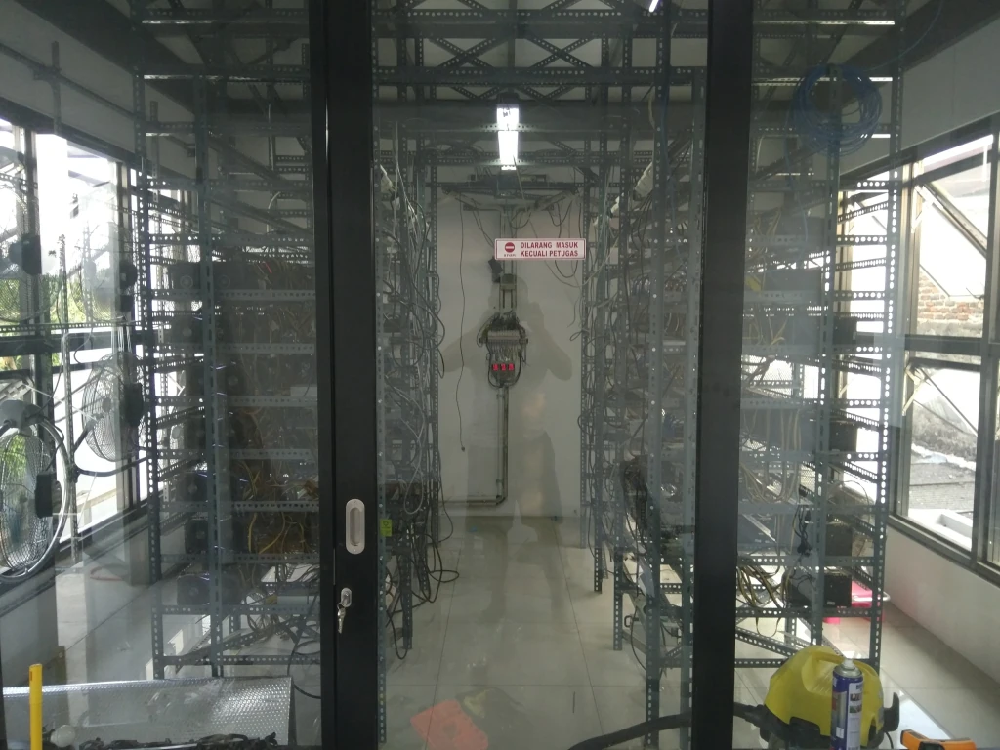
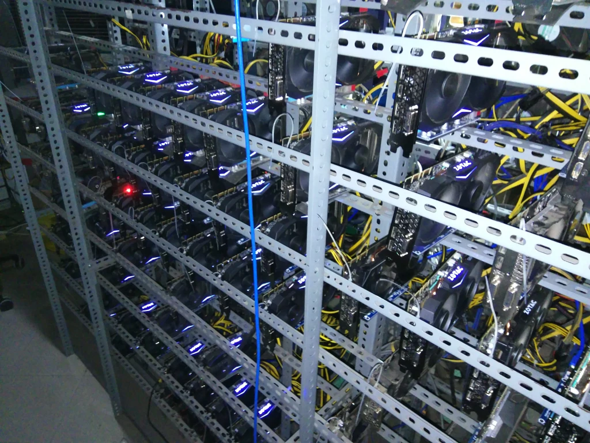
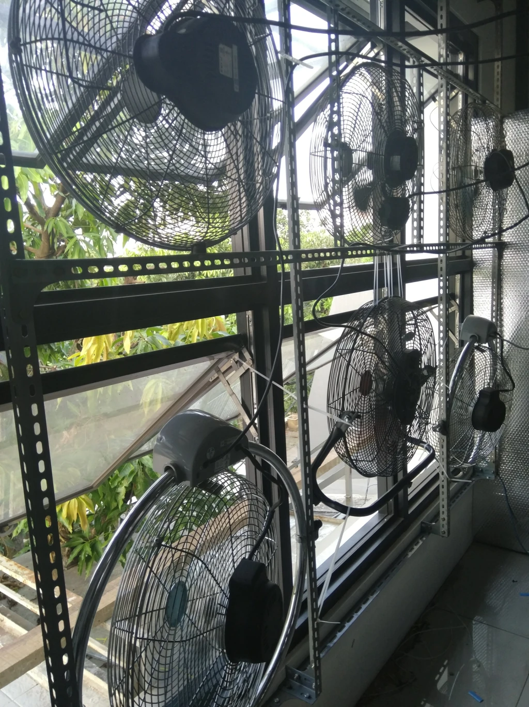
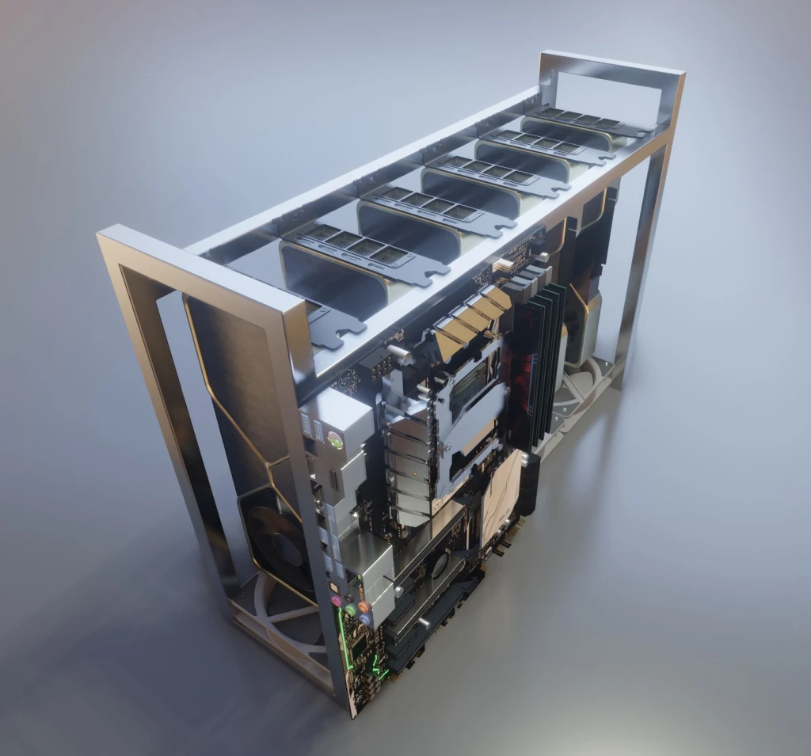
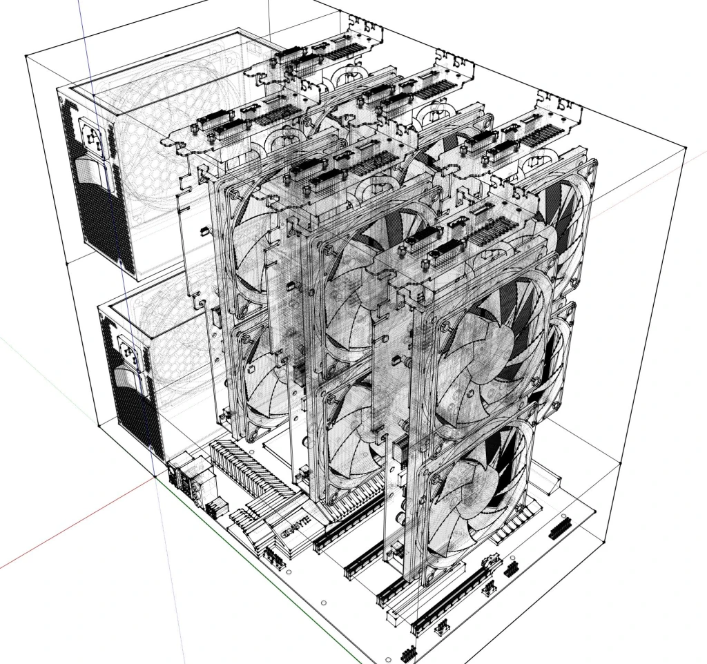
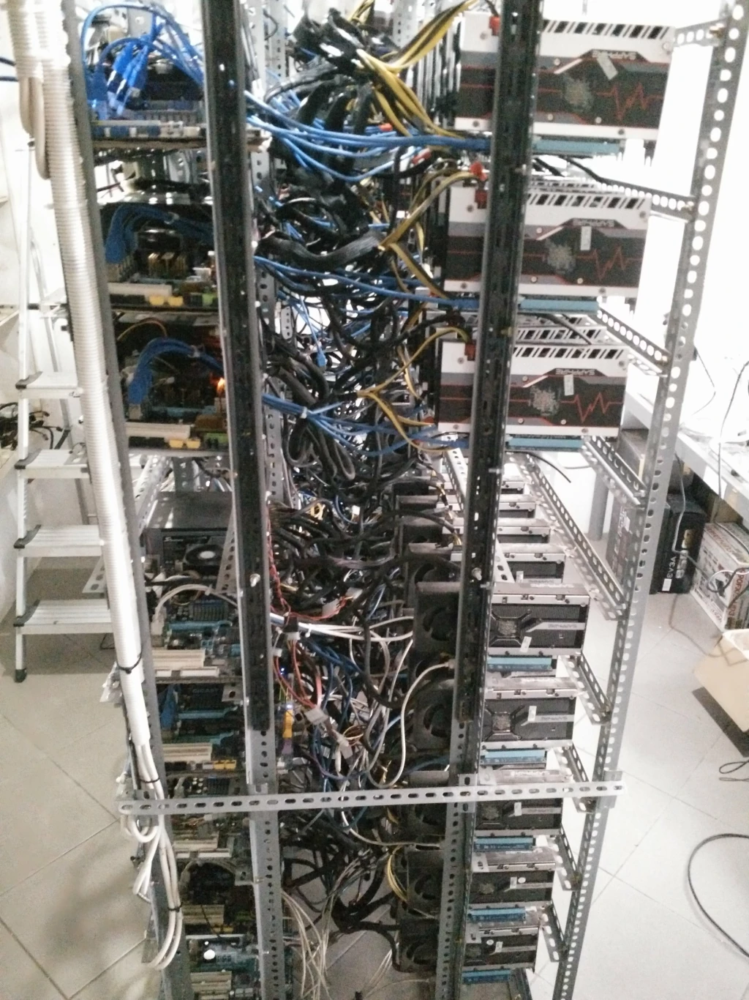
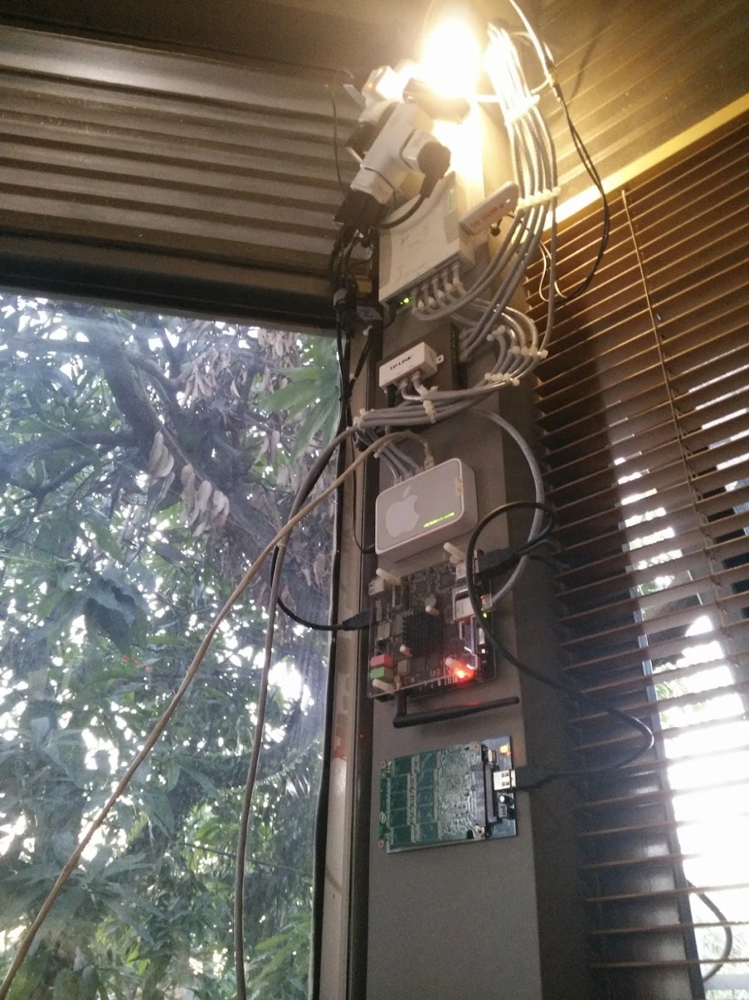

# High-Density GPU Computing Clusters & 330 kVA Facility Engineering

**Architect & Engineer:** Uray Meiviar  
**Role:** Hardware & Systems Infrastructure Architect  
**Period:** 2013 – 2018  
**Domain:** High-Density GPU Clusters, Industrial Electrical Systems, Thermal Dynamics, Open-Air Chassis Design  
**Core Infrastructure:** 330 kVA 3-Phase Industrial Power Drop, Custom Slotted-Angle Racks & Aluminum Chassis, High-Velocity Industrial Exhaust Ventilation, HP/Delta Server PSUs with Custom Breakout Boards, Multi-Tier Network Switching

---

## Executive Summary

To power a continuous high-throughput cryptocurrency and general-purpose GPU compute cluster, I transformed an entire private two-story residential building (8x12-meter footprint) in Bandung into an **industrial-grade computing datacenter**. 

The installation required upgrading the building's electrical connection with the state power utility (PLN) from standard residential service to an unprecedented **330 kVA (330,000 Volt-Amps) 3-phase industrial power feed**. The facility housed hundreds of high-power graphics processing units (AMD Radeon HD 7970 Tahiti, R9 series, and ZOTAC NVIDIA GeForce cards) operating 24/7/365 at full computational load, supported by custom mechanical chassis fabrication, high-velocity negative-pressure thermal ventilation, and custom 12V DC power distribution rails.

---

## 1. Facility Architecture & Power Engineering

```
=============================================================================
             330 kVA 3-PHASE ELECTRICAL POWER DISTRIBUTION
=============================================================================
 [ PLN Industrial Grid Drop ] ──> 3-Phase 380V AC (R-S-T Phases + Neutral)
                                       │
                                       ▼
 [ Master Distribution Panel ] ─> 500A Main Industrial Air Circuit Breaker
                                       │
            ┌──────────────────────────┼──────────────────────────┐
            ▼                          ▼                          ▼
 [ Sub-Panel Phase R ]      [ Sub-Panel Phase S ]      [ Sub-Panel Phase T ]
 (Ground Floor Cluster)     (Upper Floor Rack A)       (Upper Floor Rack B)
            │                          │                          │
            ▼                          ▼                          ▼
 [ 16A / 32A Breakers ]     [ 16A / 32A Breakers ]     [ 16A / 32A Breakers ]
            │                          │                          │
            ▼                          ▼                          ▼
 [ Server PSUs (1200W) ]    [ Server PSUs (1200W) ]    [ Server PSUs (1200W) ]
            │                          │                          │
            ▼                          ▼                          ▼
   12V DC Busbars to GPUs     12V DC Busbars to GPUs     12V DC Busbars to GPUs
=============================================================================
```

### 1.1 The 330 kVA Power Upgrade
Standard residential homes in Indonesia are allocated between **2.2 kVA and 6.6 kVA** on single-phase 220V AC. Powering hundreds of dual-8-pin graphics cards—each drawing between 250W and 325W under sustained OpenCL/CUDA compute load—demanded over **100 kW of continuous real power**.

I negotiated an industrial grid drop with the state electricity utility (PLN), running dedicated high-voltage lines directly into a newly constructed master distribution switchboard inside the building:
- **Service Rating:** 330 kVA, 3-Phase 380V/220V AC, 50 Hz.
- **Phase Balancing:** To prevent phase imbalance and neutral line overheating, computing loads were strictly mapped across phases R, S, and T.
- **Main Breaker & Copper Busbars:** Solid copper busbars with a 500A main industrial breaker fed heavy-gauge distribution wiring down isolated cable conduits.



### 1.2 12V DC Power Delivery & Avoiding Fire Hazards
Consumer ATX power supplies are notoriously inefficient, expensive, and unreliable when pushed to continuous multi-year duty. More critically, cheap SATA-to-PCIe power adapters carry a severe fire risk: standard SATA molded power connectors are rated for only **4.5 Amperes (54 Watts)** across their three 12V pins, whereas a PCIe 16x slot or 8-pin auxiliary plug can pull over **75W to 150W**.

To ensure total electrical safety and efficiency:
1. **Server Power Supply Conversion:** I deployed surplus enterprise server power supplies (HP Common Slot 1200W Platinum PSUs, achieving >94% electrical efficiency).
2. **Custom Breakout Boards & Direct Soldering:** I utilized custom breakout PCBs equipped with solid 16 AWG copper wiring, feeding 6-pin and 8-pin PCIe power plugs directly to the GPUs and powered risers.
3. **Common Ground Bonding:** All server power supplies powering a single multi-GPU node were tied to a common DC ground plane to eliminate ground-loop voltages between motherboard PCIe slots and riser connectors.



---

## 2. Thermal Dynamics & Ventilation Engineering

### 2.1 The Heat Density Problem
At full scale, the cluster consumed upwards of **100 to 150 Kilowatts of continuous electrical energy**. In physics, nearly 100% of electrical energy consumed by microprocessors is converted directly into heat. 

Dissipating 150 kW of heat in an enclosed 8x12-meter building using conventional residential split-unit air conditioners is impossible: it would require over 40 tons of refrigeration capacity, costing tens of thousands of dollars in refrigeration power alone while risking rapid compressor burnout.



### 2.2 Forced Negative-Pressure Wind Tunnel
I engineered a natural and mechanical high-flow displacement ventilation system:
1. **Window Frame Modifications:** I cut custom rectangular openings directly through the exterior window frames of the building.
2. **Industrial Exhaust Blowers:** I mounted large-diameter, high-velocity industrial ventilation exhaust fans directly into the window cutouts.
3. **Airflow Vectoring:** Fresh ambient air was drawn in through filtered lower-level intakes, forced across the multi-tier GPU racks in a horizontal sweep, and rapidly expelled out the exterior exhaust fans.
4. **Thermal Delta:** By maintaining continuous negative air pressure, the exhaust fans pulled thousands of CFM (cubic feet per minute) through the house, keeping GPU core temperatures consistently below 75°C even during peak daytime equatorial heat.

---

## 3. Structural Racks & Chassis Fabrication



### 3.1 Modular Slotted-Angle Iron Racks
Off-the-shelf 19-inch server chassis were unsuitable due to restricted airflow and extreme cooling fan noise. Instead, I engineered custom multi-tier racking systems:
- **Frame Material:** Heavy-gauge slotted-angle iron, bolted into floor-to-ceiling modular bays.
- **Card Spacing:** Graphics cards were spaced with 8 to 10 cm of clearance between heatsinks to eliminate thermal pocketing and hot-air recirculation.
- **Vibration Damping:** Motherboard trays were isolated using rubber standoffs to prevent high-velocity fan vibrations from fatiguing solder joints or loosening PCIe riser contacts.



---

## 4. Operational Telemetry & Infrastructure Resilience



### 4.2 The Master Control Node: Vertical Wall-Mounted PXE Server & Cellular Failover
The entire 330 kVA facility—spanning two floors and hundreds of graphics cards—was orchestrated by an ultra-compact, vertically mounted master control stack engineered directly onto a structural window pillar.



This vertical pillar contained the entire command, routing, and boot infrastructure:
1. **MikroTik Router with 3G/4G Cellular Dongle (Top):**
   - Managed high-throughput local subnet routing and traffic shaping for hundreds of compute nodes.
   - **Automated Cellular Failover:** A white 3G/4G USB modem was mounted directly to the MikroTik router. If the primary residential broadband connection flaked or suffered ISP downtime, the router seamlessly failed over to the 3G/4G cellular network within seconds, preventing mining pools from dropping connections or losing block reward deadlines.
2. **TP-Link Switch with Apple Sticker ("The Fake AirPort"):**
   - A permanent inside joke of this setup: that sleek white box with the Apple logo isn't a pricey Apple AirPort Express—it was just a dirt-cheap 100Mbps Ethernet switch that I slapped a spare Apple sticker on! It handled local switching reliably, proving that packets don't care about luxury branding.
3. **x86 Single Board Computer (SBC) & Automated Relay Controller:**
   - Positioned in the middle with a passive heatsink and illuminated status LEDs.
   - Ran automated background telemetry daemons polling miner API endpoints across the cluster.
   - **Hardware Relay Power-Cycling:** The SBC was directly interfaced with physical power relay modules connected to the mining rig server PSUs. If a rig stopped transmitting hash metrics or locked up, the SBC automatically pulsed the physical power relay to power-cycle the machine. It also allowed full remote power cycling via SSH from anywhere in the world.
4. **Bare 256 GB Master SSD (Bottom):**
   - An uncased 256 GB solid-state drive mounted directly to the concrete wall with exposed NAND flash packages, connected via SATA-to-USB/eSATA.
   - This single drive served as the master storage repository for the entire facility: holding the master TFTP/DHCP boot files, Linux kernels, initramfs images, and the modular **CryptoSlax** SquashFS bundles (`.sb`) distributed over Gigabit Ethernet to every diskless client rig.

### 4.3 The Bridge to Arduinos, SBCs & Project STMR
Building this automated physical infrastructure was my crucible for embedded hardware, single-board computers (SBCs), Arduinos, and IoT automation. Interfacing microcontrollers with heavy-duty power relays, reading analog line voltages, and handling automated failover gave me deep operational confidence in COTS microcontrollers.

Years later, when leading the development of the **STMR** cavalry tank simulator for the Indonesian Army, the older aerospace veterans insisted that microcontrollers were "fragile hobbyist toys." I knew better: **I had already trusted microcontrollers and SBCs to automate and safeguard a roaring 330 kVA industrial computing datacenter running 24/7/365.**

### 4.4 Engineering Legacy
Operating this 330 kVA facility provided invaluable practical mastery over:
- Industrial 3-phase high-voltage power distribution and phase balancing.
- Large-scale DC power delivery, copper busbar dimensioning, and electrical safety standards.
- High-velocity thermodynamic airflow management.
- Stateless, self-healing computing architecture that informed the mission-critical military defense networks I built for the Indonesian Armed Forces (**Project SOYUT**).

