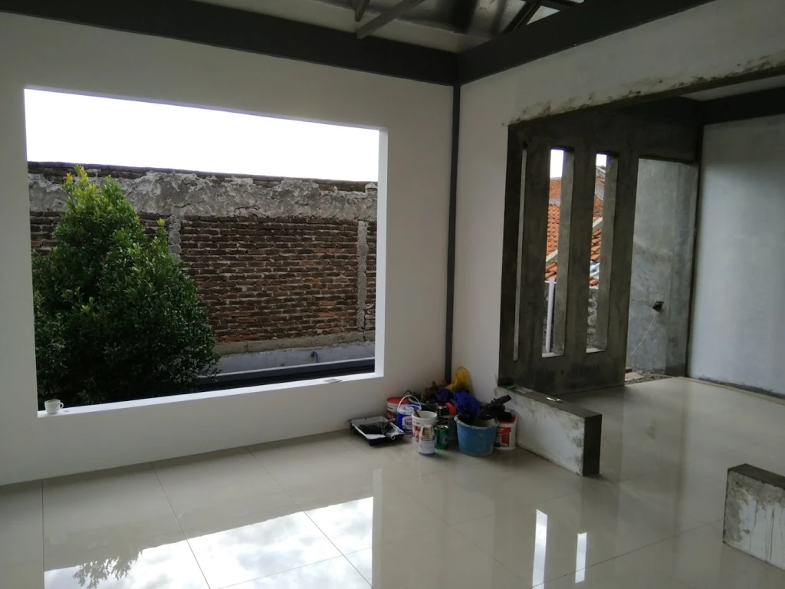

# First-Principles Architecture: Designing & Building My Own Home in Blender

**Designer & Builder:** Uray Meiviar  
**Role:** Architectural Designer, Structural Drafter & General Contractor  
**Period:** 2013 – Present  
**Domain:** Architectural Design, 3D Spatial Planning, Blender 3D CAD, Civil Construction, Thermal & Electrical Systems  
**Core Tools & Materials:** Blender (Cycles Render & Spatial Modeling), Reinforced Concrete Columns, Welded Steel Framing, Brick & Mortar Masonry, Industrial 3-Phase Electrical Grid Drop

---

## Executive Summary

As a systems software engineer with a deep background in pure mathematics and low-level computing, I have always possessed an instinctual obsession with craftsmanship, structural physics, and tinkering with physical systems. When the time came to build a home on an **8x12-meter plot** in Bandung, West Java, I refused to simply hire an architectural firm and receive a generic off-the-shelf blueprint.

Instead, I took on the challenge myself: **I designed the entire house from first principles using Blender.**

I had zero formal architecture or civil engineering credentials. I taught myself architectural drafting, structural load-bearing mechanics, reinforced concrete spans, and spatial layout from the open internet—studying civil engineering manuals, architectural forums, and communities across Reddit. I drafted the complete 3D architectural model, calculated room volumes, planned tropical sun and rain shielding, and directly managed the physical construction on site.

The building served an extraordinary dual lifecycle: during its early years, its structural resilience and custom ventilation allowed it to operate as a **roaring 330 kVA industrial GPU datacenter**; today, it has transitioned completely into a peaceful, warm, and comfortable **family-friendly home where I continue to live happily to this day.**

---

## 1. First-Principles Spatial & Structural Design


### 1.1 Why Blender Instead of Traditional Architecture CAD?
Commercial architectural suites (such as AutoCAD or Revit) were heavily constrained by legacy commercial licensing, rigid parametric templates, and complex UI overhead. 

As someone who had spent decades manipulating 3D graphics, vector mathematics, and OpenGL/DirectX pipelines, **Blender** was the natural environment:
- **Total Geometric Control:** I could draft precise millimeter-accurate vertex models of structural columns, ceiling heights, window lintels, and roof pitches.
- **Accurate Solar & Lighting Simulation:** Using Blender's Cycles ray-tracing engine, I simulated the exact sun angles and shadow casting across the Bandung equator throughout different seasons, ensuring optimal natural daylight while preventing unbearable afternoon solar heat gain.
- **Ergonomic Spatial Walkthroughs:** I placed virtual first-person camera rigs inside the rooms to evaluate ceiling clearances, stairwell angles, line-of-sight privacy, and door swing radiuses long before pouring a single cubic meter of concrete.

### 1.2 Floor Plan & Spatial Layout (8 x 12 Meters)
Building on an 8x12-meter urban lot requires intense spatial discipline:


1. **Rigid Structural Column Grid:** Structural concrete pillars were aligned on an uncompromising structural matrix, ensuring that upper-floor loads were transferred vertically straight down to foundation footings without requiring complex cantilever beams.
2. **Natural Cross-Ventilation:** In tropical Bandung, airflow is paramount. Rooms were designed with opposing window axes to generate natural convective airflow, drawing cool ground-level air through the living areas and releasing rising warm air through high-level transoms.
3. **High Ceiling Clearances:** Expanded ceiling heights increased interior air volume, significantly lowering perceived ambient temperature and giving the compact footprint an open, generous feel.

---

## 2. On-Site Physical Realization & Construction


Designing on a computer screen is only half the battle; bringing the design into physical reality demanded hands-on project management:
- **Seismic Foundations (*Cakar Ayam*):** Because Bandung is situated in a seismically active volcanic basin, I specified reinforced concrete pad footings tied together with heavy ground tie-beams (*sloof*) to resist lateral ground motion.
- **Rebar Tying & Concrete Pouring:** I oversaw the reinforcement steel bar fabrication, checking rebar diameters, stirrup spacing, and concrete aggregate mixing ratios to ensure maximum compressive strength.
- **Steel Roof Truss Fabrication:** The roof structure was fabricated from lightweight zinc-aluminum steel trusses, engineered with adequate pitch to rapidly shed heavy tropical monsoon downpours while insulating against solar radiation.



---

## 3. The Dual Lifecycle: From 330 kVA Datacenter to Family Sanctuary

```
=============================================================================
              THE EVOLUTION OF AN 8x12m FIRST-PRINCIPLES HOME
=============================================================================
 [ 2013 - 2018: The Industrial Computing Crucible ]
 - 330 kVA 3-Phase Industrial Power Drop
 - Hundreds of High-Power GPUs on Slotted-Angle Steel Racks
 - Window Frame Cutouts with High-Velocity Industrial Exhaust Fans
 - Glass-Enclosed Server Room with "DILARANG MASUK KECUALI PETUGAS" Signage
                                      │
                                      ▼
 [ 2018 - Present: The Family Sanctuary ]
 - Rigs Decommissioned & Industrial Blowers Removed
 - High Natural Airflow & High Ceilings Repurposed for Living Comfort
 - Robust Electrical Distribution Powering Modern Smart-Home Infrastructure
 - Peaceful, Warm, Family-Friendly Environment Where I Live Today
=============================================================================
```

### 3.1 The Datacenter Era
During the cryptocurrency and GPU computing era, the house proved its extraordinary engineering resilience. The structural concrete floors supported thousands of kilograms of steel racks and hardware without deflection. The window modifications allowed massive industrial exhaust fans to blow tens of kilowatts of heat out of the building.


### 3.2 The Family Home
When that chapter concluded, the house underwent its ultimate transformation:
- The roaring computing clusters were retired.
- The industrial exhaust fans were replaced with clean residential window glazing.
- The high ceilings, spacious room volumes, and natural cross-ventilation originally designed to cool hardware now keep the home naturally cool, breezy, and bright for my family.
- The heavy-duty electrical wiring that once fed mining racks now effortlessly powers a modern, resilient smart home.

---

## 4. Architectural Legacy

This project stands as physical, tangible proof of my personal engineering motto: **You do not need formal credentials to master complex systems. If you understand mathematics, physics, structural principles, and first principles, you can build anything—whether it is a defense flight simulator, a custom operating system, or the roof over your family's head.**
