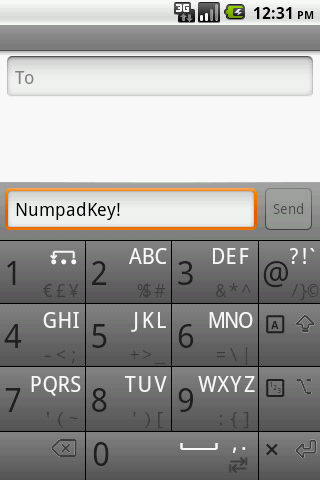

# NumpadKey: T9 Virtual Keypad for Android 1.0 (HTC Dream / T-Mobile G1)

**Architect & Developer:** Uray Meiviar  
**Role:** Mobile Systems & Android Java Developer  
**Period:** 2008 – 2009 (Android 1.0 Milestone)  
**Domain:** Mobile Operating Systems, On-Screen Virtual Keyboards (IME), Touch Ergonomics, Early Android SDK  
**Platform & Environment:** Android 1.0 SDK, Java (Dalvik VM), HTC Dream / T-Mobile G1 (Qualcomm MSM7201A @ 528 MHz, 192 MB RAM, 3.2" 320×480 HVGA Capacitive Screen)  

---

## Executive Summary

In October 2008, Google and T-Mobile launched the world's first commercial Android smartphone: the **HTC Dream** (branded in North America as the **T-Mobile G1**). While groundbreaking for introducing an open-source mobile OS, **Android 1.0 completely lacked a software on-screen keyboard**.

Whenever users needed to type anything—a brief SMS, a web address, or a quick search query—they were forced to rotate the phone horizontally, unlock the stiff spring-loaded hinge, and slide out the physical 5-row hardware keyboard. On a compact 3.2-inch portrait screen (320×480 HVGA), a full 26-key QWERTY layout would have produced minuscule, mistype-prone touch targets.

Having grown accustomed to lightning-fast, single-handed text entry on classic feature phone numerical keypads, I missed the ergonomic speed of **T9 typing**. To bring effortless one-handed texting to the HTC Dream without opening the hardware slider, I developed **NumpadKey**—my very first native Android application, engineered in pure Java on Android 1.0.

---

## 1. Historical & Technical Context: The Pre-Cupcake Era

```
=============================================================================
                       EARLY ANDROID INPUT EVOLUTION
=============================================================================
  Late 2008: Android 1.0 (HTC Dream / G1)
  ├── Hardware: Physical slide-out keyboard only
  ├── OS: NO built-in on-screen keyboard framework
  └── Problem: Every text input required two-handed slider deployment
        │
        ▼ [ Enter NumpadKey (2008 – 2009) ]
        ├── Custom Android 1.0 Java Touch View
        ├── 3x4 / 4x4 T9 numerical multi-tap & predictive layout
        └── Enabled genuine one-handed portrait typing for early adopters
        │
        ▼
  Mid 2009: Android 1.5 (Cupcake)
  └── Google finally introduced the official system InputMethodService (IME)
=============================================================================
```

When NumpadKey was developed, Android did not yet have the `android.inputmethodservice.InputMethodService` framework (which Google only introduced months later with Android 1.5 Cupcake in April 2009). Creating a virtual keyboard in the Android 1.0 era required:
1. **Direct View Hierarchy & Event Synthesis:** Engineering custom touchable canvas and view components that intercepted touch down, move, and up events, calculating bounds across low-resolution capacitive touch digitizers.
2. **Text Buffer Manipulation:** Interfacing directly with `Editable` text buffers and dispatching synthetic key down/up events into active `EditText` fields.
3. **Pure Java & Dalvik VM Constraints:** In Android 1.0, Java was the sole supported application language (the native Android NDK was not yet available). Code had to be meticulously tuned to avoid unnecessary object allocations that would trigger the early, stop-the-world Dalvik garbage collector on a 528 MHz ARM11 CPU.

---

## 2. Keypad Ergonomics & Layout Design

Rather than attempting to squeeze 26 microscopic letters into a narrow 320-pixel portrait width, NumpadKey utilized the battle-tested **3×4 numerical telephone matrix**:

```
┌───────────┬───────────┬───────────┬───────────┐
│     1     │     2     │     3     │    @ ? !  │
│    SYM    │   A B C   │   D E F   │    / ; &  │
├───────────┼───────────┼───────────┼───────────┤
│     4     │     5     │     6     │   [A]     │
│   G H I   │   J K L   │   M N O   │   SHIFT   │
├───────────┼───────────┼───────────┼───────────┤
│     7     │     8     │     9     │   [123]   │
│  P Q R S  │   T U V   │  W X Y Z  │  NUM/SYM  │
├───────────┼───────────┼───────────┼───────────┤
│    [⌫]    │     0     │    [_]    │    [↵]    │
│ BACKSPACE │   SPACE   │   COMMA   │   ENTER   │
└───────────┴───────────┴───────────┴───────────┘
```

- **Large Touch Targets:** Each primary key measured approximately 80×55 pixels, providing generous contact surfaces that prevented accidental finger slip on the early resistive/capacitive glass.
- **Multi-Tap & Timeout Engine:** Tapping key `2` cycled through `a` → `b` → `c` → `2` with a configurable debounce timer before auto-committing the active character.
- **Sub-Label Indicators:** Secondary symbols (such as currency signs, math operators, and punctuation brackets) were clearly stamped in muted secondary text beneath the main glyphs.
- **Dedicated Quick Symbols:** Key `1` and the top-right specialty key provided instantaneous access to common internet characters (`@`, `?`, `!`, `/`, `:`, `-`) essential for web browsing and email.
- **Mode Toggles:** One-touch access to Shift/Caps lock, numeric pad mode (`123`), and text navigation arrows.



---

## 3. Significance & Legacy

- **First Mobile Application:** Marked my initial foray into native Android mobile engineering, exploring the foundational building blocks of the Android operating system within weeks of its initial public SDK release.
- **Pioneering User Experience:** Solved a real daily frustration for early Android adopters who wanted fast, one-handed mobile communication without having to wrestle open a mechanical slider.
- **Foundation for Future Systems:** The lessons learned in event loop scheduling, UI responsiveness under extreme memory constraints, and low-latency input handling directly informed subsequent mobile and embedded engineering projects.
