# The Chronicles of a Systems Architect
## From 8-Bit Silicon and Pure Mathematics to Mission-Critical Defense Simulators and Avionics

**By:** Uray Meiviar  
**Origin:** Bandung, West Java, Indonesia (Born 1983)  
**Education:** B.Sc. in Mathematics, Institut Teknologi Bandung (ITB)  
**Disciplines:** Software Architecture, Real-Time Simulation, Operating Systems, Distributed Protocols (IEEE 1278 DIS), Avionics & FMS  
**Personal Motto:** *"I never apply for a job; jobs come looking for me."*

---

## Prologue: My Engineering Philosophy

In an industry currently obsessed with short-lived web frameworks, heavy abstractions, and endless package-manager dependencies, I have always operated from first principles. My mental model as an engineer was not shaped in bootcamps or cloud sandboxes; it was forged in the raw reality of early personal computers, raw memory registers, binary interrupt vectors, mathematical proofs written by hand on paper, and mission-critical military simulators where a dropped frame or a misaligned memory buffer carries physical and tactical consequences.

This document is the chronicle of my journey: how I went from writing pixels directly to VGA memory in DOS and surviving the brutal mathematical curriculum at ITB, to overhauling defense simulator hardware architectures with Ethernet decoupling, building diskless operating systems for military Joint Chiefs of Staff, and developing full-scope commercial airliner systems and Flight Management Systems (FMS).

---

## Act I: The Pre-Internet Genesis (Bandung, 1983 – Mid-1990s)

### 1.1 My Father's Workshop and the Silicon Household
I was born in Bandung in 1983. Bandung has always been the intellectual heart of technology in Indonesia, home to the country's premier engineering universities. I grew up in a household where technology was not a luxury or a curiosity, but a way of life. My father was an electrical engineer, an alumnus of Institut Teknologi Bandung (ITB), and our home was always filled with electronics, testing equipment, and computers.

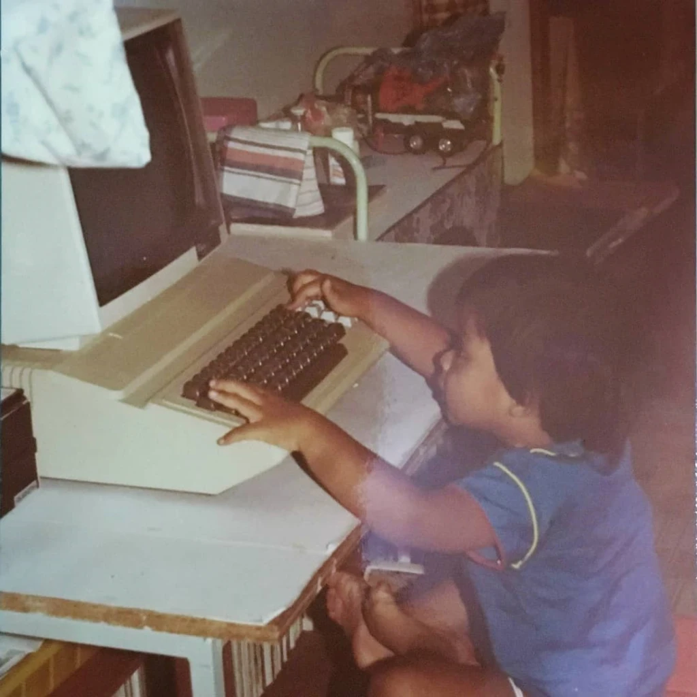

While I wasn't drawn to pure electrical engineering as a trade, growing up around circuit boards gave me an instinctual understanding of what electronics could do. Computers were always around me:
- **The Apple II:** Powered by the 8-bit MOS Technology 6502 processor running at 1.023 MHz, with its open chassis and ROM-based Integer BASIC. Long before I could read or write code, the tactile clatter of the keyboard and the green phosphor glow of the monitor were an irresistible magnet.
- **The IBM PC/XT (Model 5160):** With an Intel 8088 running at 4.77 MHz, running early IBM PC DOS, dual 5.25-inch floppy drives, and that unforgettable mechanical keyboard clatter.
- **The successive x86 generations:** 286, 386, and 486 machines that accompanied the transition from command-line computing to 32-bit protected mode.

Long before I wrote my first compiled line of code, I was playing games and living in DOS tools:
- **WordStar:** Navigating documents with keyboard shortcuts (`Ctrl+K`, `Ctrl+Q`), which burned modal editing habits into my fingers.
- **Lotus 1-2-3:** Tinkering with spreadsheets, formulas, and memory-constrained calculation engines.
- **PC Paint:** Drawing bitmaps and learning the constraints of early raster palettes.

### 1.2 Typing Code from Magazines: My Start with BASIC
Around the time I was 10 or 11 years old (around 1993–1994), my curiosity shifted from playing games to wondering how these machines actually executed instructions. In those days, there was no dial-up internet, no search engines, and no online tutorials. 

Programming was an analog discovery process. Computer magazines and printed books published source listings in BASIC. I would sit in front of the keyboard and type these programs line by line, character by character. When a program threw an error—whether because of a misplaced comma, an incorrect variable name, or a printing typo in the magazine—I had to dissect the logic manually to fix it. That mechanical discipline taught me the relationship between text, syntax, and execution. But BASIC felt interpreted and sluggish; it didn't give me the visceral speed of the games I loved.

### 1.3 How I Learned English by Reading Kernighan & Ritchie's C
In the mid-1990s, I got my hands on **Borland C++**. I knew C was the language behind real operating systems and serious software, so I looked for books to understand it.

I managed to find the landmark text:
> *"The C Programming Language"* (Second Edition, ANSI C) by Brian W. Kernighan and Dennis M. Ritchie (K&R).

There was only one problem: **I did not speak or read English at the time.**

I didn't let that stop me. I treated the English text as an extension of the programming language itself. I scrutinized the code listings, tracing pointer dereferencing (`*`), memory addressing (`&`), structures (`struct`), and memory layouts through deductive logic. I cross-referenced how the code behaved when compiled, using the deterministic nature of C as my Rosetta Stone. Shortly after, my father gave me an introductory C textbook written in Indonesian, which solidified the concepts I had deduced.

That was the turning point: **I learned how to read English through the process of reading K&R and writing C.** Because there was no internet, no search engines, and no forums to bail me out, every compiler warning and pointer mistake had to be solved through pure reasoning. That experience gave me the confidence that I could unpack any technical specification, no matter how complex or foreign.

### 1.4 The Graphics Bottleneck: Hitting the Wall with Borland BGI
Because video games were my original inspiration, my burning question was: *How do I draw fast graphics on screen?*

In the Borland C++ environment, the standard library provided for graphics was the **Borland Graphics Interface (BGI)** through `<graphics.h>`. It had functions like `initgraph()`, `line()`, `circle()`, and `putpixel()`. But the moment I tried to make a moving game, BGI hit a brick wall:
- It was completely software-rendered and unaccelerated.
- Drawing functions had enormous overhead.
- There was no double buffering or page flipping.
- Trying to animate even a handful of sprites resulted in severe screen tearing, flickering, and frame rates that dropped into the single digits.

There were no GPUs at the time, and no internet to explain how the pros did it. I had to find another way.

### 1.5 The Discovery of Interrupts: From `int 33h` to Mode 13h
To understand how software could bypass BGI and manipulate the display faster, I began systematically inspecting the raw header files (`.h`) and assembly listings that came with Borland C++.

While reading through code examples, I noticed references to **Interrupt Vectors**, specifically **`int 33h`**—the MS-DOS mouse driver API. I wrote a small test routine to call `int 33h` using inline register structs (`union REGS`). To my amazement, a functioning mouse cursor appeared on screen, tracking my physical mouse movements perfectly over the graphics surface.

To a teenager in the DOS era, that felt like pure magic. It unlocked an epiphany: **software doesn't create hardware performance through high-level libraries; it creates performance by issuing hardware interrupts and writing directly to memory-mapped registers.**

That realization triggered an obsession. I manually searched through every header file on my computer for the word `interrupt`.

That search led me straight to **BIOS Interrupt `int 10h`** (Video Services), register `AH = 00h`, and the magic value:
`AL = 13h (VGA Mode 13h)`.

When I triggered that interrupt, the display switched into a whole new world:
- **Resolution:** 320 x 200 pixels.
- **Color Palette:** 256 indexed colors chosen from an 18-bit RGB palette (262,144 possible colors).
- **Memory Mapping:** A continuous, unsegmented 64,000-byte block of video memory mapped directly to physical address:
  `0xA000:0000`.

Mode 13h eliminated the nightmare of planar memory banking that plagued EGA and VGA Mode 12h. All I needed was a raw far pointer to `0xA0000000L`:
```c
/* Direct Mode 13h Pixel Injection */
unsigned char far *VGA = (unsigned char far *)0xA0000000L;
VGA[y * 320 + x] = color;
```
For the first time, I had direct, unmediated control of the physical display. I could write custom rasterizers, software fire effects, starfields, and palette cycling at a rock-solid 60 Hz monitor refresh rate.

### 1.6 Living Through the Operating System Revolution
During those formative years, I lived through and adapted to the rapid evolution of PC platforms:
- **Windows 3.0 & 3.1:** Cooperative multitasking, real-mode vs. standard-mode constraints, and the win16 API.
- **IBM OS/2 Warp:** Preemptive 32-bit multitasking, crash-protection containers, and the Workplace Shell.
- **Early Linux (Mid-1990s):** Installing Slackware and Red Hat from floppy disks, configuring XFree86 monitor modelines manually, and learning POSIX fundamentals.
- **Windows 95 & DirectX:** Transitioning from DOS flat memory to Win32 protected mode. Building with **DirectX 7** (DirectDraw 2D hardware blitting) and eventually **DirectX 9** with programmable HLSL vertex and pixel shaders.

---

## Act II: The ITB Mathematics Crucible (Early 2000s)

### 2.1 Missing Computer Science: My Greatest Blessing in Disguise
When the time came to take the national university entrance exam (UMPTN), I followed my father's footsteps toward Institut Teknologi Bandung (ITB). 

We were allowed to list two choices:
1. **Primary Choice:** *Teknik Informatika* (Computer Science, ITB)
2. **Secondary Choice:** *Matematika* (Pure & Applied Mathematics, ITB)

Because I had spent my high school years staying up until 3:00 AM writing assembly, reverse-engineering graphics, building game engines, and studying operating system internals, I neglected the routine rote memorization demanded by standardized high school tests. When the results were published, I missed the cutoff for Computer Science and was assigned to my second choice: **The Department of Mathematics.**

At the time, it felt like a disappointment. But it turned out to be the single greatest blessing in disguise of my entire career:
- **What Computer Science would have taught me:** Data structures, object-oriented programming, standard database design, and procedural algorithms. But the truth was, **I had already taught myself all of that** through years of independent C programming and reading books. Had I entered Computer Science, I would have spent four years being bored by things I already knew.
- **What Mathematics forced upon me:** Mathematics was an absolute monster to conquer. It was rigorous, unforgiving, and demanded mental endurance that you cannot fake with clever coding:
  - **Real and Complex Analysis:** Epsilon-delta proofs, metric spaces, convergence bounds, and contour integrals.
  - **Abstract Algebra & Group Theory:** Symmetries, fields, and group actions.
  - **Differential Equations & Dynamical Systems:** Modeling continuous physical rates of change and state trajectories.
  - **Linear Algebra & Matrix Decompositions:** Vector spaces, eigenvalues, eigenvectors, LU/QR decompositions, and Singular Value Decomposition (SVD).
  - **Numerical Analysis:** Finite-difference schemes, Runge-Kutta numerical integration (RK4), and floating-point stability limits.

Surviving the ITB Mathematics curriculum reshaped the way I think. It gave me an unfair advantage that standard software developers rarely have: **the ability to understand and model physical reality.** When faced with 6-DOF aerodynamic equations, rotorcraft vortex-ring states, ballistic drag curves, quaternion attitude matrices, or digital signal attenuation, most programmers see impenetrable academic formulas. To me, they are intuitive, computable structures.

### 2.2 Running the ITB Math Computer Lab as SysAdmin
While wrestling with higher mathematics, Linux became my primary operating system. I was appointed **System Administrator for the ITB Mathematics Computer Laboratory**.

That role grounded my mathematical theory in enterprise infrastructure:
- I built and maintained multi-seat Linux and Unix workstation clusters.
- I configured departmental servers: DNS, DHCP, NFS shared storage, NIS authentication, and Apache web servers.
- I managed local network switches, subnet routing, and firewall rules.
- I optimized compile farms and managed user quotas.

I was solving differential equations during the day and debugging Linux kernel network routing tables at night. In parallel, my friends and I experimented with game prototypes using DirectX 7 and DirectX 9.

---

## Act III: The Gateway to Defense Simulation & Project G1

### 3.1 "Jobs Looking for Me": Joining PT. T&E Simulation
Throughout my entire career, I have never submitted a resume or applied for an open job posting. Opportunities have always found me through reputation, technical proof, and peer networks.

A high school friend of mine was also a programmer, and his father owned **PT. Technology & Engineering Simulation (T&E)**—a private Indonesian engineering company building military and civilian simulators. 

Knowing my background in low-level C programming, network infrastructure, and mathematical modeling, they approached me and asked me to join the company before I had even formally graduated from ITB.

### 3.2 Project G1: My 3D Anti-Gravity Tunnel Racing Sandbox
Before throwing our young engineering team into high-stakes client deliverables, the company gave us an open R&D period. The goal was to build a state-of-the-art 3D graphics and physics prototype to push the limits of modern PC hardware.

That project was **G1**:
- It was a high-speed, anti-gravity 3D space tunnel racing engine built from scratch in C++ using **DirectX 9** with custom HLSL vertex and pixel shaders.
- I built procedural 3D tunnel geometry, real-time camera spline interpolation with centrifugal tilt, dynamic wireframe energy rails, and an in-cockpit HUD with targeting reticles and velocity vectors.
- It proved that our team could take raw math and DirectX and build a world-class real-time 3D simulation engine. The sandbox phase was complete; real defense contracts were next.


---

## Act IV: My Trial by Fire — The ACV-300 Rescue Mission

### 4.1 Rescuing the Malaysian Army Contract
Our first major international contract was a trial by fire: the **ACV-300 Adnan Armored Combat Vehicle simulator** for the Malaysian Army (*Tentera Darat Malaysia*).

The contract had originally been awarded to an established defense contractor based in the United States. But mid-way through development, the American company abandoned the contract, leaving behind an unfinished, broken system. The Malaysian military was stuck with non-functional hardware and millions in sunk costs. T&E was brought in to salvage and complete the project.

### 4.2 The Disjointed Reality & MÄK VR-Forces
When we arrived, the system was completely fragmented:
- The vehicle cabin hardware was disconnected from the software.
- The mathematical dynamics were incomplete.
- The visual Image Generator (IG) was poorly aligned.
- Most critically, the simulator had to interoperate with **MÄK VR-Forces**—the COTS synthetic battlefield software standard used by NATO and allied militaries.

MÄK VR-Forces acted as the battlefield host. Our simulator had to connect to it over the network and interact with virtual forces in real-time.

### 4.3 Writing `libDIS` from Scratch: Implementing IEEE 1278
To talk to MÄK VR-Forces, our simulator had to speak the **Distributed Interactive Simulation (DIS)** protocol standard: **IEEE Std 1278**.

We didn't have access to expensive commercial third-party DIS libraries. So I took the raw, hundreds-of-pages-long IEEE 1278 specification documents and **wrote our own C++ DIS protocol engine from scratch: `libDIS`.**

I implemented:
- **Binary PDU Packing/Unpacking:** Handling `EntityStatePDU`, `FirePDU`, `DetonationPDU`, `CollisionPDU`, and sensor emissions.
- **Dead-Reckoning Algorithms:** To prevent vehicle positions from stuttering across the network, I implemented standard dead-reckoning algorithms (DRM 1 through DRM 9), using velocity and acceleration vectors to extrapolate 3D positions between network packets and smoothing the trajectory with polynomial blending.
- **Coordinate Transformations:** Converting between vehicle body coordinates, geodetic WGS-84 (latitude, longitude, altitude), and geocentric Earth-Centered Earth-Fixed (ECEF) Cartesian coordinates.

When we plugged `libDIS` into the network, it communicated with MÄK VR-Forces so seamlessly that the foreign software couldn't tell the difference between our custom simulator and an expensive Western defense rig.

### 4.4 Shared-Memory IPC, Tactical Audio & Periscope Optics
My responsibilities on the ACV-300 spanned the entire simulation pipeline:
- **Shared-Memory IPC:** I wrote a custom shared-memory ring buffer library to bridge our simulation software with the hardware databus at sub-millisecond latencies, bypassing operating system mutex bottlenecks.
- **Audio & Tactical Intercom:** I built engine audio synthesis, gear whine, track rumble, and a multi-station crew intercom with simulated radio attenuation.
- **Periscope Optics:** I helped calibrate the Image Generator to project real-time 3D terrain directly into the physical optical periscopes embedded in the armored cabin.

We delivered the ACV-300 successfully. We proved that an agile team from Bandung could step into a project abandoned by an American defense contractor and deliver a mission-ready combat simulator.

---

## Act V: COTS Modernization & The Super Puma Full Flight Simulator

### 5.1 The COTS Refurbishment Campaign (BAe Hawk & BO-105)
Our success in Malaysia gave us immense credibility back home. The Indonesian military had several high-value simulators that had been abandoned by their original foreign manufacturers:
- **BAe Hawk 109 / 209** Light Multirole Combat Jet Trainer Simulator (Indonesian Air Force / TNI-AU)
- **MBB / BO-105** Twin-Engine Light Utility Helicopter Simulator (Indonesian Army Aviation / Penerbad, TNI-AD)

These simulators had been built in Europe and the US during the late 1980s and 1990s. They were powered by room-sized mainframe racks, VMEbus backplanes, and proprietary UNIX workstations. Replacement parts were impossible to find, foreign maintenance contracts were astronomical, and the simulators sat broken.

#### Senior Project Leadership & My Systems Role
Within PT. T&E Simulation, both the Hawk 209 and BO-105 programs were flagship contracts owned and directed by the company's senior aerospace engineers—veterans who had transitioned from IPTN/DI under B.J. Habibie. As a young systems software engineer, I operated within their project hierarchy, doing what was assigned while mastering military avionics and rotorcraft dynamics:
- **On the BAe Hawk 209:** I was responsible for **tactical audio, communications, and Multi-Purpose Display (MPD)** graphics. I programmed real-time vector symbology for the head-down MPD CRT/LCD displays in C++ and OpenGL—rendering tactical horizontal situation (HSI) waypoints, navigation routes, weapon inventories (AIM-9 Sidewinders, rockets, gun pods), and softkey bezel button mode switching.
- **On the BO-105:** The commercial contract focused on refurbishing the customer's massive physical simulator on its 6-DOF hydraulic motion platform. But our software team made a pivotal move: **we extracted the mathematical flight dynamics model and ran it in our laboratory to build an experimental R&D testbed.**

#### The BO-105 Laboratory Testbed: Tablet Gauges, Control Loading & VR Motion
Rather than waiting for physical aluminum airframes or buying expensive avionics dials, we fabricated our own fiberglass helicopter cockpit inside the lab to iterate freely on flight handling, display optics, and force feedback.

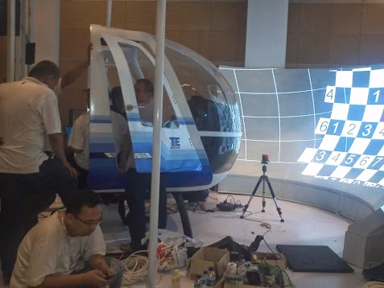

This internal lab cockpit became our proving ground for several core technologies:
1. **The Tablet-Backed "Glass Cockpit":** To solve cockpit instrumentation cheaply and flexibly, we cut circular dial apertures directly into the fiberglass dashboard. Behind the cutouts, we mounted consumer **iPads and tablets** running custom rendering software. The tablets rendered analog needles, airspeed indicators, dual-tachometers (rotor and engine RPM), torquemeters, and artificial horizons with fluid 60 FPS motion. Peering through the bezels, the pilot saw illuminated, convincing dials that could be modified in software within seconds.
2. **Active Electric Motor Control Loading (Force Feedback):** Helicopter cyclic and collective controls experience dynamic aerodynamic stick forces, trim breakout forces, and cyclic rotor vibrations. We linked the cyclic stick to high-torque electric servomotors controlled by C++ loops, calculating stick resistance, centering gradients, and rotor vibration purely in software without relying on heavy hydraulic actuators.
3. **Curved Projection Auto-Warping:** We used this rig to develop our in-house multi-projector warping and edge-blending algorithms, using optical camera feedback to calculate non-linear distortion matrices that stitched multiple overlapping projectors across curved cylindrical screens without visible seams.

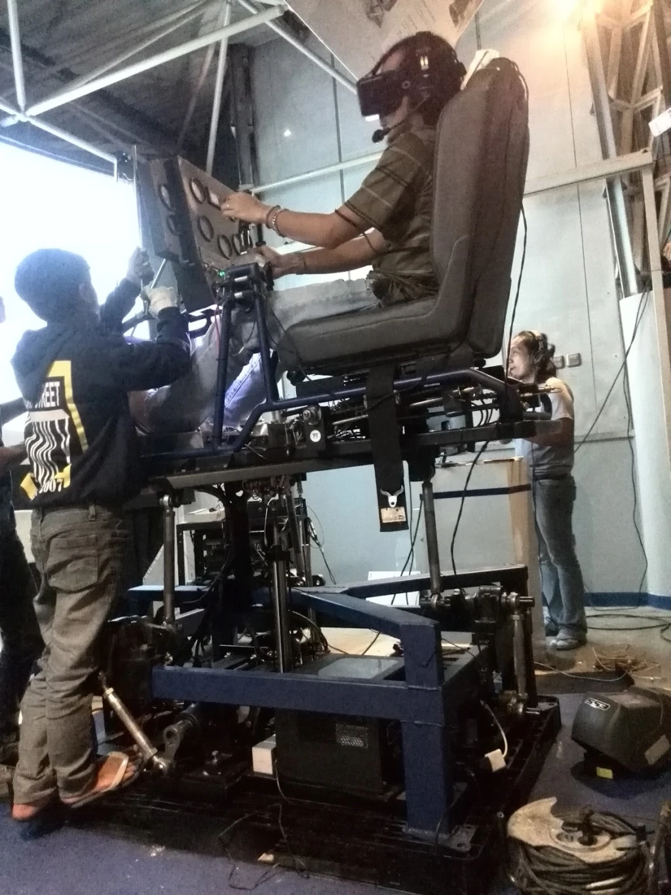

4. **The Custom Motion Platform & VR Immersion Rig:** We fabricated an experimental motion platform directly underneath the pilot seat with electric linear actuators. To evaluate our **vestibular motion washout algorithms**, we placed the test pilot in a VR headset. The goal was **not VR technology for its own sake**, but sensory immersion: by blinding the pilot to the physical laboratory walls, they could evaluate whether the physical G-forces, roll/pitch onsets, and simulated accelerations generated by our custom motion base felt aerodynamically and tactilely authentic.

This initiative saved millions of dollars and proved that standard COTS PC hardware, electric motors, and modern software could outperform legacy aerospace architectures.

### 5.2 Building the NAS332 Super Puma Full Flight Simulator
Following the refurbishment success, we were awarded our first clean-sheet, ground-up build: the **NAS332 Super Puma Helicopter Full Flight Simulator**.

Unlike our earlier static trainers, the Super Puma was a **Full Flight Simulator (FFS)** equipped with an active **6-DOF motion system** (a hydraulic hexapod Stewart platform):
- **The Motion Latency Challenge:** In a motion-based flight simulator, the margin for latency is razor-thin. If the visual display, turbine audio cues, instrument dials, and physical motion platform are out of sync by more than 15 to 20 milliseconds, the pilot's inner ear and visual system conflict, causing severe motion sickness (*simulator sickness*) and ruining instrument qualification training.
- **Motion Washout Data Interfaces:** I worked on the data interfaces feeding the motion washout algorithms—splitting accelerations into high-pass tilt cues (initial onset physical kicks) and low-pass sustained tilt cues (using gravity to simulate sustained acceleration without running out of actuator travel).
- **My Core Engineering Role:** I engineered the distributed networking architecture, tactical intercom audio system, shared-memory synchronization pipelines, and hardware-to-software I/O bridges connecting dual-pilot cyclic, collective, and anti-torque pedal linkages.

The Super Puma simulator entered operational service as one of the premier domestic flight training devices in Southeast Asia.


---

## Act VI: The STMR Revolution — Dismantling Aerospace Over-Engineering

### 6.1 The Generational Divide: Challenging the Ex-IPTN Veterans
Inside T&E, there was an intense cultural divide between two generations of engineers:
1. **The Senior Generation (Ex-IPTN / PT DI):** Veterans of Indonesia's state aerospace corporation (*Industri Pesawat Terbang Nusantara*, later PT. Dirgantara Indonesia) founded under B.J. Habibie. These engineers had incredible mechanical discipline, structural fabrication standards, and aeronautical rigor. But their software, electrical, and systems philosophies were rigid, conservative, and stuck in 1980s aerospace compliance.
2. **Our Next-Generation Team:** Led by myself and my fellow young engineers, who embraced modern microcontrollers, low-latency networking protocols, agile iteration, and modular computing.

The conflict came down to philosophy. The senior engineers designed vehicle simulators the only way they knew how: **as if they were building a real, certified aircraft.**
- Every switch, lamp, dial, and sensor inside a cabin was connected via dedicated, thick wire bundles.
- These bundles ran through banks of mechanical relays, analog signal conditioning boxes, massive DC power supply rails, and custom-etched discrete PCB circuit boards.
- Simulators ended up weighed down by hundreds of kilograms of copper wiring, dozens of physical failure points, and wiring schematics that took months to draft and debug.

For certified civil aviation, that conservatism had legal justification. But for an Army tank simulator, it was completely wrong: it drove production costs through the roof, made field maintenance a nightmare, and paralyzed software deployment.

### 6.2 Taking Total Ownership of STMR
The turning point came with **STMR: Simulator Taktis Multi Ranpur** (Joint Tactical Fighting Vehicle Simulator) for the Indonesian Army Cavalry Corps (*Pussenkav*). The Army operated a mixed armored fleet:
- **Alvis FV101 Scorpion:** Fast, lightweight British reconnaissance tank with a 90mm Cockerill gun.
- **AMX-13 / AMX-90:** French-built light tank with oscillating turret.
- **Armored Support Vehicles & Troop Carriers.**

The Army needed a modern simulator. Drawing upon our ACV-300 experience, my peers and I made a bold political move within the company:
> *"Give the STMR project to our team. We will own the entire software and systems architecture from the ground up."*

We left the physical mechanical cabin fabrication to the older generation—leveraging their unquestioned mastery of steel, sheet metal, and cockpit ergonomics—while I took total command of the electrical and software architecture.

### 6.3 My Three Architectural Commandments
As Software Architect, I laid down three non-negotiable mandates:

```
=============================================================================
                      MY ARCHITECTURAL MANDATES (STMR)
=============================================================================
 1. ZERO ANALOG SIGNALS ACROSS THE CABIN BOUNDARY
    All analog-to-digital conversion (ADC) must occur inside the vehicle cabin.
    No raw voltage, potentiometer lines, or analog wires may exit to external servers.

 2. 100% IP / ETHERNET DATA TRANSMISSION
    All telemetry, switch states, steering inputs, and control commands must
    be serialized into digital packets and transmitted over standard Ethernet
    cables using IP-based protocols (TCP, UDP, or raw Packet32 frames).

 3. ZERO CUSTOM DISCRETE PCBS OR SCHEMATICS
    I banned custom-etched electronic boards in favor of standard, Commercial-
    Off-The-Shelf (COTS) Single Board Computers (SBCs), microcontrollers
    (AVR, Arduino, ESP32), and industrial SoCs.
=============================================================================
```

### 6.4 "Well, It's a Tank Anyway, Not an Aircraft"
The older generation resisted fiercely. They argued that Arduino and microcontrollers were "fragile hobbyist toys," unbefitting a military defense contractor. They warned that abandoning custom PCBs and discrete relay boxes would compromise stability and cost people their specialized jobs.

I disarmed their resistance with a single, pragmatic argument:
> *"Well, it's a tank anyway, not an aircraft."*

I knew they derived immense professional pride from their aeronautical background. By framing the ground combat vehicle as beneath their aircraft certification standards, I gave them a face-saving way to step aside.

The engineering truth was that my conviction was not based on abstract theory or tech blog hype: **it came from raw, battle-tested operational experience.** In my own high-density computing lab, I had already spent years using x86 Single Board Computers (SBCs), Arduinos, and IoT power relay modules to automate, monitor, and power-cycle hundreds of screaming GPUs pulling 330 kVA. If low-cost COTS microcontrollers and SBCs could reliably orchestrate hundreds of kilowatts of inductive industrial load 24/7/365 without failing, they could effortlessly read the 5V potentiometer wipers and switch states of an armored tank simulator cabin.

The operational advantages on STMR were undeniable:
- COTS microcontrollers operated on clean, uniform 3.3V and 5V DC logic.
- If a microcontroller burned out in the field, a replacement cost five dollars, required no custom PCB etching, and could be flashed with firmware over USB in thirty seconds.
- Standard I2C, SPI, and UART busses handled all potentiometer and switch multiplexing within the cabin.

### 6.5 The Single-Cable Decoupling & The "Hot-Swappable" Cabin
The results of this architecture transformed our company:

```
[ Traditional Aerospace Architecture ]
Cockpit Switches ---> [Analog Harness] ---> [Signal Conditioners] ---> [Relay Banks] ---> [Server A/D Cards]
(Hundreds of heavy analog wires, brittle connectors, high latency, fixed spatial distance)

[ My IP-Decoupled Architecture ]
Cockpit Switches ---> [COTS Microcontrollers] ---> [Local Switch] ======= SINGLE CAT6 CABLE =======> [Simulation Host]
                                                                        (Pure Digital Packets)
```

- **The Single Cable:** The entire armored cabin—including turret rotation encoders, driver pedals, gunner sights, commander controls, and instrument panels—connected to our simulation servers through a **single, standard Ethernet cable**.
- **Spatial Independence:** It no longer mattered where the server racks sat. They could be placed beside the simulator, in an air-conditioned server room fifty meters away, or in another building. The network did not care.
- **The Hot-Swappable Cabin on a Single Motion Base:**
  During development, the Army requested simulators for multiple vehicle variants (FV101 Scorpion, AMX-13, and APCs). However, the military budget could not support buying multiple multi-million-dollar 6-DOF motion bases.
  
  Because I had decoupled the cabin interface over Ethernet, I proposed a radical mechanical/software solution:
  > **Keep one single motion platform base. Make the vehicle cabins mechanically unboltable and hot-swappable.**

  The Army could unbolt the Scorpion tank cabin, crane it off the motion base, bolt on the AMX-13 cabin, plug in the single Ethernet cable, and boot up. The simulation host recognized the IP endpoint of the connected cabin and automatically reconfigured the vehicle dynamics, visual parameters, and ballistic tables.


### 6.6 Ditching MÄK: Total Software Independence with `libDIS`
On the ACV-300, we had relied on MÄK VR-Forces for the battlefield host. On STMR, we abandoned foreign commercial licenses completely.

We deployed:
- Our own in-house tactical map and entity management software.
- The mature **`libDIS`** engine connecting independent tank simulators across the local area network.
- Complete cooperative tactical platoon training: FV101 Scorpions and AMX-90 tanks operated in shared synthetic virtual terrain, coordinating line-of-sight target acquisitions, maneuvering in echelon formations, and executing doctrine-level combat engagements.

STMR proved that our architectural philosophy—COTS hardware, IP-based telemetry decoupling, and in-house distributed protocols—was vastly superior to legacy defense engineering.

---

## Act VII: Scaling the Enterprise & Parallelizing Production

### 7.1 Solving the Software Engineering Talent Bottleneck
Following the high-profile success of STMR, military leadership requested a slate of larger, higher-budget simulation programs. Our marketing division aggressively pursued contracts.

However, we hit a structural wall common to emerging technical ecosystems: **the extreme scarcity of high-caliber systems software engineers.**
- Indonesian engineers with deep low-level C/C++, mathematical dynamics, and networking skills were rare.
- Those who possessed such skills frequently emigrated to multinational tech companies or Western defense contractors.
- Foreign engineers could not easily be hired due to budget limits, visa constraints, and military security clearances.

Historically, our company executed projects sequentially: whenever a contract was signed, the entire engineering roster was assigned to it from inception to delivery. With multiple high-budget programs arriving simultaneously, sequential execution meant turning down contracts.

### 7.2 Creating Reusable Core Platform Engines: `CommSystem` & `CodeGraph`
I solved this organizational bottleneck through radical architectural modularization. Instead of treating every new simulator contract as a bespoke monolithic codebase, I decomposed our core technologies into isolated, hardened, reusable platform engines.

Two of these engines became the foundational nervous system of our entire company:

#### 1. `CommSystem`: The Universal Tactical Audio & Voice Engine
Military simulation requires far more than background sound: it requires mission-critical tactical radio and inter-crew intercom fidelity.

`CommSystem` began during the **ACV-300** era when I needed a networked radio communication system for combat vehicle crews. Over successive programs, I architected its evolution into a studio-grade simulation engine:
- **Phase 1 (FFmpeg & Multicast):** Started with FFmpeg encoding/decoding and packet distribution over UDP Multicast.
- **Phase 2 (Custom Codecs):** Replaced FFmpeg with a tailor-made, lightweight built-in encoder/decoder pipeline to eliminate buffer queuing and slash processing latency.
- **Phase 3 (OpenAL 3D Spatial Audio):** Integrated **OpenAL** to position real-time environmental sound in 3D space—dynamically calculating Doppler shifts and directional vectors for turbine whines, rotor blade slaps, and artillery blasts based on operator head orientation.
- **Phase 4 (VST-Compatible Audio Chaining for RF Degradation):** To simulate real military combat radios—which suffer from atmospheric static, bandpass voice filtering (300 Hz–3,400 Hz), amplifier clipping, and squelch cutouts—I implemented a **VST-compatible audio plugin chaining architecture**. Voice streams passed through mathematical DSP stages that procedurally injected white noise, harmonic distortion, and electromagnetic squelch bursts on push-to-talk (PTT) release.
- **Phase 5 (ASIO & Studio Hardware Integration):** Integrated **ASIO (Audio Stream Input/Output)** drivers to achieve deterministic sub-5ms audio latency, interfacing directly with professional rackmount hardware like the **Focusrite Saffire Pro 40** (locked at 48 kHz over FireWire) and **M-Audio Fast Track Ultra 8R** preamplifiers.

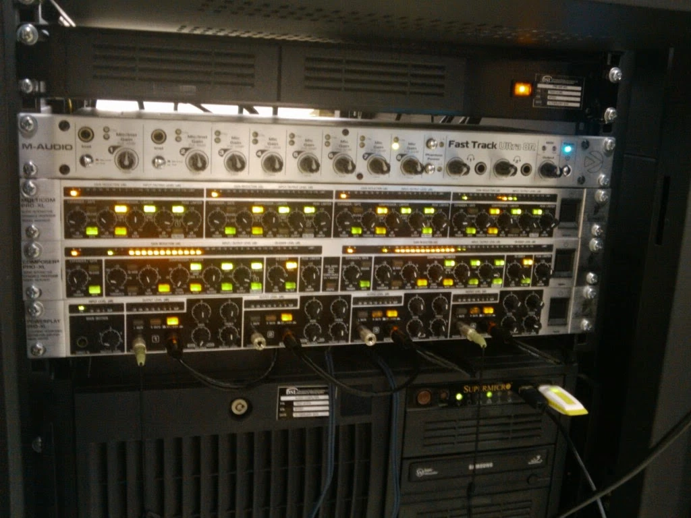

`CommSystem` became our universal audio backbone across **ACV-300, BO-105, BAe Hawk 209, STMR, F-16 FTD, the KCI commuter train, and SOYUT.**

#### 2. `CodeGraph`: The Node-Based Integration Protocol & Middleware
Historically, linking simulator subsystems (flight dynamics, instruments, motion actuators, relays) meant writing fragile point-to-point C++ glue code and hardcoded memory structs. If one engineer changed a variable, the entire simulator broke.

To eliminate this friction, I designed **CodeGraph**: our proprietary in-house communication protocol and visual node-based integration middleware.

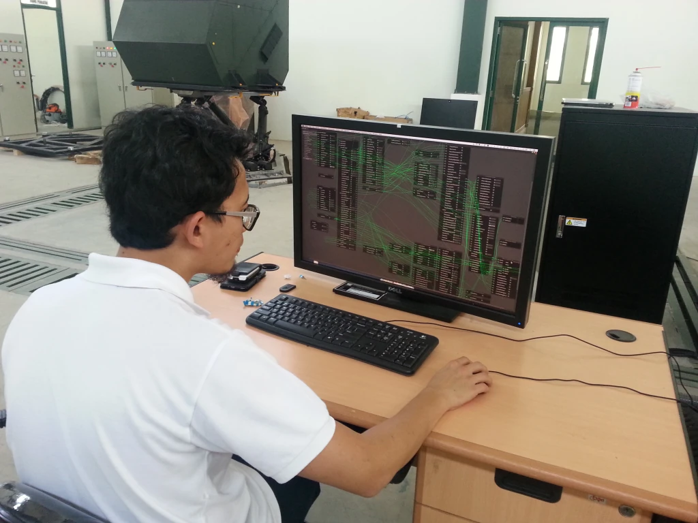

- **Standardized Typed "Pins" & "Sockets":** Every simulator subsystem was wrapped as a self-contained CodeGraph module. Developers authored modules with standardized inputs and outputs.
- **Arbitrary Data Payloads:** Pins could transport continuous high-bandwidth audio buffers for `CommSystem`, 6-DOF linear/angular acceleration vectors for motion platforms, raw analog throttle voltages, or discrete boolean triggers for physical power relays.
- **Topological & Network Transparency:** If two nodes resided on the same machine, CodeGraph transferred data via zero-copy shared memory. If they were on separate machines, CodeGraph automatically serialized and transmitted the packets across the LAN via **Unicast or Multicast UDP**.
- **Device-to-Device Integration:** CodeGraph bridged physical hardware directly to software logic and other physical devices. An Arduino reading a physical switch could directly trigger a simulator breaker relay across the network with zero custom glue code.

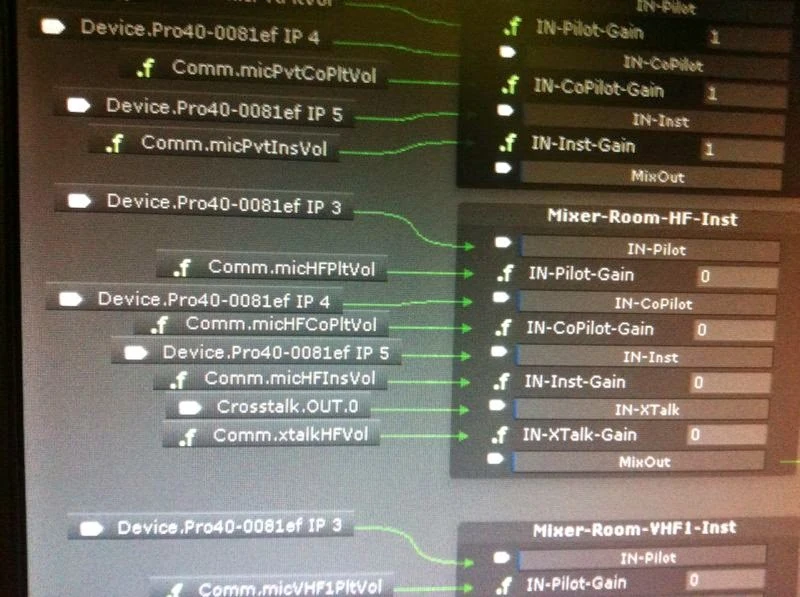

### 7.3 Parallelizing Turnkey Projects and Freeing My Team
With `libDIS`, `CommSystem`, and `CodeGraph` standardized and battle-tested, we fundamentally transformed our company's production model from sequential contracting to parallel execution:

- **Turnkey Simulators & Subsystem Reuse (F-16 FTD & KCI):**
  - **F-16 Flight Training Device (FTD):** When our company secured the contract to build the F-16 fighter simulator for the Indonesian Air Force at Iswahyudi AFB, **I was not involved in the day-to-day routine development.** The senior engineering cohort handled the physical cockpit wiring, mechanics, and integration. Yet the simulator succeeded because it was built entirely on the reusable platform foundations I had created: `libDIS` for military network interoperability, `CommSystem` for tactical cockpit and radio audio, and `CodeGraph` for subsystem interconnects.
  - **KCI Commuter Train Simulator:** When PT Kereta Commuter Indonesia / PT KAI contracted us for a civilian rail simulator, we adapted our core engines to model train rolling stock inertia, wheel-rail contact friction, and pantograph electrical traction, reusing `CommSystem` for cab intercoms and track acoustics.


- **Advanced Clean-Sheet Systems:** 
  - Because turnkey projects could be delivered by the wider engineering team using our reusable engines with zero core software intervention, **my core team was completely liberated.** 
  - We could dedicate 100% of our focus and intellectual energy to the most complex, classified, and prestigious challenge in Indonesian defense simulation history: **Project SOYUT.**

---

## Act VIII: The Crucible of CryptoSlax — 330 kVA, Hundreds of GPUs, and Stateless Computing (2010 – 2015)

### 8.1 The Pre-Exchange Era: Sub-$1 Bitcoin, Compiling `bitcoind`, and Midnight Cron Jobs
Around 2010 to 2011, long before cryptocurrency became a speculative Wall Street asset or a household term, I stumbled upon a technical paper that immediately seized my attention:
> *"Bitcoin: A Peer-to-Peer Electronic Cash System"* by Satoshi Nakamoto.

At that time, Bitcoin traded for pennies—well below $1—and possessed virtually zero recognized fiat value. There were no trading platforms, no crypto exchanges, no mobile wallets, and no online brokers. To almost everyone, it looked like an obscure cryptography experiment. But as someone trained in pure mathematics and distributed systems, I immediately recognized the profound elegance of the concept: an autonomous, Byzantine fault-tolerant distributed consensus mechanism operating over an immutable, cryptographically chained ledger.

Because there were no commercial apps or pre-built binaries for consumer platforms, the only way to hold a wallet or interact with the network was to compile the client yourself:
- I pulled the original C++ source code from repository archives.
- I resolved the raw dependencies on Linux: Berkeley DB (`libdb4.8++`) for wallet storage, OpenSSL for elliptic curve cryptography (`secp256k1`), and Boost libraries.
- I compiled the **`bitcoind`** daemon from source and let it synchronize the earliest blocks of the blockchain.

In those days, proof-of-work difficulty was so low that you could mine blocks using standard x86 CPU instructions. At our office, we had racks of high-performance dual- and quad-socket Intel Xeon enterprise servers that sat idle overnight after simulation runs. I wrote hidden bash scripts orchestrated via cron jobs that silently engaged the Xeon CPU cores at midnight, hashing through block headers while the building was empty, and quietly terminating execution before business hours began.

Through those midnight cron jobs, I generated roughly **1 BTC per day**.

When **Mt. Gox** emerged as the first major global exchange, it was virtually useless for an engineer living in Indonesia. The platform operated entirely in USD wire transfers routed through Japanese and American banking rails, with zero integration into Indonesian banking or local currency (IDR). Having no realistic way to liquidate or spend the coins in the real economy, I treated them as mathematical play money—wagering fractions of Bitcoins on **Satoshi Dice**, the earliest provably-fair on-chain dice game, purely to explore transaction propagation and script verification.

### 8.2 The Philosophy of Freedom: Buying Back My Time
As Bitcoin began to capture global attention, the computational arms race escalated rapidly:
1. **CPU mining gave way to GPU compute kernels:** Mining shifted to ATI/AMD Radeon graphics cards running OpenCL pipelines (HD 5000 and HD 7000 series, specifically the Tahiti architecture), where vector ALUs calculated SHA-256 hashes orders of magnitude faster than x86 CPUs.
2. **The birth of Ethereum:** In 2015, Ethereum introduced Turing-complete smart contracts and the memory-hard **Ethash (Dagger-Hashimoto)** proof-of-work algorithm, which favored high-bandwidth consumer GPU VRAM over specialized ASIC hardware.

As my cryptocurrency holdings appreciated, I did not buy sports cars, luxury watches, or status symbols. My objective was purely philosophical: **to buy back my time and technical freedom.**

I bought a modest second-hand car and purchased a two-story house with an 8x12-meter footprint in Bandung. My calculation was grounded in personal autonomy: if I could engineer an autonomous, automated computing infrastructure that generated passive cash flow, I would never again be held hostage by the need for a routine corporate paycheck. I could walk away from bureaucratic consulting jobs, decline uninspiring projects, and dedicate 100% of my intellectual energy to the hardest, most interesting software architecture challenges in the world.

### 8.3 The 330 kVA Residential Datacenter
I was unmarried at the time and lived alone in the 8x12-meter house. Unconstrained by conventional domestic needs, I converted the entire residential property into an industrial high-density GPU computing facility.

```
=============================================================================
              MY 330 kVA RESIDENTIAL GPU DATACENTER (BANDUNG)
=============================================================================
 [ 2nd Floor Facility ]    Slotted Steel Angle Racks | Custom Aluminum Frames
                           Hundreds of GPUs (AMD HD 7970 Tahiti / R9 / ZOTAC)
 ---------------------------------------------------------------------------
 [ Thermal Management ]    Window Frame Cutouts | High-Velocity Industrial
                           Ventilation Exhaust Fans (Dumping Kilowatts Outside)
 ---------------------------------------------------------------------------
 [ 1st Floor Workshop ]    Central Master Server (PXE/TFTP/DHCP) | Switch Racks
                           Glass-Enclosed Operations Room ("DILARANG MASUK")
 ---------------------------------------------------------------------------
 [ Power Substation ]      330 kVA 3-Phase Industrial Grid Drop | Heavy Copper
                           Busbars | Split Distribution Panels & Breakers
=============================================================================
```

A standard residential house in Indonesia typically runs on an electrical connection of **2.2 kVA to 6.6 kVA**. I worked with the state electricity company (PLN) to execute an extraordinary infrastructure upgrade: **installing a massive 330 kVA (330,000 Volt-Amps) 3-phase industrial power feed directly into a private residence.**


I filled both the ground floor and the upper floor with multi-tier slotted angle steel racks and custom open-air aluminum chassis:
- Hundreds of graphics cards—AMD Radeon HD 7970s, R9 280X/290X, and multi-GPU ZOTAC GeForce clusters—ran at 100% compute load, 24 hours a day, 365 days a year.
- Industrial electrical distribution panels split the 3-phase power into isolated breaker rails to balance the massive inductive and resistive loads.


The primary enemy was thermal dissipation. Hundreds of GPUs drawing hundreds of amperes generated staggering amounts of continuous heat, turning the house into an industrial blast furnace. Standard residential air conditioning was hopelessly inadequate: compressors would fail within hours under such thermal density.

I solved the heat problem with mechanical brute force: **I cut rectangular holes directly through the exterior window frames and fitted large, high-velocity industrial exhaust ventilation fans.** These fans evacuated thousands of cubic feet of superheated air per minute directly out into the Bandung atmosphere, creating a continuous negative-pressure wind tunnel across the GPU heatsinks.


### 8.4 The Failure of the "Do Nothing" Myth: Maintenance Hell
The broader public imagines crypto mining as "making money while you sleep." In reality, running a cluster of hundreds of consumer GPUs on desktop-grade motherboards was an exhausting operational gauntlet:
- Consumer motherboards and budget PCIe 1x-to-16x riser ribbon cables were never engineered for continuous, multi-year, full-load industrial duty.
- Risers developed micro-fractures, SATA power connectors melted under sustained current, and GPU VRMs suffered thermal stress.
- Voltage fluctuations or driver lockups caused individual computing nodes to freeze.

Whenever a rig froze or crashed, the only recovery mechanism was a hard power cycle. But running standard operating systems (whether Windows or standard desktop Linux distributions like Ubuntu) on local USB thumb drives or mechanical hard drives turned every crash into a maintenance catastrophe:
1. **Filesystem Journal Corruption:** Hard power cuts during active write operations corrupted ext4 or NTFS filesystem journals. Upon reboot, the machine would halt at an interactive `fsck` prompt, requiring a physical keyboard and monitor to clear.
2. **NAND Flash Degradation:** Continuous operating system logging (`/var/log/syslog`, kernel ring buffers) burned through the write endurance of consumer USB flash drives, permanently bricking them after weeks of operation.
3. **Driver Inconsistencies:** Half-applied updates or corrupted configuration files left rigs in unpredictable states.

Instead of gaining the freedom I had sought, I found myself sprinting up and down the stairs between roaring server racks at 3:00 AM, carrying a portable monitor and keyboard, manually re-flashing USB flash drives, and diagnosing corrupted OS installations.

The realization was immediate: **Storage media was the enemy. To achieve true autonomy, I had to eliminate local disks entirely.**

### 8.5 Engineering CryptoSlax: Statelessness, PXE Boot, and OverlayFS
To eliminate maintenance downtime, I sat down and engineered a custom, bulletproof operating system: **CryptoSlax**.


Derived from the minimalist principles of SLAX (a Slackware-based modular live distribution), I engineered a stripped-down Linux distribution with an initial footprint of under **100 MB**, purpose-built for unattended, headless GPU acceleration.

```
=============================================================================
                    CRYPTOSLAX STATELESS BOOT SEQUENCE
=============================================================================
 [ Node Powered On ]      Motherboard BIOS executes PXE Network Boot ROM
 ---------------------------------------------------------------------------
 [ DHCP & TFTP ]          Pulls IP address & downloads minimal Linux Kernel
                          and initramfs from Master Server over Gigabit LAN
 ---------------------------------------------------------------------------
 [ Copy to RAM ]          Transfers compressed SquashFS modules directly into
                          4 GB system RAM; network connection can now drop
 ---------------------------------------------------------------------------
 [ Dynamic OverlayFS ]    Mounts read-only system layers in RAM:
                          ├── 01-core.sb     (Linux Kernel, Glibc, BusyBox)
                          ├── 02-xorg.sb     (Minimal X11 Display Server)
                          ├── 03-drivers.sb  (AMD Catalyst / fglrx OpenCL)
                          └── 04-miners.sb   (cgminer 3.7.2 / ethminer)
 ---------------------------------------------------------------------------
 [ Auto-Execution ]       Watchdog daemon probes GPUs, applies clocks/voltages,
                          spawns mining process with failover pool endpoints
=============================================================================
```

The architecture rested on three uncompromising technical pillars:
1. **100% Diskless (PXE Network Boot):** Every mining rig was stripped of local storage. There were no HDDs, no SSDs, and no USB thumb drives. Motherboard NICs booted via PXE (Preboot Execution Environment) over our local Gigabit Ethernet network, requesting bootloader instructions from a central master server via DHCP and TFTP.
2. **Execution from Volatile RAM ("Copy to RAM"):** Upon booting, the compressed operating system image was loaded entirely into the rig's 4 GB of system RAM and decompressed into a tmpfs virtual filesystem. Once loaded, the machine no longer accessed the network for operating system binaries: it executed completely out of high-speed RAM.
3. **SquashFS & Modular OverlayFS Layers:** The operating system was constructed as immutable, read-only SquashFS module packages (`.sb`):
   - `01-core.sb`: The hardened Linux kernel, minimal glibc, and BusyBox core utilities.
   - `02-drivers.sb`: The proprietary graphics stack (AMD Catalyst `fglrx` with OpenCL runtime, or NVIDIA CUDA drivers), stripped of unnecessary desktop fluff.
   - `03-miners.sb`: Custom-compiled mining binaries (**`cgminer 3.7.2`** with Tahiti GPU optimizations, `sgminer`, or `ethminer`).
   - `04-config.sb`: Node identification, clock frequencies, undervolting profiles, and pool failover lists.


#### The Power of Total Statelessness
Because the root filesystem was mounted as read-only memory overlaid on top of immutable SquashFS bundles, **the operating system was physically immune to corruption.**

If a rig froze, overheated, or suffered a power dip, there was no need to troubleshoot or gently shut down the machine. A hardware watchdog or remote network relay simply killed the AC power and turned it back on. Within twenty seconds:
- The motherboard initiated a PXE boot over the LAN.
- A pristine, byte-perfect operating system was pulled into RAM.
- GPU clocks and undervolt offsets were applied.
- The miner launched automatically and resumed hashing.

There was no filesystem to corrupt, no `fsck` prompt, no failing flash drive, and zero human maintenance required. A facility pulling 330 kVA with hundreds of consumer GPUs ran with the deterministic stability of an industrial power plant.

#### The Wall-Mounted Nerve Center: PXE Server, x86 SBC Watchdog & 3G/4G Failover
The central nervous system orchestrating the entire two-story, 330 kVA facility was not a massive server rack: it was an ingenious, ultra-compact vertical control stack mounted directly to a structural window pillar.


This vertical column held every critical operational subsystem:
- **MikroTik Router with 3G/4G Cellular Dongle (Top):** Managed high-speed Gigabit LAN subnetting and traffic prioritization. A 3G/4G USB cellular modem mounted to the top of the router provided automated multi-WAN failover: whenever the home broadband connection dropped, traffic seamlessly rerouted over cellular within milliseconds, ensuring zero missed mining pool deadlines.
- **TP-Link Switch with Apple Sticker ("The Fake AirPort"):** A running inside joke in the facility—that sleek white device with the Apple logo wasn't an expensive Apple AirPort Express, but a cheap 100Mbps Ethernet switch onto which I slapped a spare Apple sticker! It reliably routed management packets just the same.
- **x86 Single Board Computer (SBC) & Hardware Relay Controller (Middle):** Ran continuous health telemetry daemons. Interfaced via GPIO and USB to physical power relays on the mining rig PSUs, the SBC monitored cluster heartbeats. If a rig froze or failed to report, the SBC autonomously triggered the power relay to hard-reboot the machine, or allowed me to power-cycle any rack remotely via SSH.
- **Bare 256 GB Master SSD (Bottom):** An uncased 256 GB SSD mounted directly to the concrete pillar with exposed NAND flash chips, storing the master TFTP/DHCP boot files, Linux kernels, and **CryptoSlax** SquashFS module packages distributed across the network.

Crucially, this hands-on mastery of **x86 SBCs, Arduinos, and IoT relay automation** was not an isolated hobby: it was the exact technical foundation that gave me the empirical proof and unshakeable confidence to dismantle aerospace over-engineering on **Project STMR**, replacing heavy discrete relay banks and custom PCBs with five-dollar COTS microcontrollers.

### 8.6 Squeezing the Silicon: Forking `cgminer` & Tuning Custom Compute Kernels
Stateless operating system stability was only half the equation. In high-density cryptocurrency mining, electricity is your primary operational cost, and hashing difficulty continuously escalates. Running standard, off-the-shelf mining software placed you at the mercy of default developer choices.

To get ahead of global competition, I didn't just accept stock binaries: **I forked the source repositories of `cgminer` and `sgminer` and hand-optimized the underlying OpenCL and CUDA compute kernels directly.**
- **AMD GCN Architecture Tuning (Tahiti HD 7970 / R9 280X):** I modified the OpenCL kernel code to match the exact hardware characteristics of AMD's 28nm Graphics Core Next (GCN) architecture. By analyzing the compiled ISA instructions, I unrolled inner loops in the cryptographic rounds and manually optimized register usage.
- **Minimizing Register Pressure (VGPR Allocation):** Reducing vector register usage per work-item allowed the GPU hardware scheduler to schedule maximum concurrent wavefronts across all 32 Compute Units (2,048 stream cores), eliminating idle execution stalls.
- **Memory Coalescing & Cache Hierarchy:** I restructured scratchpad buffer access into aligned 128-byte transactions, saturating the 384-bit wide GDDR5 memory bus with zero wait-states.
- **CUDA Kernel Optimizations:** For NVIDIA compute nodes, I re-tuned thread block dimensions and shared memory allocations to extract peak performance per watt.

These custom-compiled compute engines yielded higher stable hashrates at lower core voltages, giving my cluster a decisive mathematical and economic edge.

#### Sub-Millisecond GPU Telemetry: Engineering `nvstat` for Linux Clusters
Operating hundreds of GPUs across high-density 12-GPU rigs pulling 3,000 Watts per node created a severe operational challenge: stock vendor tools like `nvidia-smi` were far too slow. Spawning `nvidia-smi` took 200–500ms, creating unacceptable context-switching overhead for automated watchdog loops, while its generic output obscured the actual board partner model.

To solve this, I wrote **`nvstat`**—a dedicated, lightweight C/C++ Linux command-line tool. By querying NVIDIA driver ioctls directly and reading PCIe VBIOS subsystem descriptors (`/sys/bus/pci/devices/`), `nvstat` returned a dense, ANSI color-coded status matrix in under 5 milliseconds. It reported exact board partner identities (MSI, ZOTAC, NVIDIA Founders Edition), power draw, fan speeds, core/memory clocks, and thermal warnings—allowing instant visual triage over SSH and sub-second automated thermal shutdown before hardware degradation could occur.

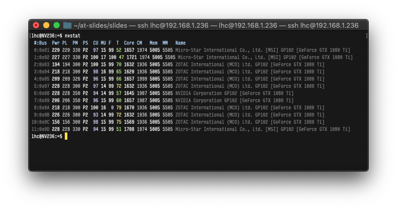

### 8.7 The Burstcoin Era: Proof-of-Capacity & Entering the Cloud (AWS & GCP)
During the mining timeline, a revolutionary new project caught my attention: **Burstcoin**. 

While Bitcoin and Ethereum burned vast amounts of electricity through brute-force Proof-of-Work, Burstcoin pioneered **Proof-of-Capacity (PoC)**. Instead of crunching hashes in real time on scorching GPUs, miners pre-computed cryptographic plot files using the **Shabal-256** hash function and stored them on magnetic hard drives. When a new block arrived, miners merely read a tiny slice of data from their hard drives to calculate a forging "deadline." It was mathematically elegant, completely green, and quiet.

Intrigued by this new consensus model, I stepped into the project as a core ecosystem contributor, working directly alongside the pseudonymous, unknown core developer. I engineered three major pieces of infrastructure:
1. **The Official Burstcoin Blockchain Explorer:** Built on Node.js, this high-throughput web service ingested raw binary block data from the daemon RPC, visualized network plot capacity across Petabytes of storage, and tracked on-chain transactions and asset transfers in real time.
2. **The Web-Based Online Wallet:** To spare users from downloading hundreds of gigabytes of blockchain data, I co-developed an ultra-fast browser wallet. It handled key derivation and transaction signing client-side in browser memory via JavaScript (`Curve25519` / `SHA-256`), transmitting only the signed bytecode to the backend to ensure zero-trust security.
3. **High-Availability Burst Mining Pool:** I architected and hosted a global mining pool that aggregated deadline shares from miners worldwide, submitted the lowest deadline to the chain, and automatically distributed block rewards proportionally.

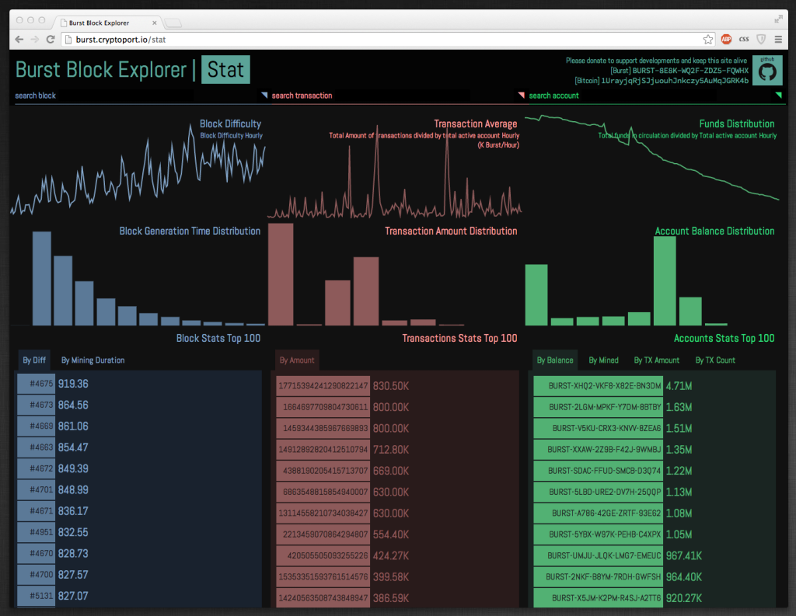

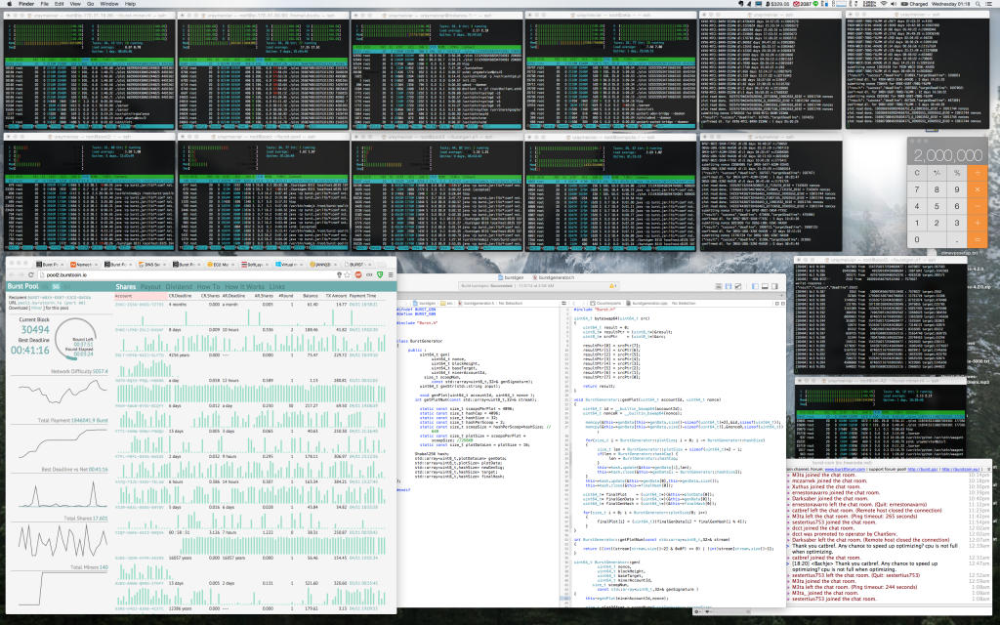

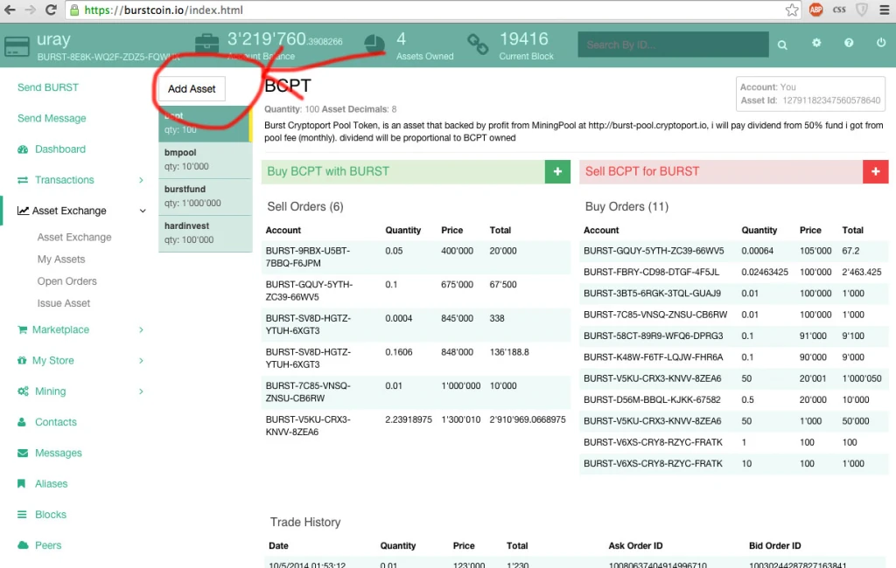

#### The Cloud Crucible: The Failure of Residential Hosting
Operating public blockchain services taught me an invaluable infrastructure lesson. Initially, I tried hosting the explorer, web wallet, and mining pool on high-spec physical servers inside my Bandung residential workshop, backed by my 330 kVA power supply.

It failed for a simple reason: **Indonesian residential internet was fundamentally unreliable.**
- Home broadband suffered frequent intermittent drops, packet loss, and high latency to international routes.
- If the internet blipped for even thirty seconds, miners across Europe and the Americas were disconnected, missed 4-minute block deadlines, and lost money.
- Running public financial tools like a blockchain explorer and online wallet requires non-negotiable **99.99% high-availability SLA**.

That operational wall forced my transition into **enterprise cloud architecture**:
- I migrated our global infrastructure to **Amazon Web Services (AWS)** and **Google Cloud Platform (GCP)**.
- I designed fault-tolerant topologies with **AWS EC2** compute nodes residing in private **VPCs**, fronted by **Elastic Load Balancers (ELB)** with Nginx reverse proxies, and managed by **Amazon Route 53** with latency-based geo-routing and automated health-check failover.
- I deployed secondary mirror nodes on **GCP Compute Engine** across North America, Europe, and East Asia, backed by distributed in-memory Redis clusters for live share synchronization.

This transition transformed me from a bare-metal local sysadmin into a cloud architect capable of deploying planetary-scale, resilient distributed backends.

### 8.8 Cryptolet: Handheld & Desktop ESP32 Cryptocurrency Hardware Ticker
As cryptocurrency markets and mining revenues accelerated, constantly checking prices on power-hungry workstations or smartphones felt inefficient. I wanted an autonomous, distraction-free physical hardware monitor sitting on my desk or carried in my pocket.

I engineered **Cryptolet**, a custom embedded appliance powered by the dual-core **ESP32** microcontroller (240 MHz) with an integrated color TFT LCD and four tactile side buttons.
- **Captive Portal Wi-Fi Provisioning:** On first boot or when moving to a new network, Cryptolet automatically spawned a SoftAP (`cryptolet<mac>`) and an embedded captive web portal (`http://192.168.4.1`). Users could configure Wi-Fi credentials, custom REST API endpoints, and target coin pairs directly from their phone, with settings stored permanently in SPIFFS flash memory.
- **Embedded Candlestick Graphics:** Once connected, the firmware contacted cryptocurrency exchange APIs (Indodax, Bitfinex) via low-overhead HTTP REST and parsed streaming JSON payloads with zero heap fragmentation. It rasterized real-time multi-period OHLC candlestick charts, price percentage deltas, and NTP-synchronized timestamps directly into the display frame buffer.

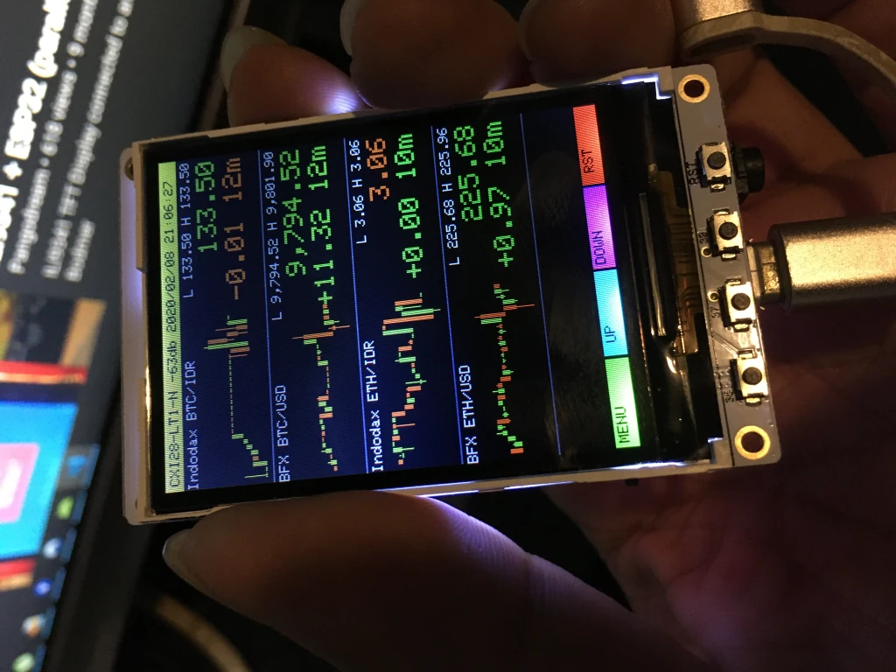

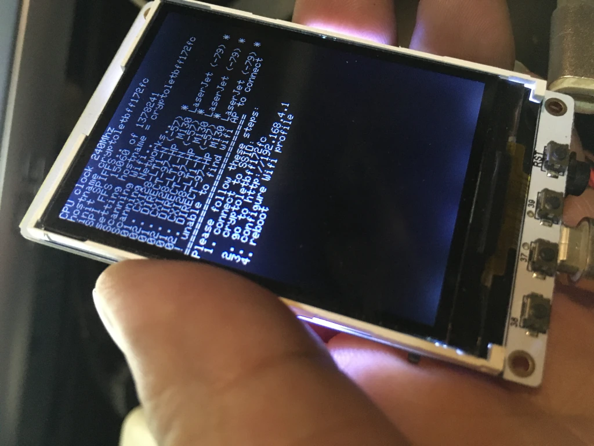

### 8.9 The First-Principles Maker: Designing and Building My Home in Blender
My obsession with systems engineering, structural physics, and tinkering has never been confined to software and silicon. I love the physical reality of materials, load vectors, and the craftsmanship of making things with my own hands.

When I purchased the **8x12-meter plot** in Bandung, I faced a choice: hire an architectural firm to produce a generic template, or design it myself.

I chose to design it from scratch.

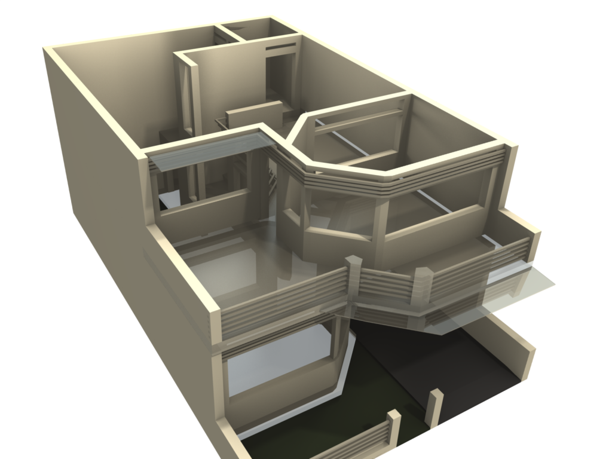

I had **zero formal education in architecture or civil engineering**. But true to my philosophy that all engineering stems from first principles, I treated building a house as another complex physical system to conquer:
- I spent months immersing myself in civil engineering texts, building code manuals, structural mechanics, and online communities across Reddit (studying structural framing, concrete curing, reinforcement ratios, and tropical climate mitigation).
- Instead of using expensive, rigid proprietary architectural CAD tools (AutoCAD, Revit), **I drafted the entire two-story house in Blender.**
- Using Blender's 3D spatial viewport and the **Cycles ray-tracing engine**, I modeled structural concrete columns on a rigid load-bearing grid, designed natural cross-ventilation corridors, and simulated seasonal tropical sun trajectories across the equator to position eaves and window lintels for optimal daylighting without solar heat soak.

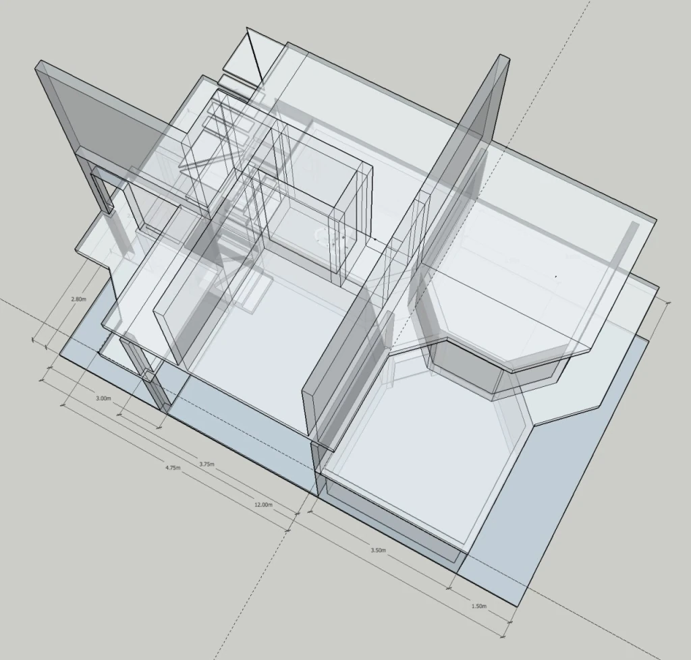

When design met reality, I personally oversaw the physical construction on site:
- Directing excavation and structural reinforced footings (*Cakar Ayam*) designed to withstand Bandung's seismic fault lines.
- Checking rebar cages, concrete slump tests, and steel roof truss fabrication.

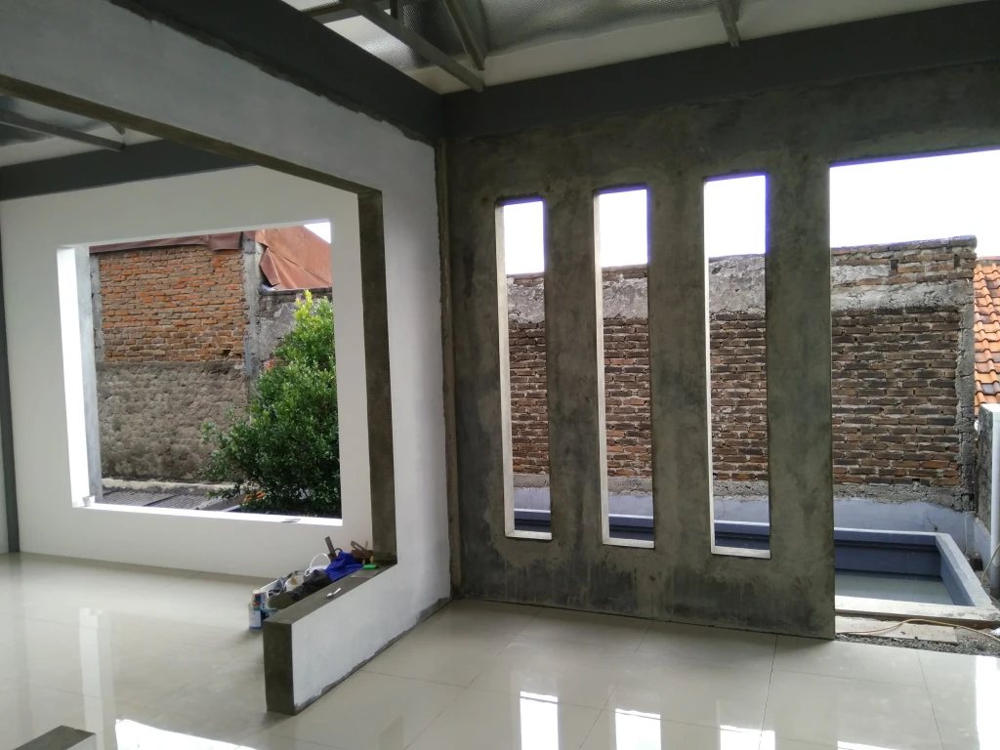

#### The Life Cycle: From 330 kVA Datacenter to Family Sanctuary
I built the house with enough structural and electrical margin to support my wildest technical ambitions. During the peak mining years, that 8x12m structure effortlessly carried the load of hundreds of kilograms of steel racks, heavy copper busbars, a 330 kVA industrial grid feed, and industrial window exhaust fans blowing kilowatts of heat out of the building.

And when that era ended?

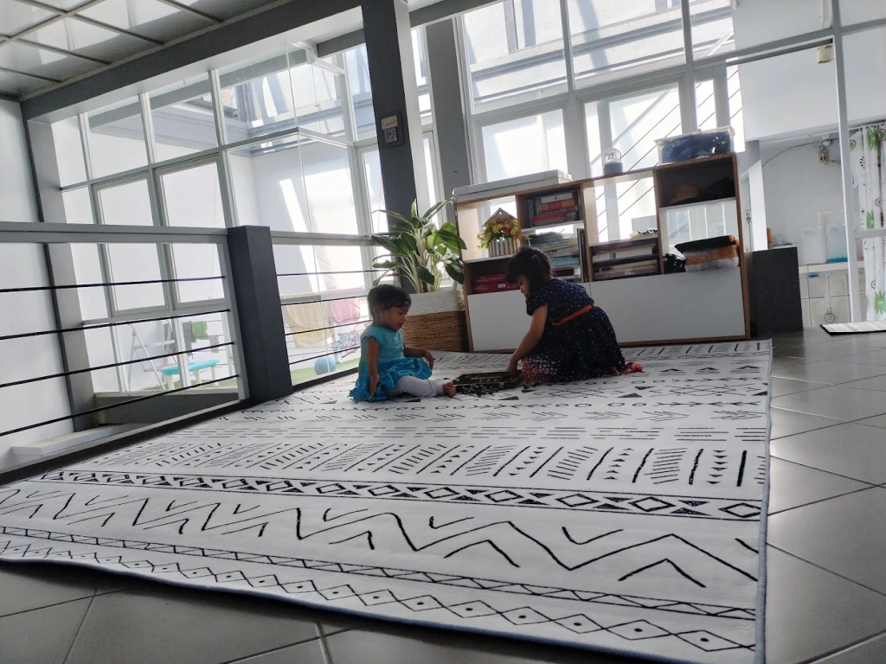

The house underwent its most rewarding transformation: **I retired the roaring rigs, removed the industrial fans, and turned the space into a warm, comfortable, and peaceful family-friendly home where I continue to live happily to this day.** The high ceilings and natural cross-ventilation originally engineered to cool screaming GPUs now keep my family naturally cool and comfortable in the tropical climate.

It remains one of the proudest achievements of my life: tangible, brick-and-mortar proof that you don't need formal credentials or institutional permission to design something that lasts.

### 8.10 The Extreme Maker Interlude: IoT, Carolina Reapers & PC Waterblocks (Tabulampot)
My obsession with systems engineering and hardware tinkering was never limited to roaring GPU racks or datacenter failovers. Once the mining facility and basic home automation were running autonomously, simple relay switches felt too trivial. I was looking for a fun, multidisciplinary challenge that combined electronics, thermodynamics, fluid dynamics, and living biology.

Around that time, I watched my mother caring for her home garden on our porch, cultivating vegetables and chillies in terracotta pots. In Indonesia, this practice is known as **Tabulampot**—an acronym for ***Tanaman Buah Dalam Pot*** (*"Potted Fruit Plant"*), a traditional technique for growing produce in compact domestic spaces.

I looked at those soil-filled pots and wondered: *What if I re-engineer the Tabulampot concept into a high-tech, aerospace-grade automated ecosystem?*

I decided to grow chillies—not because of commercial demand, but because I love spicy food. But ordinary cayenne or local bird's eye chillies (*cabe rawit*) wouldn't test the limits of climate engineering. Instead, I imported certified seeds of the **Carolina Reaper (*Capsicum chinense*)**, officially recognized by Guinness World Records as the hottest chili pepper on Earth, exceeding **2.2 million Scoville Heat Units (SHU)**.

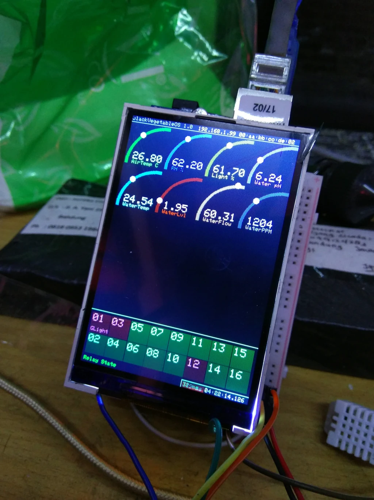

The Carolina Reaper is notoriously finicky to cultivate in tropical indoor settings: it demands high humidity and constant oxygen, yet its roots easily succumb to fungal dampening and rot if water temperatures rise.

To conquer these constraints, I designed an **automated indoor aeroponic cultivation chamber**:
- **True Soil-Less Aeroponics:** The plants were suspended in net pots over an airtight, light-sealed chamber. The roots hung entirely in free air, completely isolated from soil pathogens.
- **Ultrasonic Nutrient Atomization:** Instead of high-pressure hydraulic mist nozzles—which clog from mineral fertilizer salts and require noisy pumps—I installed submerged piezoelectric ultrasonic ceramic transducers. Vibrating at ~1.7 MHz, they cavitated the nutrient solution into a cold, ultra-fine 5-to-10 micron fog that enveloped the suspended roots with zero hydraulic resistance and maximum dissolved oxygen absorption.

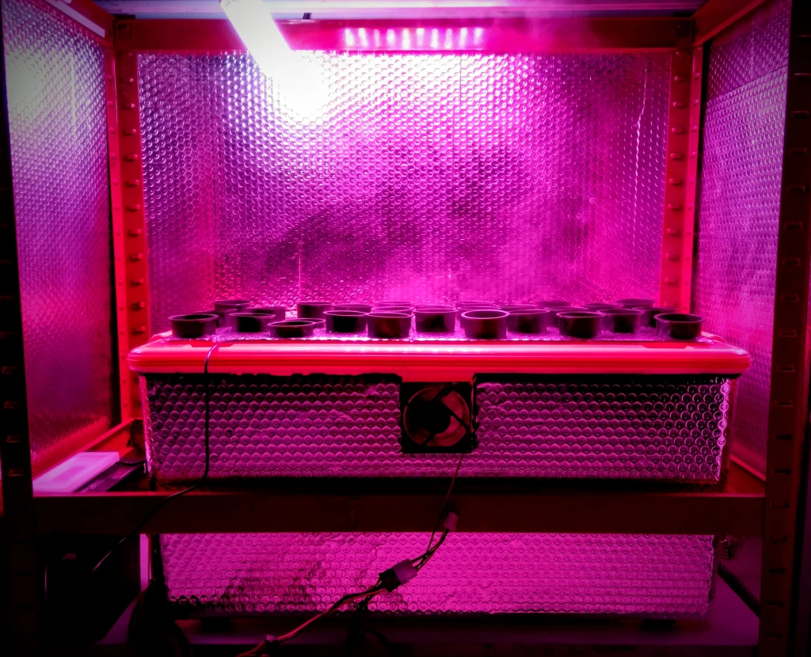

#### The PC Enthusiast's Chiller: Peltier Plates Sandwiched Between CPU Waterblocks
In tropical Bandung, daytime temperatures often climb to 30°C–32°C. At those temperatures, nutrient water loses dissolved oxygen and breeds *Pythium* (root rot), which will destroy a superhot pepper plant in two days. Roots require a cool, stable root zone maintained at **18°C–21°C**.

Commercial hydroponic chillers were bulky, loud, and cost thousands of dollars. As a lifelong PC hardware enthusiast, I engineered my own thermodynamic solution: **a custom solid-state nutrient chiller built from PC watercooling parts**.

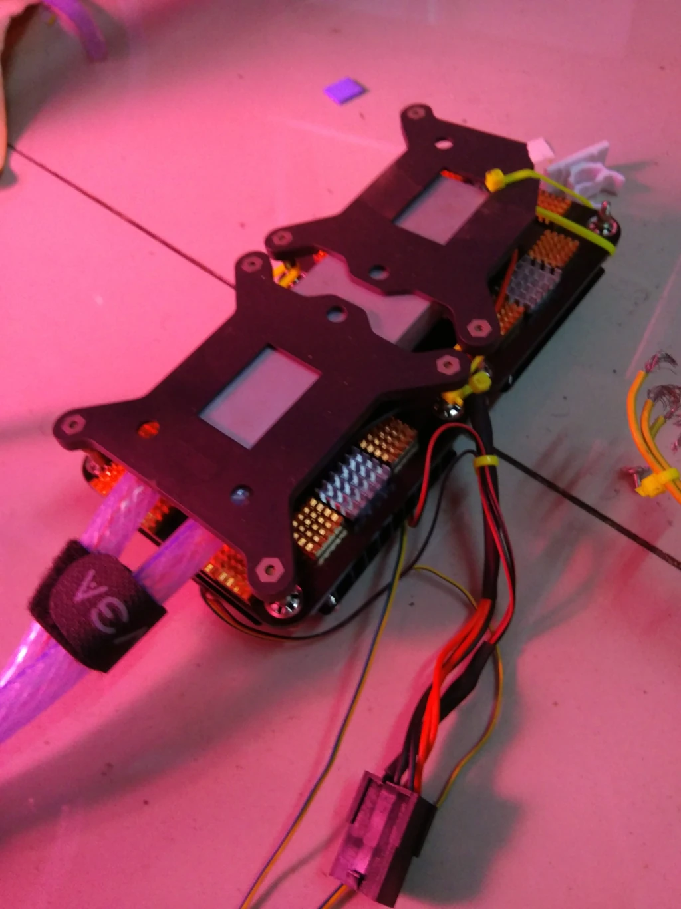

- **The Thermodynamic Sandwich:** I clamped a high-power **Peltier Thermoelectric Cooler (TEC1-12706)** plate between **two PC CPU liquid cooling waterblocks**.
- **The Cold Loop:** Cold-side nutrient liquid was pumped through one waterblock, absorbing cooling before flowing into the ultrasonic fogger chamber.
- **The Hot Loop:** The hot-side waterblock was plumbed into a custom loop with a PC radiator and 120mm static-pressure cooling fan to shed excess heat into the ambient air.
- **Closed-Loop Regulation:** Driven by a clean 12V PC power supply rail and switched via microcontroller relays, this assembly maintained the nutrient solution within an exact 19°C–21°C window, banishing root rot and saturating the fog with oxygen.

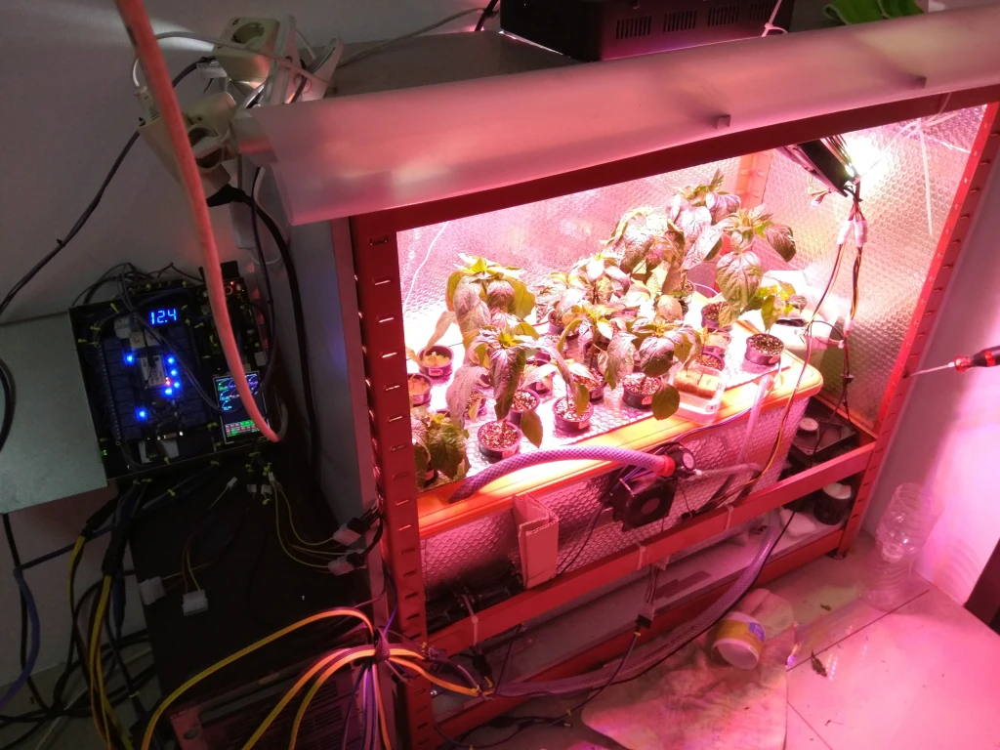

#### Closed-Loop Microcontroller Telemetry
I instrumented the chamber with an Arduino and single-board computer running deterministic control loops:
- **Submersible DS18B20 1-Wire sensors** monitored reservoir and root chamber temperatures down to fractions of a degree.
- **Analog industrial pH probes** with signal conditioning boards tracked solution acidity in real time, keeping nutrient uptake locked within the critical 5.8–6.2 pH window.
- **Ultrasonic level sensors** measured reservoir fluid consumption.
- **Automated Dual-Spectrum Photoperiod:** During the daytime, plants absorbed natural ambient daylight; at sunset, the controller engaged an array of **deep violet/red UV grow lights** (450nm royal blue + 660nm deep red) through the night, driving 18-hour accelerated vegetative growth.

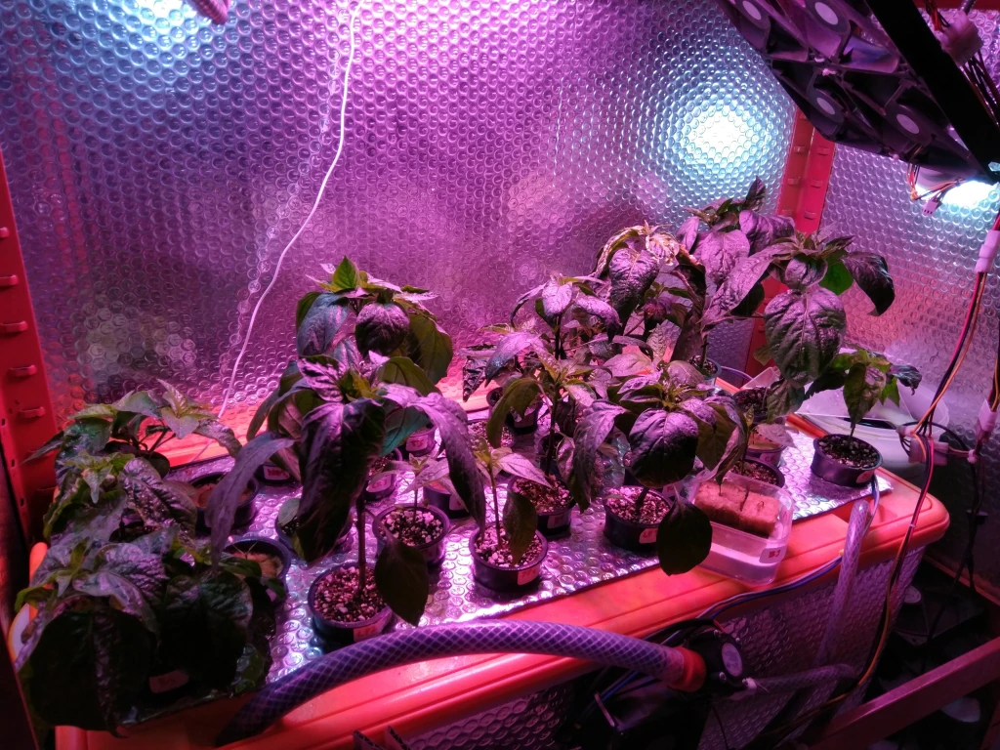

The results were astonishing: the Carolina Reaper plants developed thick woody structural stems, pristine white fibrous root beards, and enormous, deep-green foliage. 

This lighthearted maker experiment proved that the core tenets of engineering remain identical whether you are tuning graphics cards, designing aircraft avionics, or keeping a superhot pepper alive: **deterministic control loops, precision thermal management, and first-principles problem-solving.**

### 8.11 The Direct Architectural Lineage to Project SOYUT
This intense multi-domain crucible—combining operating system internals, custom GPU compute kernels, fault-tolerant cloud backends, physical structural engineering, and embedded IoT environmental control—was far more than a collection of hobbies: **it was the technological foundation that defined my architectural maturity.**

When the Indonesian Armed Forces High Command (TNI) approached us with the classified requirements for **Project SOYUT**—demanding zero data exfiltration risks, zero local storage, absolute immunity from client-side tampering, and dynamic military role switching across hundreds of client workstations—other defense contractors were paralyzed by the architectural complexity.

I was not. I did not have to speculate or experiment with unproven concepts.

I had already spent years running a 330 kVA industrial computing cluster powered by diskless, read-only, PXE-booted Linux nodes executing out of volatile RAM with OverlayFS module injection, supported by high-availability distributed backends and automated microcontrollers. I took that exact, battle-hardened architectural blueprint, ported it to a custom Linux From Scratch (LFS) base, hardened it with cryptographic verification, stripped USB mass storage drivers at the kernel level, and delivered a military-grade RTOS for the nation's highest-ranking military commanders.

---

## Act IX: Project SOYUT — Strategic Joint Command War Games (C4)

### 9.1 The Strategic Shift: Simulating Joint Archipelago War Campaigns
All our prior simulators were **tactical**: they simulated the immediate physical reality of an individual vehicle—the stick forces of an F-16, the torque of a Super Puma turbine, the turret rotation of a Scorpion tank. The physics were bounded by flight manuals, real-world operators sat in the cockpits, and the mathematical laws were deterministic.

**Project SOYUT (Sistem Olah Yudha Terpadu — Integrated War Game Simulation System)** was fundamentally different:
- **Customer:** The Indonesian Joint Armed Forces High Command (TNI: Air Force, Army, and Navy Joint Chiefs of Staff).
- **Scope:** A national **C4 (Command, Control, Communications, and Computers)** strategic joint war campaign simulator.
- **Role:** Rather than training junior pilots or drivers, SOYUT was operated by **High-Ranking Military Generals, Admirals, and Strategic Planners** to simulate theater-level warfare across the Indonesian archipelago.
- **Simulated Operations:**
  - Joint troop movements across multi-island maritime theaters.
  - Multi-echelon logistics, supply chain replenishment, and ammunition/fuel depletion rates.
  - Strategic transport scheduling (C-130 Hercules transport flights, naval landing craft, rail logistics).
  - Radar coverage boundaries, electronic warfare jamming, encrypted command channels, and signaling.
  - Vague, subjective operational parameters: unlike flight simulators with rigid aerodynamic charts, military generals had subjective tactical doctrines with no pre-existing software specifications.

### 9.2 The Classified Security Dilemma & 3-Year Deadline
SOYUT operated under severe constraints:
- **Absolute Secrecy:** Because it modeled actual national defense war plans, contingency operations, and strategic theater deployments, zero foreign software or third-party contractors were permitted. Commercial solutions (such as MÄK software) were legally prohibited.
- **Strict Delivery Horizon:** Typical defense simulation programs took 2 to 3 years; SOYUT was held to the same rigid schedule despite having no commercial baseline to build upon.
- **Massive Distributed Deployment:** The software was not intended for a single room; it had to be deployed across hundreds of client workstations distributed throughout various armed forces branch headquarters.

### 9.3 My "RTOS" Solution: The Diskless Zero-Trust Linux Stack
Maintaining hundreds of classified client workstations across military headquarters posed a fatal administrative problem. If each workstation ran a standard desktop OS (Windows or standard Linux):
- Dedicated sysadmins would be required at every facility to patch, configure, and troubleshoot client machines.
- Military operators might attempt to install unauthorized software, alter drivers, or compromise security.
- Physical theft or extraction of a hard drive could compromise classified tactical data.

Drawing directly upon the proven architecture of **CryptoSlax**, I engineered a radical defense infrastructure solution: **A Diskless, Zero-Trust Custom Linux Operating System.**

```
=============================================================================
                      SOYUT ZERO-TRUST DISKLESS OS STACK
=============================================================================
 [ Application Layer ]       Cesium3D (WebGL) | WebRTC Voice | WebSockets Streaming
 ---------------------------------------------------------------------------
 [ Dynamic Role VFS ]        AUFS / OverlayFS (Memory-Mounted Role Layers)
 ---------------------------------------------------------------------------
 [ Hardened Base OS ]        Linux From Scratch (LFS) - Minimal Kernel & Glibc
 ---------------------------------------------------------------------------
 [ Hardware Security ]       USB Drivers Disabled | Read-Only RAM Execution
 ---------------------------------------------------------------------------
 [ Network Boot (PXE) ]      TFTP / DHCP Boot over Encrypted Military LAN
 ---------------------------------------------------------------------------
 [ Physical Machine ]        Client PC (ZERO HARD DRIVES / ZERO LOCAL STORAGE)
=============================================================================
```

1. **Linux From Scratch (LFS):** Rather than stripping down an existing distribution (such as Ubuntu or CentOS), I compiled an entire Linux operating system from source using the Linux From Scratch methodology. Every kernel module, the glibc C runtime, device drivers, and minimal core utilities were compiled specifically for our target hardware.
2. **Zero Local Storage (Diskless PXE Network Boot):** Client workstations contained **no hard drives, no SSDs, and no local magnetic media**. Upon power-up, the network interface card (NIC) booted via PXE over the local military network, pulling down a cryptographically verified kernel image directly into system RAM.
3. **Hardware-Level Air-Gapping:** USB storage drivers were stripped from the kernel configuration. Inserting a USB flash drive resulted in zero system recognition, physically neutralizing data exfiltration risks.
4. **Dynamic Layered Filesystems (AUFS / OverlayFS):** The base Linux image ran in volatile, read-only memory. To handle different military roles (Air Force Command, Naval Logistics, Artillery Intelligence), I deployed **AUFS / OverlayFS**. Depending on the authenticated officer's login credentials and station ID, application layers were dynamically mounted over the network into system memory, ensuring strict least-privilege security.

### 9.4 Building the Web-First Strategic Command Kiosk
On the application software side, writing native compiled desktop binaries (C++ / Qt / Win32) for hundreds of distributed military stations would have created an unmaintainable testing nightmare.

I made another visionary architectural choice: **I built the entire SOYUT strategic application as a secure, high-performance web platform executed inside a locked-down browser kiosk on top of the bare-metal Linux OS.**

In an era when web technologies were largely dismissed as toy platforms for simple websites, I recognized that modern web primitives could deliver military-grade distributed capabilities:
- **3D Geospatial Visualization (Cesium3D):** I integrated the **Cesium3D WebGL engine** to render the entire Indonesian archipelago and global airspace in 3D, supporting high-resolution satellite imagery, topographic terrain elevation, tactical military icons, and dynamic airspace control sectors.
- **Encrypted Real-Time Communications (WebRTC):** I deployed **WebRTC** data and media streams, enabling instantaneous, encrypted peer-to-peer voice communications between commanding generals and operational theater staff without relying on external telephony servers.
- **Sub-Second State Streaming (WebSockets):** I engineered bidirectional **WebSocket channels** streaming tactical events, order-of-battle updates, unit positions, and supply status across hundreds of concurrent clients with sub-second latency.
- **High-Concurrency Microservices (Node.js + Redis):** The backend was engineered as high-throughput **Node.js microservices** backed by **Redis** as an in-memory data store and pub/sub broker. Redis handled live tactical state caching, while Node.js coordinated war game logic, supply consumption formulas, and operational scheduling.

SOYUT proved to be a triumph of systems design: a zero-maintenance, diskless, military-grade joint war game simulator that solved hardware security, administrative overhead, and real-time strategic synchronization in a single stroke.

---

## Act X: Stepping into the Civilian Market — The KCI Commuter Train Simulator

### 10.1 The Dilemma of Defense Engineering: Escaping the NDA Shadow
By the time **Project SOYUT** was operational across the armed forces high command, our company had achieved technical maturity that rivaled international simulation prime contractors. We had built supersonic fighter jet trainers, multi-mission combat helicopters, multi-type armored cavalry simulators, and archipelago-scale strategic war games.

Yet military defense engineering carries an inherent, frustrating paradox: **you can never publicly talk about what you build.**
- Defense contracts are bound by strict Non-Disclosure Agreements (NDAs), classified security clearances, and sensitive political agreements.
- Outside the secure perimeter of military bases, the general public—and the wider software engineering community—did not even know our company existed.
- We were invisible architects: delivering world-class distributed systems, yet unable to show our work or celebrate our achievements with the public of our own country.

To break out of the defense confidentiality shadow, our executive leadership made a strategic gamble: **we decided to enter the civilian transit simulation market.**

Our target was **PT Kereta Commuter Indonesia (PT KCI / PT KAI)**, the national rail operator modernizing the commuter train network across the Greater Jakarta metropolitan area (Jabodetabek). Winning the **KCI Commuter Train Driving Simulator** was our wedge: by proving ourselves on heavy electric commuter rail, we hoped to expand into metro rail (MRT), light rail transit (LRT), and high-speed rail programs.

### 10.2 Unknown Territory: The Russian Dynamics Partnership
Entering railway simulation presented an immediate knowledge barrier: **we knew nothing about train dynamics.**

For fifteen years, our engineering expertise had lived entirely in the air and on tactical combat tracks:
- We commanded aerodynamic lift/drag polar curves, 6-DOF flight dynamics, rotor blade flap kinematics, and tank track suspension.
- But heavy electric rolling stock was an entirely unfamiliar physical realm: wheel-rail contact mechanics, non-linear creep forces, multi-bogie pneumatic brake wave propagation along an eight-car train, coupler slack action, and overhead pantograph electrical traction curves.

Reinventing wheel-rail physics from scratch would have taken years of trial-and-error. True to our first-principles pragmatism, we sought an international partner with proven, ready-to-use rolling stock physics: **we partnered with a specialized engineering team in Russia.**

- **The Division of Labor:** We integrated the Russian partner's software module for core train dynamics.
- **In-House Bandung Engineering (100%):** Everything else—the physical driver cab shell, hardware master controller levers (*Mascon*), multi-channel visual projection, 3D route scenery, station assets, signaling logic, `CommSystem` acoustics, and the entire integration pipeline—was engineered in-house in Bandung.

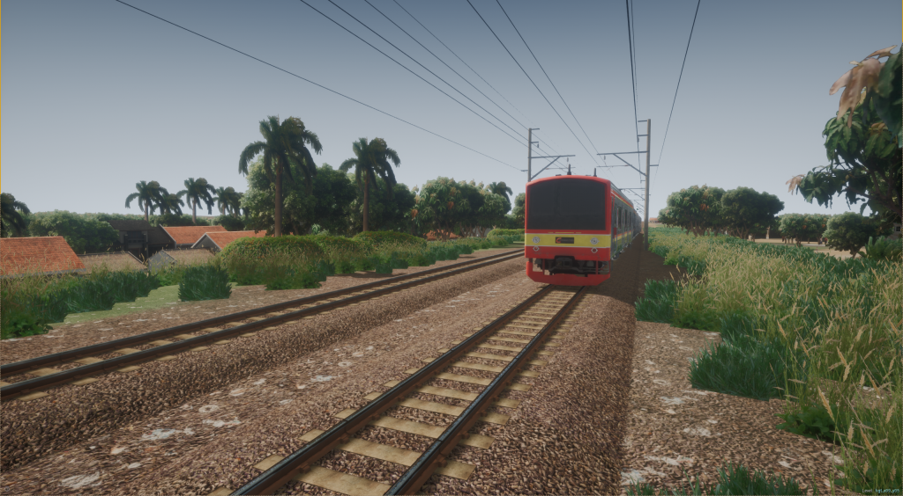

### 10.3 The Parametric Railway Editor (`railroad-editor-web`)
My central responsibility was to deconstruct the Russian dynamics module, understand its mathematical input contracts, and engineer a rapid production pipeline that connected 3D artists, surveyed land data, and the simulator runtime.

The Russian physics engine did not accept polygonal 3D mesh tracks: it required pure **parametric mathematical curves** to calculate wheel-rail contact forces:
- Exact horizontal tangent lines, circular arcs, and clothoid transition spirals.
- Vertical grade profiles and elevation changes.
- Superelevation (*cant* / banking angle in curves) to balance centrifugal lateral forces.
- Micro-vibrations and rail roughness profiles to simulate track joint clicks and bogie shudder.


To solve this, I developed a custom **web-based Parametric Railway Editor (`railroad-editor-web`)**:
- Running in a browser over our local network, artists and route designers could visually author tangent lines, curve radiuses, and transition spirals on an interactive 2D canvas.
- The editor ingested raw GPS and GIS survey elevation points of the real Greater Jakarta rail corridor (such as the heavily traveled Jakarta Kota – Bogor line).
- It calculated continuous mathematical splines, exported parametric geometry into the Russian dynamics engine, and simultaneously generated georeferenced 3D rail tracks, ballast embankments, and catenary poles for our 3D visual engine with millimeter precision.

### 10.4 Architectural Simplicity: The 1D Route & Redis State Caching
Compared to open-world military simulators like SOYUT—which tracked thousands of autonomous air, land, and naval units across the entire archipelago—railway simulation was computationally simpler in one major respect: **the operational arena is topologically constrained to a 1-dimensional line along the track.**

Because train movement is locked to a fixed track route, there was no need for complex spatial grid indexing or distributed multi-agent routing.

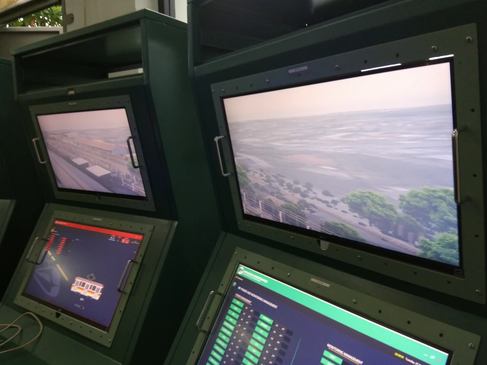

I architected the simulator backend around a lightweight **Redis in-memory database**:
- **Static Track Geometry:** Redis held pre-computed track curves, speed limits, station markers, and kilometer posts.
- **Dynamic Telemetry Streaming:** As the train traveled, the simulator polled the train's linear track position (`meter_marker`) and pulled local rail banking, gradients, and signal aspect states in sub-millisecond Redis queries.
- **Touchscreen Instructor Consoles:** Instructor stations used touchscreens to monitor real-time electrical power status, pantograph voltage, brake pressures, and cab door interlocks, with instructors able to inject emergency scenarios (track obstructions, signal failures, traction motor trips) directly via Redis key updates.

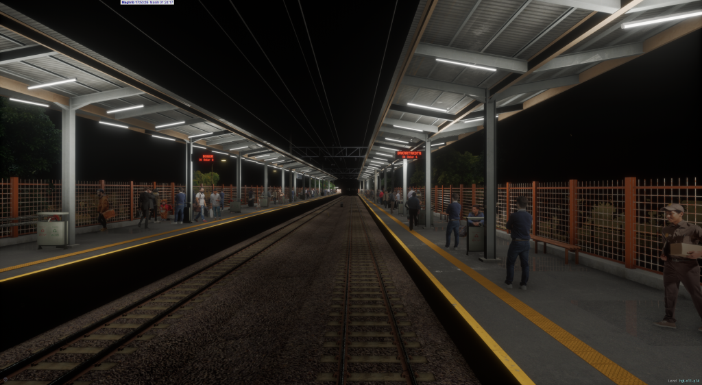

### 10.5 The Record-Breaking Turnaround: Delivered in 1 Year
Typical military full-mission simulator programs took 2 to 3 years. The commercial contract with PT Kereta Commuter Indonesia came with an aggressive, non-negotiable constraint: **the entire simulator had to be completed and operational in just 1 year (12 months)!**

Delivering a clean-sheet transit simulator in an unfamiliar vehicle domain within 12 months was the fastest record turnaround in our company's history. We achieved it by refusing to reinvent the wheel: integrating the Russian dynamics solver, automating track generation with `railroad-editor-web`, and deploying our reusable in-house platform engines (**`CommSystem`** for cab intercoms and train sound, and **Redis** for state distribution).

The KCI project was a triumph: proof that the engineering discipline honed in defense simulation could cross into civilian transit and deliver with speed and precision.

---

## Act XI: The Political Shift, COVID-19, and the Freelance Crucible

### 11.1 The Fragility of State Contracts: When Politics Overrides Engineering
Following the unbroken succession of successful deliveries—the Malaysian ACV-300, the Hawk 209 and BO-105 refurbishments, the Super Puma FFS, the STMR cavalry platoon, SOYUT strategic C4, and the KCI transit simulator—our executive leadership believed we had secured an unassailable grip on long-term government and defense programs. High-ranking military delegations visited our facilities regularly, constantly inquiring about our bandwidth to take on larger simulation programs.

Yet as you climb into the highest tiers of state procurement, an unyielding political reality emerges: **political dynamics become far more decisive than technical excellence.**
- In defense and public procurement, contracts do not exist in an objective vacuum of code quality or mathematical fidelity. They depend heavily on political alignments, bureaucratic allegiances, and ministerial relationships.
- Whenever government cabinets reshuffled, defense ministers rotated, or high-ranking armed forces generals were reassigned to new posts, their policy stances, budget priorities, and preferred contractor alliances shifted overnight.
- Programs that were considered locked-in priorities suddenly vanished into bureaucratic limbo.

Believing massive multi-year programs were right on the horizon, our company had made aggressive, pre-emptive financial commitments: expanding physical research laboratories, acquiring advanced machining tools, scaling up headcount, and leasing expansive infrastructure. We were gearing up for the next decade of defense technology.

Then came the hammer blow: **the COVID-19 pandemic struck in early 2020.**

### 11.2 The Pandemic Freeze, Mounting Debt, and the Indefinite Layoff
When the pandemic locked down the world, Indonesian government budgets underwent radical emergency restructuring. Non-essential capital projects across defense, simulation, and public transport were abruptly frozen or outright canceled, with state funds diverted entirely to public health emergencies and economic subsidies.

Our company was trapped:
- We had taken on substantial debt to finance our expansive pre-emptive investments in facilities, equipment, and personnel.
- With government procurement frozen and zero incoming cash flow, the financial hemorrhage was unsustainable.
- There was no safety net: **operations were halted, the entire engineering roster was laid off indefinitely, and corporate facilities and offices were liquidated and sold.**

Just like that, the elite engineering team that had revolutionized Indonesian defense simulation—building everything from supersonic jet cockpits to classified archipelago war games—was disbanded.

### 11.3 The Diaspora: Surviving in the Freelance Wilderness
The sudden collapse scattered our team into the cold realities of the private freelance market. 

It was a humbling, gritty period of survival:
- Non-programming colleagues and 3D artists who had modeled tanks, aircraft, and railway corridors took to digital freelance marketplaces, modeling 3D assets and selling them on the internet just to put food on the table.
- Rather than waiting for government contracts that might never return, several former T&E colleagues and I banded together to hunt for commercial freelance software contracts.

That hustle opened new doors in unexpected sectors: **enterprise banking and commercial video game development.**

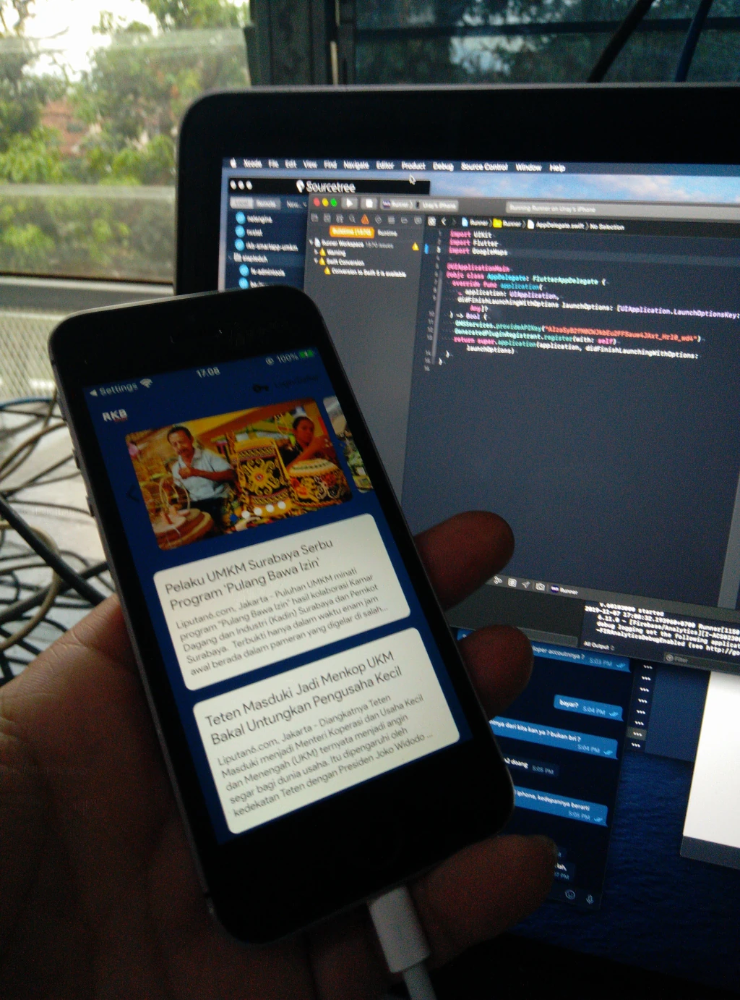

### 11.4 Enterprise Mobile Architecture: Bank Rakyat Indonesia (BRI)
One of the first significant contracts our freelance group secured was with **Bank Rakyat Indonesia (BRI)**, the nation’s largest state-owned microfinance banking giant. 

BRI needed a cross-platform mobile application for **Rumah Kreatif BUMN (RKB)**, a national initiative empowering Micro, Small, and Medium Enterprises (MSMEs / *UMKM*). 

- **The Shift in Scale:** Transitioning from supersonic flight equations and custom operating systems to a mobile app felt technically modest, but it required ironclad engineering rigor.
- **The Flutter & Dart Stack:** We architected the application using **Flutter and Dart**, delivering a unified, reactive codebase for iOS and Android.
- **Resilience for the Real World:** We implemented clean reactive state management (BLoC) and resilient caching strategies so rural artisans and small business owners could register profiles, view mentoring courses, and showcase local products even over fragile 3G cellular connections in remote regencies.
- **Enterprise Security:** Integrated secure OAuth 2.0 authentication and encrypted credential storage communicating directly with BRI’s core banking backends.

The BRI contract provided essential financial stability and proved our team's versatile engineering adaptability: true systems engineers can master modern mobile app frameworks and enterprise banking APIs in a matter of days.

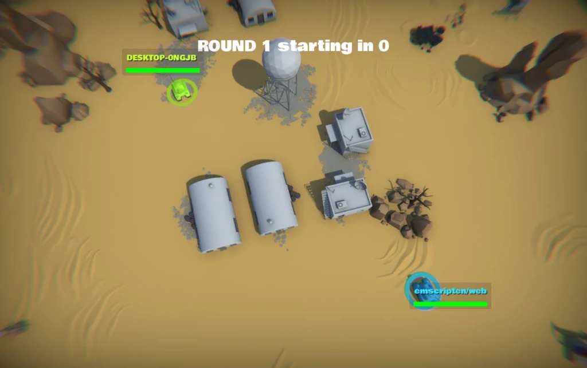

### 11.5 Multiplayer Game Architecture: Agate Studio & `netEngine`
Around the same time, my network engineering background opened an exciting opportunity in commercial game development. 

A longtime friend who was a co-founder of **Agate Studio**—Indonesia's premier video game development company, based in Bandung—approached me with an urgent technical dilemma. Agate was building real-time multiplayer titles in **Unity**, but they were crippled by the state of commercial game networking:
- Unity’s built-in **UNet** networking library was bloated, unreliable, and was being deprecated.
- Standard **TCP was completely unusable** for fast-paced action games due to **head-of-line blocking**: a single dropped packet stalls the entire stream, causing unbearable latency spikes.
- Raw **UDP** avoids head-of-line blocking, but packets arrive out-of-order, duplicate, or vanish without delivery guarantees.

Agate asked me to build a high-performance multiplayer networking library from scratch for their Unity games: **`netEngine`**.

#### The Architecture of `netEngine`
Drawing upon the principles I had refined when building **`libDIS`** for military simulators, I engineered `netEngine` as a custom protocol layer over UDP in C#:
1. **Sliding-Window 32-Bit Acknowledgment Bitfield:** Every packet header carried the sequence number of the most recently received packet alongside a 32-bit integer bitfield acknowledging the previous 32 incoming packets. This enabled continuous, reliable packet tracking with **zero dedicated ACK packets**.
2. **Dual-Channel Multiplexing:** Unreliable/unsequenced channels handled continuous position/orientation streams, while reliable/sequenced channels guaranteed delivery for critical gameplay events (weapon firing, health damage, round start).
3. **The Zero-Allocation Memory Architecture (Zero GC):** In Unity/C#, dynamic memory allocations trigger the .NET Garbage Collector (GC), causing dreaded frame micro-stutters during intense multiplayer matches. I architected `netEngine` with pre-allocated circular ring buffers and reusable memory pools, resulting in **exactly 0 bytes of GC memory allocation per frame during active gameplay.**
4. **Cross-Platform & WebAssembly (Emscripten):** As shown in the multiplayer test match screenshot above, `netEngine` seamlessly synchronized native desktop clients (`DESKTOP-0NGJB`) with in-browser WebAssembly clients (`emscripten/web`), bridging diverse runtimes with deterministic real-time state.

The freelance crucible was a powerful chapter: it proved that when institutional structures crumble, core engineering fundamentals—deep mathematics, low-latency networking, and unwavering resilience—remain indestructible.

---

## Act XII: The International Simulation Arena — Stairport, Asobo & The Aerosoft A330 FMS

### 12.1 The Stairport Connection: From Scenery Model Supply to X-Plane C++ Plugins (World Aircraft)
The freelance diaspora following the collapse of T&E was not merely an era of survival: it was the gateway that launched me into the global commercial flight simulation industry.

As I mentioned earlier, our former non-programming colleagues and 3D artists who had modeled military tanks, helicopters, and railway networks were selling 3D assets online to international studios. One of their frequent clients was **Stairport (Stairport Sceneries)**, a prominent German flight simulation company specializing in high-detail airport sceneries for **Laminar Research's X-Plane**. 

Stairport needed an immense volume of realistic 3D airport buildings, ground service equipment, and environmental objects. My friends proved to be such reliable, high-quality modelers that Stairport soon recruited them directly as dedicated in-house 3D artists.

Shortly after, Stairport’s owner approached my friends with an engineering bottleneck:
- The studio wanted to expand beyond static 3D airport sceneries into **interactive, living airport ecosystems**.
- Animating jetways, dynamic ground service vehicles, marshallers, and moving airport traffic required native scripting, C/C++ plugin development, and deep simulation logic.
- The owner asked: *"Do you know any programmer who is capable of writing low-level code and plugin architecture for flight simulators?"*

My friends immediately gave him my name.

I was brought on board to develop native X-Plane C/C++ plugins under Stairport Sceneries. My first major project was **World Aircraft**:
- Developed as a high-performance scenery plugin for X-Plane, **World Aircraft** populated airport terminals with intelligent, dynamic AI traffic.
- Rather than rendering static, lifeless tarmac scenes, the plugin injected realistic ground traffic, taxiing airliners, pushback sequences, and scheduled flight operations around the airport.
- Writing native C++ plugins interacting with the X-Plane SDK required direct memory access, manipulating datarefs at 60 FPS, and multi-threaded pathfinding—a natural continuation of the distributed agent architectures I had engineered for military war games.

### 12.2 The Next-Gen Leap: Moving to MSFS & The SeaRey Elite Amphibian
Around late 2020 through 2022, the flight simulation landscape underwent a generational earthquake: Microsoft launched its next-generation sequel, **Microsoft Flight Simulator (MSFS 2020)**. Powered by a photogrammetric digital twin of the Earth, advanced atmospheric simulation, and modern SDK architecture, the global community migrated in mass to the new platform.

Recognizing the shift, our team transitioned platforms from X-Plane to MSFS, leading to the creation and evolution of **FlightSim Studio AG (FSS)**.

Embarking on high-complexity airliner projects (such as our later flagship Embraer E-Jets family) immediately on an unfamiliar engine would have been reckless. MSFS introduced a radically new tech stack: HTML/JS/CSS vector displays rendered via CoherentGT, WebAssembly (Wasm) sandboxed gauges, and a complex SimVar simulation variable bus.

True to our agile first-principles ethos, we began by developing smaller aircraft first:
- I was brought in to engineer systems for the **SeaRey Elite**, an amphibious light sport seaplane manufactured by Progressive Aerodyne.
- My responsibility was integrating Microsoft Flight Simulator's built-in avionics suite into the seaplane, configuring the modern **Garmin G3X glass cockpit**, engine instrumentation, and electrical systems.
- I configured the cockpit systems to support versatile amphibious flight: water landings, hull hydrodynamics, landing gear retract alarms, and bilge pump logic.
- In a personal homage to our team's roots, our cockpit flight deck carried the Indonesian registration **`PK-FSS`** prominently displayed on the instrument panel and pilot kneeboard.


### 12.3 Engineering Core Avionics for Asobo Studio: ACD-57, AR6201, VT-02 & The Taurus Glider
As FlightSim Studio demonstrated exceptional precision in avionics systems and SDK integration, our reputation reached the core architects of the simulator itself: **Asobo Studio**, the French game studio contracted by Microsoft to build Microsoft Flight Simulator.

Asobo was expanding the default aircraft fleet for major platform updates—including gliders, light-sport aircraft, and European general aviation. But default aircraft required authentic, certified European avionics hardware instruments with realistic behavior, exact menu trees, and pixel-perfect displays.

Asobo Studio contracted FlightSim Studio to develop official hardware instruments directly for the core simulator. I personally took on the software engineering for three major European avionics units:

#### 1. AIR Avionics / Dittel ACD-57 Multi-Function Display
The **ACD-57** is a remarkable 57mm (2.25-inch) round multi-function instrument widely used in European soaring and ultralights:
- It packs a complete 8.33 kHz VHF radio transceiver, a certified precision barometric altimeter, and a transponder display into a single miniature circular dial.
- I modeled the moving vertical altimeter tape, barometric pressure calibration (supporting both hPa and inHg), altitude alerts, standard pressure toggle (1013.3 hPa), flight level monitoring (`FL000`), and active/standby frequency flip-flop switching (`118.200 / 121.500 MHz`).


#### 2. Becker AR6201 Compact VHF Transceiver
The German-engineered **Becker AR6201** is one of the most popular aviation transceivers in global general aviation:
- I programmed the certified dual 8.33 kHz / 25 kHz channel spacing logic, dual concentric rotary tuning (outer ring for MHz, inner knob for kHz channels), frequency exchange, and integrated squelch (`SQL`).
- I modeled memory channel banks (such as channel `08` storing `121.600 MHz`), inter-communication (`IC`) modes, and internal battery supply voltage telemetry.


#### 3. Garrecht VT-02 Mode S Transponder
The **Garrecht (AIR Avionics) VT-02** is a certified Mode-S / ADS-B Out transponder:
- I recreated the authentic green backlit dot-matrix LCD display, active squawk code register (`>1234`), and editable standby squawk register (`SBY 0022`).
- Integrated pressure altitude reporting directly into real-time Flight Level (`FL000`) readouts, one-touch standard VFR code selection, and ATC IDENT pulse transmission.


#### Co-Developing the Pipistrel Taurus Motorized Glider for Asobo
Following the success of our avionics instruments, Asobo Studio awarded FlightSim Studio a contract to co-develop an entire official aircraft for the **MSFS 40th Anniversary Glider Update**: the **Pipistrel Taurus**.

The Pipistrel Taurus is an advanced two-seat side-by-side motorized self-launching glider featuring an auxiliary engine mounted on a retractable dorsal mast behind the cockpit:
- I was involved in engineering the critical mechanical and electrical subsystems of the aircraft—specifically the **retractable dorsal engine and propeller mast mechanism**.
- Extending and retracting the engine in flight is a delicate multi-stage mechanical sequence: bay doors unlatch and swing open, an electric actuator raises the engine mast through an 8-second arc, and limit switches lock the mast upright before enabling engine ignition and starter motors.
- Upon engine shutdown, the pilot engages a mechanical propeller brake; an optical alignment sensor detects when the two propeller blades are aligned vertically along the mast axis, locking the shaft so the mast can be retracted flush into the fuselage, restoring laminar low-drag soaring glide ratios.
- I engineered the state sequencer and SimVar animation drivers governing this mechanical sequence with full physical fidelity.


### 12.4 The Widebody Airliner Core: Contracting for the Aerosoft Airbus A330 FMS
As my reputation for solving complex real-time avionics mathematics spread across the European flight simulation network, I received a career-defining opportunity.

**Aerosoft**—one of the oldest, most prestigious flight simulation publishing and development houses in Europe—was developing their flagship widebody airliner for Microsoft Flight Simulator: the **Airbus A330**. 

While Aerosoft possessed exceptional 3D modeling, texturing, sound recording, and systems teams, building the mathematical brain of a modern fly-by-wire widebody airliner—the **Flight Management System (FMS)**—required deep mathematical and algorithmic mastery:
- Parsing hundreds of megabytes of standardized global aeronautical navigation data (**ARINC-424** cycle updates from Navigraph and Jeppesen).
- Constructing dynamic lateral flight plans across enroute airways, complex SIDs, STARs, and curved RNP-AR Radius-to-Fix (RF) approach legs.
- Solving vertical navigation profiles (VNAV): computing the exact geographic **Top of Descent (TOD)**, fuel burn curves, step climbs, and speed/altitude restrictions.

Recognizing my unique background across aerospace mathematics, coordinate transformations, and low-latency C++ systems, FlightSim Studio AG contracted me individually to Aerosoft to serve as the **dedicated FMS Core Systems Architect**.


#### 1. ARINC-424 Navigation Engine & Turn Anticipation Geometry
I engineered the core C++ ARINC-424 navigation engine:
- Decoded complex leg types: Initial Fix (`IF`), Track to Fix (`TF`), Course to Fix (`CF`), Direct to Fix (`DF`), and Radius to Fix (`RF` curved arcs).
- Implemented dynamic **turn anticipation geometry** for fly-by waypoints: calculating speed-dependent bank angles ($\phi_{bank}$) and centrifugal turn radius ($R$):
  $$R = \frac{V_{TAS}^2}{g \cdot \tan(\phi_{bank})}$$
- Derived the exact lead turn distance ($D_{lead}$) to initiate roll before the waypoint:
  $$D_{lead} = R \cdot \tan\left(\frac{\Delta\theta}{2}\right)$$
  ensuring the airliner smoothly transitions between airway legs with zero course overshoot.

#### 2. The Airbus MCDU & Flight Planning State Machine
I developed the core Multifunction Control and Display Unit (MCDU) flight planning architecture:
- `INIT A / INIT B`: Gross weight, Zero Fuel Weight (ZFW/ZFWCG), Block Fuel, Cost Index (CI), and cruise level.
- `F-PLN`: Real-time waypoint sequencing, airway stringing, SID/STAR insertion, step climb management (e.g. `.79/FL370` as shown on the trans-Atlantic `LIRF/KBOS` route above), and flight plan discontinuity resolution.
- `DIR TO` and `PERF`: Phase-dependent performance calculations across Takeoff, Climb, Cruise, Descent, and Approach.

#### 3. Backward-Integrating Vertical Navigation (VNAV) & Top-of-Descent (TOD)
To compute the **Top of Descent (TOD)**, I engineered a backward-integrating trajectory solver:
- Starting at the destination runway threshold at zero feet AGL, the solver steps backward along the flight plan route.
- It applies aerodynamic drag polars for the clean A330 airframe, accounting for engine idle thrust, forecast winds, and ISA temperature deviations.
- It integrates total energy state equations:
  $$\frac{dh}{dt} = \frac{(T - D) \cdot V}{m \cdot g} - \frac{V}{g} \cdot \frac{dV}{dt}$$
- Where this backward-calculated idle descent line intersects the cruise altitude (e.g. FL370), the algorithm marks the exact geographic coordinate of the **Top of Descent (TOD)**, rendering the TOD symbol on both the MCDU and the Navigation Display (ND).


#### 4. Navigation Display (ND) Vector Rendering & Autopilot Coupling
I coupled the FMS flight plan trajectory directly to the cockpit glass displays and autopilot flight director:
- Rendered high-speed vector route lines, curved transitions, and waypoint markers on the Navigation Display (ND) in ROSE NAV, ARC, and PLAN modes.
- Output real-time cross-track error ($y_{xtk}$) and track angle error ($\Delta\psi$) vectors directly to the Autopilot Flight Director (AP/FD) lateral guidance loop, delivering smooth, rock-solid course tracking across thousands of nautical miles.

### 12.5 The Horizon: The Embraer E-Jets Family at FlightSim Studio AG
The success of the SeaRey, the official Asobo avionics instruments, the Pipistrel Taurus glider, and the Aerosoft A330 FMS core solidified our team's position on the global simulation stage. 

It set the stage for our crowning, ongoing masterwork: **The Embraer E-Jets Family (E170, E175, E190, E195, and E-Freighters)** for Microsoft Flight Simulator. 

Representing the ultimate convergence of everything I have engineered over twenty-five years—from deep coordinate math and custom RTOS kernels to ARINC-424 navigation engines, fly-by-wire autoflight laws, and full-cockpit glass display architectures—the E-Jets project is our ongoing flagship enterprise. I will chronicle the detailed architectural story of this program in the upcoming chapter.

---

## Act XIII: My Technical Philosophy & Core Architectural Principles

Throughout my career across defense systems, low-level operating systems, distributed clusters, and avionics, I have operated according to core engineering tenets:

### 1. First-Principles Pragmatism over Industry Orthodoxy
When industry convention insists that something must be done with expensive proprietary hardware or complex certifications (such as aerospace-grade wiring on tank simulators), I question the premise. If a five-dollar COTS microcontroller and a standard Ethernet cable perform the job with greater reliability, lower latency, and zero maintenance friction, the orthodox method must be discarded.

### 2. Deep Mathematics as the True Architectural Bedrock
Frameworks, libraries, and programming languages evolve and become obsolete. Mathematical fundamentals—vector spaces, linear coordinate transformations, numerical integration, differential equations, and probability—are immutable. An engineer who commands mathematics can model any physical reality, whether it is an anti-gravity tunnel racer, an armored combat vehicle periscope, or a modern commercial jet transport.

### 3. Decouple Everything at the Network Layer
From my early days with `int 33h` to the deployment of `libDIS` and single-cable tank cabins, I treat software and hardware as decoupled distributed nodes. If interfaces are defined by clean, well-specified packet protocols (whether IEEE 1278 DIS, raw UDP, or WebSockets), components can be swapped, moved, parallelized, or modernized without destabilizing the host.

### 4. Statelessness as the Ultimate Defense Against Entropy
Storage is brittle. Filesystems corrupt, flash sectors degrade, and persistent configurations drift into chaos under the stress of 24/7/365 operational reality. By enforcing strict statelessness—booting diskless systems over PXE, loading immutable squashfs modules into volatile RAM, and layering transient states with OverlayFS—you make hardware indestructible to hard power cuts, thermal crashes, and operator tampering. This principle governed both my 330 kVA home GPU datacenter and the joint war game simulator for the Armed Forces High Command.

### 5. Zero Credentialism, Absolute Competence
In an industry fixated on resumes, certifications, and enterprise pedigree, true engineering breakthroughs are executed by those who know how the silicon behaves when the lights go out. A career where *"jobs come looking for me"* is the direct consequence of solving impossible problems that established contractors walk away from.

---

## Summary of Core Technical Competencies

| Domain | Key Technologies, Protocols & Methodologies |
| :--- | :--- |
| **Programming Languages** | C (K&R, C99, C11), C++ (Real-Time Simulation, Low-Latency OOP, Modern C++17/20), C# (.NET, Unity), JavaScript / TypeScript (Node.js, WebGL, CoherentGT), Dart / Flutter, Assembly (x86, DOS Real-Mode Interrupts), Python, Bash / Shell |
| **Commercial Flight Sim & SDKs** | Microsoft Flight Simulator SDK (MSFS 2020/2024), Laminar Research X-Plane C++ Plugin SDK, CoherentGT Vector HTML/JS Gauges, WebAssembly (Wasm) Sandboxing, SimConnect, SimVars / DataRefs |
| **Avionics & Flight Management (FMS)** | ARINC-424 Navigation Specification (IF, TF, CF, DF, RF Curved Legs), Airbus MCDU Architecture (INIT, F-PLN, DIR TO, PERF), Lateral Navigation (LNAV) Turn Anticipation, Vertical Navigation (VNAV) Top-of-Descent (TOD) Solver, Mode S Transponders (Garrecht VT-02), 8.33 kHz VHF Radios (Becker AR6201, ACD-57) |
| **Distributed Simulation & Protocols** | IEEE 1278 DIS (Distributed Interactive Simulation), HLA (High Level Architecture), MÄK VR-Forces Interoperability, Hardware-in-the-Loop (HIL) Integration |
| **Operating Systems & Kernel Engineering** | Linux From Scratch (LFS), CryptoSlax Custom OS, PREEMPT_RT Real-Time Linux Kernel Patch, PXE Diskless Network Boot (DHCP/TFTP), OverlayFS / AUFS Layered Memory Filesystems, Shared-Memory IPC |
| **High-Density Computing & Hardware** | 330 kVA 3-Phase Industrial Power Grid Infrastructure, Multi-GPU OpenCL/CUDA Clustering (AMD Tahiti HD 7970, R9 Series, NVIDIA), Custom Chassis Thermal Management & High-Velocity Airflow Modeling |
| **Cloud Architecture & Infrastructure** | Amazon Web Services (AWS EC2, VPC, Route 53 Geo-DNS, Elastic Load Balancing), Google Cloud Platform (GCP Compute Engine), Nginx Reverse Proxies, High-Availability Multi-Region Failover |
| **High-Performance Networking** | Custom Reliable UDP (Sliding-Window ACK/NACK, Zero-Allocation Memory), WebSockets, WebRTC Data/Audio Channels, Raw Packet32 Ethernet, TCP/IP Socketry |
| **3D Graphics & Geospatial Visualization** | Cesium3D (Geospatial WebGL), DirectX 9 (HLSL Shaders), DirectX 7 (DirectDraw), VGA Mode 13h (`0xA000:0000`), Image Generators (IG), Periscope Optical Projection |
| **Architectural 3D CAD & Construction** | Blender (Cycles Ray-Tracing, 3D Spatial CAD Modeling, Solar Ingress Simulation), First-Principles Structural Engineering (Reinforced Concrete, Steel Framing), On-Site Project Management |
| **Embedded Systems, IoT & Aeroponics** | Arduino, x86 SBC, C/C++, Piezoelectric Ultrasonic Mist Generation, Peltier Thermoelectric Coolers (TEC), PC Liquid Cooling Waterblocks, Closed-Loop Telemetry (pH, Temp, Humidity), Solid-State Relays |
| **Distributed Backend & Blockchain** | Proof-of-Capacity (PoC, Shabal-256 Plotting), Blockchain Explorers, Web Wallets, Mining Pools, Node.js Microservices, Redis In-Memory Pub/Sub |
| **Applied Physics & Mathematics** | 6-DOF Flight Dynamics, Aerodynamic Stability Derivatives, Runge-Kutta Numerical Integration, Coordinate Frames (ECEF, WGS-84, Body Axes), Euler / Quaternion Transformations, Ballistic Trajectory Modeling |

---

*This document chronicles my career from early 8-bit silicon, military defense simulators, and stateless operating systems to international commercial flight simulation with Stairport, Asobo Studio, and Aerosoft. The upcoming chapter will delve into the full-scale engineering and multi-decade culmination of the Embraer E-Jets family at FlightSim Studio AG.*

