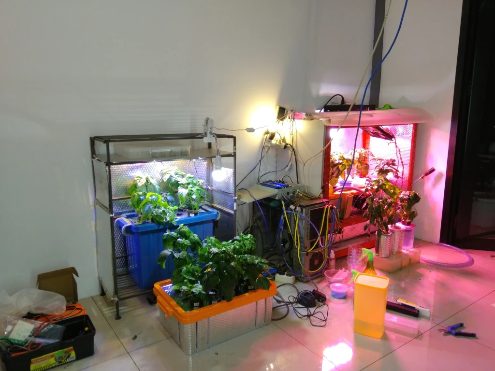
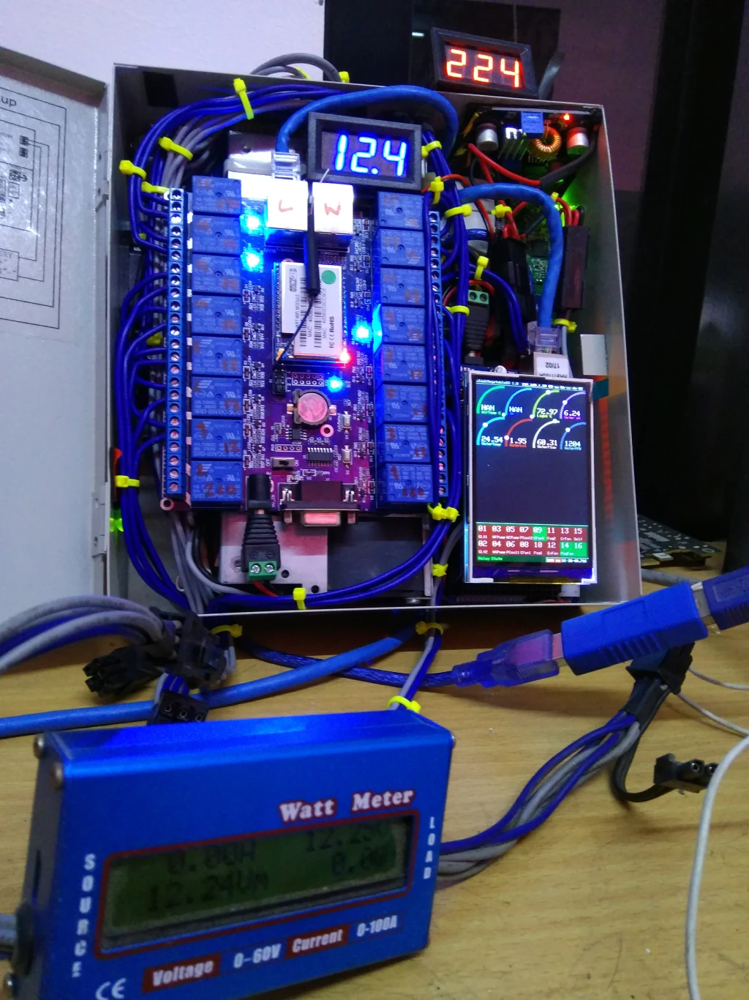

# High-Tech IoT Aeroponics & Carolina Reaper Lab (Tabulampot)

> **Role:** Designer, Hardware Engineer & Embedded Systems Architect  
> **Domain:** Embedded Systems, IoT Automation, Aeroponics, Thermal Engineering  
> **Timeline:** 2018  
> **Tech Stack:** Arduino, x86 SBC, C/C++, Ultrasonic Piezoelectric Transducers, Peltier Thermoelectric Coolers (TEC), PC CPU Liquid Waterblocks, DS18B20 Temp Sensors, Analog pH Probes, Solid-State Relays, Full-Spectrum UV/Grow LEDs  

---

## 1. The Spark: Beyond Boring Relays — High-Tech "Tabulampot"

After spending months automating a roaring 330 kVA cryptocurrency mining facility and building out home automation circuits, I felt a familiar creative restlessness. 

Flipping AC power relays based on server heartbeats or writing scripts to ping router interfaces was mechanically straightforward. I had solved those problems; they were just banks of relays and deterministic logic. I wanted a project that was quirky, technically intricate, and fun—a real multidisciplinary challenge where electronics, thermodynamics, fluid dynamics, and biological life collided.

Around that time, I noticed my mother caring for her potted home garden on the porch, growing common household vegetables and red chillies. In Indonesia, this practice is affectionately known as **Tabulampot**—an acronym for ***Tanaman Buah Dalam Pot*** (*"Potted Fruit Plant"*), a beloved domestic technique for cultivating compact fruit trees and produce in confined suburban spaces.

I looked at those traditional terracotta pots filled with dirt and thought:

> *"What if I take the Tabulampot concept, strip away all the dirt, and re-engineer it from first principles using single-board computers, sensors, ultrasonic foggers, and PC liquid-cooling blocks?"*

It was the perfect mad-science engineering sandbox.

---

## 2. The Subject: The World's Most Lethal Pepper (Carolina Reaper)

I have always had an extreme passion for fiery, spicy food. If I was going to construct an aerospace-grade climate-controlled cultivation chamber, I wasn't going to waste it on ordinary supermarket cayenne chillies or standard *cabe rawit*.

I decided to grow the most notorious pepper on Earth: **The Carolina Reaper (*Capsicum chinense*)**.

Certified by Guinness World Records as the hottest chili pepper in the world—peaking at over **2.2 million Scoville Heat Units (SHU)**—the Carolina Reaper is notoriously finicky to cultivate outside its native subtropical microclimate:
- It requires agonizingly long germination periods (often 3 to 5 weeks).
- It is highly susceptible to root dampening, fungal rot, and shock from improper watering.
- It demands strict pH nutrient windows and high ambient humidity paired with exceptionally high root oxygenation.

Cultivating a superhot pepper indoors in tropical Indonesia without soil became the ultimate stress-test for custom environmental instrumentation.

---

## 3. The Chamber Architecture: True Soil-Less Aeroponics

Traditional soil cultivation acts as a biological buffer, but it is an opaque black box: you cannot inspect root morphology in real time, soil harbors pests and nematodes, and nutrient delivery is uneven. Hydroponics (such as Deep Water Culture or Ebb & Flow) submerges roots in standing liquid, where dissolved oxygen levels rapidly drop as water temperatures rise.

I chose **true aeroponics**:
- **Suspended Root Zone:** The Carolina Reaper plants were seated in net pots filled with inert expanded clay pebbles (*Hydroton*) and rockwool plugs, suspended over an airtight, light-sealed growth chamber.
- **Root Air Suspension:** The root systems hung entirely in free air inside the chamber, completely isolated from soil pathogens and saturated with 100% ambient oxygen.

### Ultrasonic Micro-Droplet Fog Generation
Rather than using high-pressure mechanical misting nozzles—which frequently clog from mineral nutrient salts and require noisy high-pressure diaphragm pumps—I engineered an **ultrasonic atomization system**:
- Submerged piezoelectric ultrasonic ceramic transducers vibrated at high frequency (~1.7 MHz), cavitating the water column into an ultra-dense, cold micron-level vapor (droplets between 5 to 10 microns in diameter).
- This nutrient fog enveloped the suspended root hairs like a cloud, delivering ionic mineral salts and moisture directly to the cell walls with zero physical hydraulic resistance and maximum oxygen uptake.

---

## 4. The PC Enthusiast's Chiller: Peltier Plates Sandwiched Between CPU Waterblocks

Aeroponics in tropical climates faces a critical thermodynamic obstacle: **Water Temperature**.

In Bandung, ambient room temperatures easily reach 28°C to 32°C during the day. In an aeroponic reservoir, warm nutrient water is fatal:
1. Dissolved oxygen ($DO$) drops precipitously above 22°C.
2. High root temperatures trigger explosive colonization by *Pythium* (anaerobic water mold), causing devastating **root rot** that will liquefy a pepper plant's root system in forty-eight hours.
3. Superhot peppers require a continuous nutrient root zone temperature maintained between **18°C and 21°C**.

Commercial hydroponic aquarium chillers were out of the question: they were massive, cost thousands of dollars, consumed hundreds of watts, and sounded like loud refrigerator compressors.

As a hardcore PC builder and hardware enthusiast, I built my own thermodynamic solution:

### The Dual-Waterblock Thermoelectric Assembly
I created a solid-state liquid chiller using PC watercooling hardware:
- **Core Component:** A high-power **Peltier Thermoelectric Cooler (TEC1-12706)** plate.
- **Cold Side:** Sandwiched against a copper **PC CPU waterblock**. Cold nutrient water was continuously pumped through this block, absorbing cooling directly from the Peltier plate's cold face before circulating back to the ultrasonic fogger chamber.
- **Hot Side:** Sandwiched against a secondary matching CPU waterblock with non-conductive thermal paste. This hot-side water loop was piped to an external aluminum PC radiator cooled by a high-static-pressure 120mm fan, shedding heat efficiently into the exhaust air.
- **Power Delivery:** Powered by a clean 12V rail from a modular PC power supply (PSU), regulated via solid-state relays controlled by the microcontroller.

This compact, silent, all-solid-state liquid cooler maintained the nutrient solution within an exact 19°C–21°C sweet spot, completely banishing root rot and saturating the nutrient fog with dissolved oxygen.

---

## 5. Closed-Loop Telemetry & Microcontroller Automation

To keep the ecosystem completely autonomous, I wired a custom telemetry stack managed by an Arduino microcontroller and a companion single-board computer (SBC).

### Sensor Instrumentation
- **Submersible DS18B20 Digital Thermometers:** Monitored water reservoir and root chamber temperatures over the 1-Wire bus with 0.0625°C resolution.
- **Industrial Analog pH Probe & Signal Conditioning Board:** Monitored nutrient solution acidity in real time. Carolina Reapers require a strict pH range of **5.8 to 6.2** for optimal uptake of nitrogen, phosphorus, potassium, and micronutrients (calcium and magnesium).
- **Ultrasonic Fluid Level Sensor:** Measured fluid depth inside the reservoir to detect evaporation and transpiration depletion, triggering low-water alerts.
- **DHT22 Environmental Sensor:** Monitored ambient chamber humidity and air temperatures.
- **Digital LED Voltmeter & Telemetry Displays:** Mounted on the exterior chassis, providing immediate visual feedback on 12V bus health (12.4V nominal) and operating temperatures.

### Deterministic Actuation Loops
The firmware executed automated feedback loops across a multi-channel optocoupled relay board:
1. **Peltier Chiller Loop:** Engaged the Peltier 12V rail whenever reservoir temperature exceeded 21.5°C, cutting power once it dropped to 19.5°C (hysteresis loop).
2. **Duty-Cycled Ultrasonic Atomization:** Piezoelectric foggers were pulsed on a fine-tuned timer (e.g., 30 seconds of dense fog every 4 minutes) to keep the roots glistening with micro-droplets without waterlogging the root hairs.
3. **Automated Dual-Spectrum Photoperiod:**
   - During the daytime, plants absorbed natural ambient light.
   - At sunset, the controller engaged an array of **deep violet/red full-spectrum UV grow lights** (450nm royal blue + 660nm deep red wavelengths) to drive maximum chlorophyll A/B absorption throughout the night.
   - This provided an extended 18-hour daily photoperiod, dramatically accelerating vegetative growth cycles.

---

## 6. The Result: Explosive Foliage and Vibrant Health

The combination of zero-resistance aeroponic root oxygenation, chilled nutrient delivery, and continuous photoperiod control produced staggering results.

Within weeks of germinating, the Carolina Reaper plants exploded in size:

- **Foliage Development:** The plants developed massive, deep-green, waxy spade leaves with zero leaf curl or nutrient burn.
- **Stem Thickness:** Constant gentle air currents and optimal calcium uptake yielded thick, woody structural main stems capable of supporting heavy pepper yields.
- **Root Mass:** The root system inside the dark chamber transformed into a pristine, white, glistening fibrous beard, totally devoid of algae or discoloration.

The experiment was an overwhelming success: the world's hottest pepper was thriving inside a synthetic, computer-controlled living laboratory built out of PC cooling parts and microcontrollers.

---

## 7. Engineering Takeaways & Systems Philosophy

What began as a lighthearted maker side-track—taking my mother's beloved *Tabulampot* hobby into the realm of high-tech tinkering—reinforced fundamental engineering truths that transcend software and hardware:

1. **Closed Loops Govern Everything:** Whether you are balancing real-time flight simulator dynamics, tuning GPU clock frequencies against thermal throttling, or balancing pH and temperature in a biological root chamber, the governing mathematics of feedback loops and hysteresis are universal.
2. **COTS Cross-Pollination:** The most elegant engineering solutions often happen when you cross disciplinary lines. Using PC gaming liquid waterblocks and Peltier plates to solve an agricultural thermodynamics problem is proof that tools are only limited by your imagination.
3. **Empirical Hands-On Mastery:** Calibrating analog ADC noise on high-impedance pH probes and driving inductive relay loads directly reinforced the embedded electrical expertise that I brought to industrial and military defense projects.

---

*Document Author: Uray Meiviar*  
*Repository: [`uraymeiviar/data/tabulampot`](https://github.com/uraymeiviar/uraymeiviar/tree/main/data/tabulampot)*
