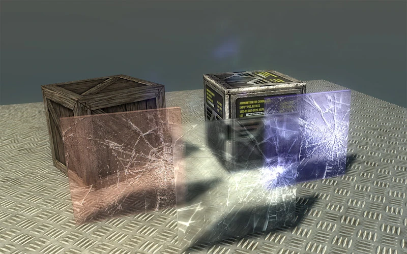

# Broken Glass Shader: Real-Time Optical Refraction & Diffraction Surface Shader

**Architect & Engineer:** Uray Meiviar  
**Role:** Graphics & Shader Programmer  
**Period:** 2012 (Published December 2012)  
**Domain:** Real-Time Computer Graphics, Surface Shaders, Optical Physics Simulation, Material Rendering  
**Platform:** Unity 3D (Unity 3.5 / 4.x), ShaderLab, CG / HLSL, Unity Asset Store  

---

## Executive Summary

Rendering realistic glass in real-time graphics engines is an established problem, but accurately simulating **fractured and shattered glass** introduces difficult optical challenges. In physical glass, a crack introduces microscopic fissures and jagged air-gap boundaries. Light rays passing through fractured glass do not merely transmit; they bend sharply at irregular angles (refraction), separate into chromatic wavelengths along micro-facets (diffraction/dispersion), and catch brilliant specular glints along fissure edges (Fresnel reflection).

To bring high-fidelity shattered glass optics to game developers without expensive volumetric simulation, I authored the **`Broken Glass Shader`**, commercially released on the **Unity Asset Store** in December 2012.

The shader accepts standard normal map textures encoding intricate spiderweb crack patterns, impact craters, or hairline fracture lines, translating them into dynamic optical refraction, prismatic diffraction, and glancing specular highlights in real time.

---

## 1. Optical Pipeline & Shader Architecture

```
=============================================================================
                  BROKEN GLASS SHADER OPTICAL PIPELINE
=============================================================================
  [ Camera View Ray & Scene Background Buffer ] (`GrabPass` / Screen Buffer)
                        │
                        ▼
  [ Tangent Space Normal Map Input ] (Spiderweb Cracks / Shatter Patterns)
                        │
                        ├──> [ Optical Refraction UV Displacement ]
                        │     └── Distort screen-space UV coordinates via normal vector
                        │
                        ├──> [ Chromatic Diffraction & Dispersion ]
                        │     └── Staggered R, G, B channel offsets along crack vectors
                        │
                        └──> [ Fresnel Reflection & Specular Highlights ]
                              └── Glancing angle falloff: 1 - max(0, dot(Normal, View))
                        │
                        ▼
  [ Final Blended Surface Output ]
   - Physically-distorted background refraction through cracked glass shards
   - Chromatic fringe highlights along fracture boundaries
   - Configurable tint attenuation (clear, tinted, frosted, bullet-resistant)
=============================================================================
```

---

## 2. Core Shader Features & Innovations

### Dynamic Refraction via Normal Displacements
Rather than relying on flat alpha transparency that looks fake and plastic, the shader captures the scene behind the glass geometry via a screen `GrabPass`. By displacing screen-space texture coordinates proportionally to the tangent-space surface normals of the crack pattern, the world behind the glass bends and refracts naturally through each distinct shard.

### Chromatic Diffraction & Edge Luminance
Physical glass fractures disperse light wavelengths unequally. The shader applies subtle chromatic aberration across sharp normal transitions, breaking refracted light into spectral fringes at fracture boundaries. Furthermore, internal reflections within the cracks produce illuminated spiderweb lines that catch environmental lighting.

### Comprehensive Material Customization
The shader exposes an intuitive material property inspector in Unity:
- **Normal Map Slot:** Supports arbitrary fracture patterns (radial bullet impacts, spiderweb spidering, shattered block shards, tempered safety glass granules).
- **Refraction Strength & Distortion Scale:** Allows fine-tuning from subtle decorative etched glass to heavily warped fractured safety glass.
- **Glass Tint & Absorption:** Renders crystal-clear architectural glass, vintage amber bottles, cobalt industrial panes, or darkened ballistic glass.
- **Specular Gloss & Fresnel Exponent:** Controls glancing-angle sheen and edge illumination against dynamic point and directional lights.



---

## 3. Commercial Impact & Technical Highlights

- **Unity Asset Store Release:** Published commercially in December 2012, serving indie and studio developers building action games, sci-fi environments, and interactive architectural scenes.
- **Cross-Platform Efficiency:** Written in optimized ShaderLab / CG to run smoothly across desktop graphics cards and early mobile hardware without causing fill-rate collapse.
- **Drop-In Material:** Seamlessly applicable to any 3D primitive, window mesh, or UI viewport with simple drag-and-drop workflow.
