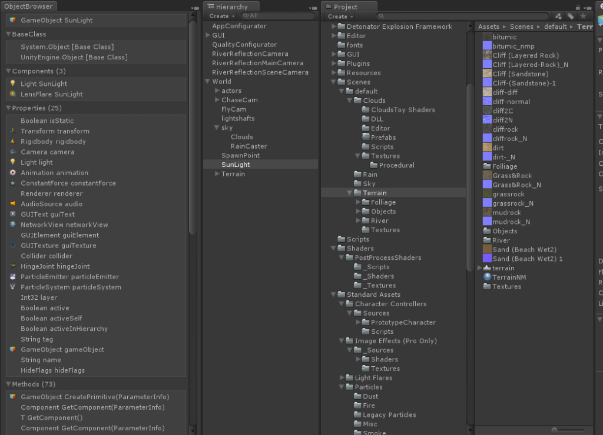
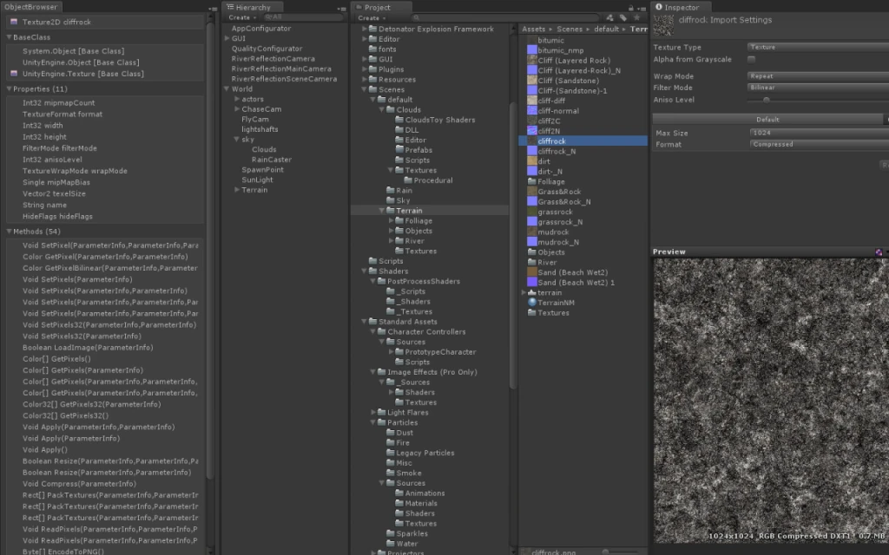

# ObjectBrowser: Deep .NET Reflection & Type Inspector for Unity

**Architect & Engineer:** Uray Meiviar  
**Role:** Unity Tool Developer & Systems Programmer  
**Period:** 2012 (Published December 2012)  
**Domain:** Game Engine Tooling, Unity Editor Extensions, .NET Reflection, Systems Diagnostics  
**Platform:** Unity 3D (Unity 3.5 / 4.x), C#, Mono Runtime / .NET CLR, Unity Asset Store  

---

## Executive Summary

In game development with Unity, developers routinely work with deeply nested object architectures, imported third-party plugins, and internal engine objects. The default Unity Inspector window is intentionally limited: it exposes only serialized public fields or properties tagged with `[SerializeField]`, completely hiding private state, internal properties, non-serialized member fields, method signatures, and base class inheritance chains.

To solve this diagnostic blind spot, I engineered **`ObjectBrowser`**—a developer productivity and introspection tool released commercially on the **Unity Asset Store** in December 2012.

Leveraging .NET / Mono runtime reflection, `ObjectBrowser` creates a dockable EditorWindow that continuously monitors the developer's selection. Whether an engineer selects a complex `GameObject` in the Scene Hierarchy or an asset (such as a `Texture2D`, `AudioClip`, or `Mesh`) in the Project tree, `ObjectBrowser` exposes its complete internal anatomy in real time.

---

## 1. Introspection Architecture & Reflection Pipeline

```
=============================================================================
                    OBJECTBROWSER INTROSPECTION PIPELINE
=============================================================================
  [ Unity Editor Selection ] ──> `Selection.activeObject` / `activeGameObject`
               │
               ▼
  [ Selection Change Hook ] (`OnSelectionChange` Event Handler)
               │
               ▼
  [ .NET / Mono Reflection Engine ]
   ├── `System.Type` Extraction: `target.GetType()`
   ├── Base Class Traversal: Recursive `BaseType` inspection -> `System.Object`
   ├── Component Extraction: `GetComponents<Component>()`
   ├── Property Reflection: `GetProperties(BindingFlags.Public | NonPublic | Instance)`
   └── Method Reflection: `GetMethods()` -> Extract Return Types & `ParameterInfo`
               │
               ▼
  [ Hierarchical Tree GUI: Docked EditorWindow ]
   ├── ▾ BaseClass (Inheritance lineage back to System.Object)
   ├── ▾ Components (Active attached components & instances)
   ├── ▾ Properties (Data type, property name, and real-time state)
   └── ▾ Methods (Method name, argument parameters, and return types)
=============================================================================
```

---

## 2. Key Capabilities & Inspection Modes

### Scene Hierarchy GameObject Inspection
When a scene object (such as a light source, character controller, or camera rig) is selected, `ObjectBrowser` resolves:
- **Base Class Hierarchy:** Displays the exact inheritance lineage (e.g. `System.Object` → `UnityEngine.Object` → `GameObject`).
- **Component Breakdown:** Enumerate all attached components with instance references (e.g. `Light SunLight`, `LensFlare SunLight`).
- **Full Property Table:** Reveals both exposed and hidden properties, including internal layer indices, tag strings, transform caches, active-in-hierarchy states, and hide flags.
- **Method Signatures:** Lists all available methods and overloads with their full parameter metadata (`ParameterInfo`), aiding debugging and rapid API discovery.



---

### Project Window Asset Introspection
Developers can also select raw project assets directly in the Project tree:
- **Texture Inspection:** When inspecting assets like `Texture2D cliffrock`, `ObjectBrowser` bypasses surface-level importer panels to disclose true underlying memory properties: mipmap counts, internal `TextureFormat` enums, pixel dimensions, filter modes, anisotropic levels, wrap modes, and texel vectors.
- **Engine Asset Methods:** Discloses all callable low-level utility methods, including `SetPixels32`, `GetPixelBilinear`, `Compress`, `PackTextures`, and `EncodeToPNG`.



---

## 3. Commercial Impact & Technical Highlights

- **Unity Asset Store Release:** Published commercially in December 2012 as an essential developer debugging and learning tool for the global Unity community.
- **Non-Intrusive Workflow:** Built as a dockable `EditorWindow` utilizing immediate-mode GUI (`GUILayout` / `EditorGUILayout`) that automatically refreshes upon selection changes without causing editor lag.
- **Architectural Utility:** Enabled engineers to easily audit memory footprints, locate hidden runtime references, and verify reflection-based serialization pipelines.
